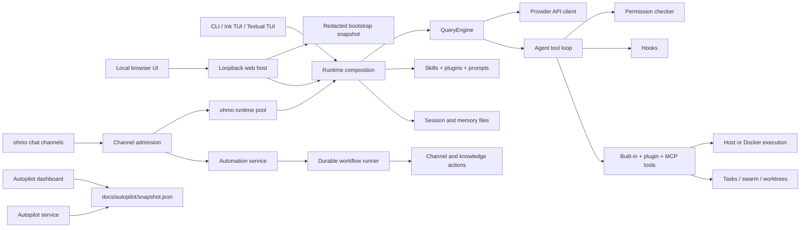

# OpenHarness current-state architecture

This document describes the repository as implemented. Confidence labels mean:

- **Observed**: directly supported by source, configuration, or tests.
- **Inferred**: strongly suggested but not exercised or fully specified here.
- **Unknown**: the repository does not contain enough evidence to assert the behavior.

## Scope

**Observed.** The repository ships two Python command-line applications from one package:

- `openharness` / `oh` / `openh`: a reusable coding-agent runtime and its CLI/TUIs.
- `ohmo`: a personal-agent application that composes OpenHarness with a persistent workspace and chat gateways.

It also contains three TypeScript applications: the Ink-based terminal UI under
`frontend/terminal`, the local React browser shell under `frontend/web`, and the Vite autopilot
dashboard under `autopilot-dashboard`.

Primary evidence: `pyproject.toml`, `src/openharness/cli.py`, `ohmo/cli.py`, and both `package.json` files.

## System view

**Observed.** `build_runtime()` is the composition root. It resolves settings and provider auth, discovers plugins, connects MCP servers, creates the tool registry, builds hooks and the system prompt, creates `QueryEngine`, restores a session when requested, and optionally starts the Docker sandbox. Evidence: `src/openharness/ui/runtime.py`.

## Component catalog

| Component | Responsibility and interfaces | State / dependencies | Confidence and evidence |
| --- | --- | --- | --- |
| CLI | Typer entrypoint for setup, auth, providers, MCP, plugins, cron, autopilot, print mode, and interactive mode | Reads settings and launches UI/runtime | **Observed:** `src/openharness/cli.py`, `src/openharness/__main__.py` |
| Runtime composition | Builds and tears down a complete session | Settings, plugins, MCP, tools, hooks, prompts, sandbox, session backend | **Observed:** `src/openharness/ui/runtime.py` |
| Agent engine | Owns messages, model selection, token/cost accounting, memory checkpoints, and the streamed turn loop | Provider client, registry, permission checker, hooks | **Observed:** `src/openharness/engine/query_engine.py`, `query.py`, `src/openharness/tools/executor.py` |
| Provider clients | Normalize Anthropic, OpenAI-compatible, Codex subscription, and Copilot streaming APIs | External APIs and auth stores/environment | **Observed:** `src/openharness/api/` and `src/openharness/auth/` |
| Tools | Expose Pydantic-described asynchronous operations to models | Filesystem, shell, web, MCP, tasks, swarm, cron, images | **Observed:** `src/openharness/tools/base.py`, `tools/__init__.py` |
| Permissions and sandbox | Decide whether a tool may run; route supported operations through Docker when enabled | Settings, approval callbacks, Docker | **Observed:** `src/openharness/permissions/`, `src/openharness/sandbox/` |
| Hooks | Execute lifecycle and tool hooks, including blocking pre-tool hooks | Settings and plugin hook definitions | **Observed:** `src/openharness/hooks/` |
| Skills and prompts | Discover instructions and assemble runtime context | Bundled, user, project, and plugin skill roots; `CLAUDE.md`-style context | **Observed:** `src/openharness/skills/`, `src/openharness/prompts/` |
| Plugins | Load manifest-declared skills, commands, agents, tools, automation actions, hooks, and MCP configuration | User plugins by default; trusted project plugins when enabled | **Observed:** `src/openharness/plugins/` |
| MCP | Connect to stdio, HTTP, or WebSocket MCP servers and adapt their tools/resources | Settings and plugin MCP definitions | **Observed:** `src/openharness/mcp/` and MCP tests |
| Session and memory | Persist conversations, tool-loop metadata, project memory, usage, and optional extraction/consolidation | `~/.openharness` by default | **Observed:** `src/openharness/services/session_*`, `memory/`, `services/autodream/` |
| Tasks and swarm | Run background shell/agent tasks, coordinate teammates, mailboxes, permissions, and Git worktrees | Local processes, filesystem mailboxes, Git, optional tmux/iTerm | **Observed:** `src/openharness/tasks/`, `swarm/`, `coordinator/` |
| Channels | Normalize inbound/outbound chat messages and bridge them to an engine | In-memory queues plus channel SDKs | **Observed:** `src/openharness/channels/` |
| Automation | Validate declarative workflows, match generic events, checkpoint sequential runs, execute restricted skill agents, and dispatch typed effects | `<ohmo workspace>/automations` definitions and `<ohmo workspace>/automation` run state | **Observed:** `src/openharness/automation/`, `ohmo/automation/` |
| ohmo | Adds workspace identity, memory, session storage, gateway configuration, per-conversation runtimes, and channel commands | `~/.ohmo` by default and OpenHarness runtime | **Observed:** `ohmo/` and `tests/test_ohmo/` |
| Autopilot | Maintains a per-repository task registry, policies, journals, run artifacts, verification, and dashboard export | `.openharness/autopilot` and `docs/autopilot` | **Observed:** `src/openharness/autopilot/`, workflows, tests |
| Terminal UI | React/Ink frontend connected to a Python backend protocol; Textual fallback also exists | Node.js process and Python backend | **Observed:** `frontend/terminal/`, `src/openharness/ui/` |
| Local web UI | Loopback-only aiohttp host, token-protected status API and controlling WebSocket, responsive React workbench, sessions, and runtime controls | One shared structured backend controller, one controlling socket, bounded reconnect state, and packaged Vite assets | **Observed:** `src/openharness/ui/web_server.py`, `backend_host.py`, `frontend/web/` |

## Main runtime flows

### Interactive or headless request

1. **Observed.** Typer resolves CLI options and selects print, React TUI, or fallback UI behavior (`src/openharness/cli.py`).
2. **Observed.** `build_runtime()` merges persisted settings, environment variables, provider profiles, and explicit CLI overrides (`src/openharness/ui/runtime.py`, `config/settings.py`).
3. **Observed.** Plugins and MCP configuration are loaded before the tool registry and system prompt are finalized.
4. **Observed.** `QueryEngine.submit_message()` appends a normalized user message, fires `user_prompt_submit`, builds `QueryContext`, and delegates to `run_query()`.
5. **Observed.** The query loop streams a model response. Tool uses are resolved through `ToolRegistry`, checked by `PermissionChecker`, passed through pre/post hooks, executed, and returned to the model (`src/openharness/engine/query.py`).
6. **Observed.** Stream events feed the selected UI/output renderer. Session memory and optional durable-memory extraction run after turns.
7. **Observed.** Shutdown stops the Docker sandbox, performs best-effort personalization extraction, closes MCP/API clients, and fires `session_end`.

### Tool safety and failure path

1. **Observed.** Unknown tools produce an error result rather than arbitrary dispatch.
2. **Observed.** Sensitive credential paths are denied before configurable allow rules, including in full-auto mode.
3. **Observed.** Explicit deny/allow lists and path/command rules are evaluated before permission-mode defaults.
4. **Observed.** Read-only tools run without confirmation; mutating tools require confirmation in default mode, are blocked in plan mode, and run in full-auto mode.
5. **Observed.** Pre-tool hooks may block an invocation; post-tool hooks observe results.
6. **Observed.** Tool errors are normalized into tool results so the model can recover within the turn budget.

Evidence: `src/openharness/permissions/checker.py`, `src/openharness/engine/query.py`, and corresponding tests.

### Skills and plugin discovery

**Observed.** Skill precedence is implemented by later registry entries replacing earlier names. Loading order is bundled, user compatibility roots, explicit extra roots, project roots from least to most specific, then enabled plugins. Default project roots are `.openharness/skills`, `.agents/skills`, and `.claude/skills`. Evidence: `src/openharness/skills/loader.py`, `registry.py`.

**Observed.** User plugins load from `~/.openharness/plugins`. Project plugins live in `.openharness/plugins` but are disabled unless `allow_project_plugins` is true. Plugins may contribute skills, slash commands, agent definitions, Python tools, hooks, and MCP servers. Evidence: `src/openharness/plugins/loader.py`.

### ohmo gateway

**Observed.** `ohmo` creates a separate workspace with identity prompts, user profile, memory, plugins/skills, sessions, attachments, logs, and gateway state. The gateway normalizes channel messages, derives a session key, reuses or creates a runtime per conversation, and emits progress/final responses through channel adapters. Evidence: `ohmo/workspace.py`, `gateway/router.py`, `gateway/runtime.py`, `gateway/bridge.py`.

**Observed.** After a channel adapter admits a message, the gateway also creates a sanitized
`channel.message` automation event. Matching workflows reserve durable runs before executing in
background tasks. A workflow can continue to the normal assistant, consume that turn, or remain
silent. Its named skill agent receives an exact filtered tool registry; external effects occur
through policy-checked `channel.send`, `knowledge.upsert`, or trusted plugin actions. Gateway
shutdown leaves active checkpoints for startup recovery rather than blindly replaying uncertain
effects. Approval requests are checkpointed, routed through the bus, and resolved only by an
admitted actor in the step allowlist. Local `ohmo automation` commands provide validation, dry-run,
manual submission, inspection, and explicit recovery transitions. Evidence: `ohmo/automation/`,
`src/openharness/automation/`, and automation tests.

**Observed.** Workflow defaults bound per-step time and total run duration. The store bounds live
and archived terminal history, while structured lifecycle logs carry workflow, run, event, and step
identifiers without message content. Definition loading rejects credential-shaped fields and common
plaintext token formats before execution.

## State and ownership

| State | Default location | Owner |
| --- | --- | --- |
| Settings and credentials | `~/.openharness/settings.json` and credential stores under `~/.openharness` | Config/auth modules |
| Sessions | `~/.openharness/data/sessions/<project>-<hash>/` | Default session backend |
| Tasks, cron, feedback, logs | `~/.openharness/data/` and `~/.openharness/logs/` | Services/tasks/config paths |
| Project memory | Project-relative memory paths resolved by `memory/paths.py` | Memory subsystem |
| Project skills | `.openharness/skills`, `.agents/skills`, `.claude/skills` | Skill loader |
| Project plugins | `.openharness/plugins` | Plugin loader; opt-in trust |
| Autopilot | `.openharness/autopilot/` | Autopilot store |
| ohmo workspace | `~/.ohmo` unless overridden | `ohmo.workspace` |
| ohmo workflow definitions and runs | `~/.ohmo/automations/*.yaml` and `~/.ohmo/automation/` | `ohmo.automation` and `openharness.automation` |
| Published dashboard | `docs/autopilot/` | Autopilot export and GitHub workflows |

## Contracts and extension boundaries

- **Observed.** Provider clients implement the streaming-messages protocol in `src/openharness/api/client.py`.
- **Observed.** Tools subclass `BaseTool`, use a Pydantic input model, and return `ToolResult`; reusable execution policy and hook ordering live in `GovernedToolExecutor`.
- **Observed.** Hooks use the event names in `src/openharness/hooks/events.py`.
- **Observed.** Sessions can replace the default file backend through the `SessionBackend` protocol.
- **Observed.** Channels implement `BaseChannel` and exchange `InboundMessage` / `OutboundMessage` through `MessageBus`.
- **Observed.** Automation actions subclass `AutomationAction`, validate Pydantic input, and return JSON-safe `ActionResult`; trusted plugins may contribute them from `automation_actions/`.
- **Observed.** Plugins are defined by `plugin.json` or `.claude-plugin/plugin.json` and the schema in `plugins/schemas.py`.

See [EXTENDING.md](EXTENDING.md) for implementation checklists.

## Constraints and invariants

- **Observed.** Python 3.10 and 3.11 are CI-supported; Ruff targets Python 3.11 syntax (`pyproject.toml`, `.github/workflows/ci.yml`).
- **Observed.** Project plugin execution is a trust boundary and defaults off.
- **Observed.** User-facing runtime state can come from persisted settings, environment overrides, provider profiles, and CLI overrides; tests must cover precedence when changing configuration.
- **Observed.** Model APIs differ in streamed thinking, tool call, and message replay semantics; provider changes must test conversion as well as initial requests.
- **Observed.** The React terminal source is packaged into the Python wheel, so launcher/protocol/packaging changes cross Python and Node boundaries.
- **Observed.** The browser production bundle is packaged at `openharness/_web`; `oh web` serves it
  only on a validated loopback address and protects REST data and the controlling WebSocket with a
  high-entropy launch token. The WebSocket injects typed request/event callbacks into the same
  `ReactBackendHost` used by the terminal, so runtime composition, event ordering, selectors,
  permissions, modal futures, interruption, and cleanup retain one owner. One tab controls the
  runtime; bounded events are retained during a five-second reclaim window, after which prompts are
  denied, the active turn is interrupted, and the runtime closes.
- **Observed.** `ui/web_resources.py` is the browser presentation adapter for Capabilities, Work,
  Knowledge, and Autopilot. It reads bounded snapshots through existing subsystem owners and never
  treats browser JSON as a persistence format. Browser mutations are limited to five named,
  Pydantic-validated actions (`task.stop`, `bridge.stop`, `cron.toggle`, `cron.run`, and
  `autopilot.enqueue`); they require the launch token and same-origin mutation request and delegate
  to the task, bridge, cron, or autopilot owner. Disabled project plugins remain undiscovered by
  executable plugin loading when the Capabilities snapshot is opened.
- **Observed.** Unit/CI tests are designed to run without real model credentials; live evaluations are separate.
- **Observed.** The intended product dependency direction is `ohmo` to `openharness`, but core currently has optional reverse imports for ohmo attachment paths, managed Feishu group lookup, and cron notification/config integration. Treat these as boundary debt rather than extension precedent; see [the developer improvement backlog](developer/IMPROVEMENTS.md#p1-remove-reverse-dependencies-from-core-into-ohmo).

## Known unknowns

- **Unknown.** There is no formal external stability/versioning policy for Python classes; treat internal imports as non-public unless documented in the README.
- **Unknown.** Production scale limits for the in-memory message bus, filesystem mailboxes, and per-session ohmo runtime pool are not specified or benchmarked.
- **Unknown.** Backward-compatibility guarantees for settings, plugin Python APIs, and persisted session metadata are not formally versioned.
- **Inferred.** `src/openharness/channels/UPSTREAM` and the channel sync script indicate some channel code is synchronized from another project, but this repository does not define a complete upstream contribution policy.

For architectural decisions, trade-offs, limitations, and future directions, start with the
[architecture decision guide](architecture/README.md). For a source-oriented walkthrough and
change-impact map, see the [codebase guide](developer/CODEBASE_GUIDE.md). Prioritized structural and
quality opportunities are tracked separately in the
[improvement backlog](developer/IMPROVEMENTS.md) so this document remains a description of current
behavior. Detailed entrypoint-to-cleanup traces for individual subsystems are indexed under
[critical runtime flows](developer/flows/README.md).

Accepted current-state decisions are indexed under
[architecture decision records](architecture/decisions/README.md). Security and disclosure
boundaries are detailed in the [threat model](security/THREAT_MODEL.md) and
[data-handling guide](security/DATA_HANDLING.md); exact state formats and compatibility expectations
are cataloged in [state and persisted formats](reference/STATE_AND_PERSISTED_FORMATS.md) and the
[compatibility policy](COMPATIBILITY.md).
