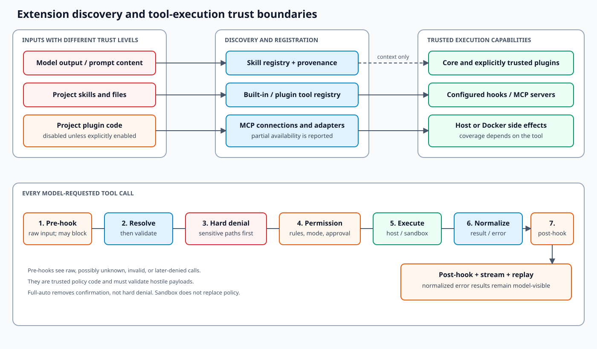

# Extensions and trust boundaries

**Confidence: Observed unless marked otherwise.** OpenHarness has several extension mechanisms with
different capabilities. Treating all of them as equivalent is unsafe: a Markdown skill influences
the model, while a Python plugin tool or command hook executes code.

## Trust-boundary map

## Capability matrix

| Mechanism | What it contributes | Executes code locally? | Network access? | Default project trust |
| --- | --- | --- | --- | --- |
| Skill | Instructions and references loaded into prompt/tool context | Indirectly, only through later model tool choices | Indirect | Project skills enabled by default |
| Slash command | Command metadata and handler defined by core/plugin | Handler may execute | Handler-dependent | Plugin gate applies |
| Python plugin tool | `BaseTool` implementation loaded dynamically | Yes | Tool-dependent | Project plugins disabled by default |
| Hook | Command, HTTP, prompt, or agent checks on lifecycle events | Command hooks: yes | HTTP/prompt/agent hooks: yes | Plugin/project configuration gate applies |
| MCP server | External process/service tools and resources | Stdio server may launch locally | HTTP transport and tool behavior may use network | Explicit server configuration |
| Built-in tool | Core-owned operation registered at runtime | Tool-dependent | Tool-dependent | Shipped code |
| Sandbox | Alternate execution path for supported operations | In container | Config/policy-dependent | Explicitly enabled |

“Read-only” is a permission property declared by a tool, not a proof that its implementation has no
side effects. New extension code must be reviewed at the capability boundary it actually crosses.

## Discovery and precedence

### Skills

The registry loads bundled skills, user compatibility roots, explicit extra roots, project roots
from broad to specific, and then enabled plugin skills. Later registration of the same name wins.
Project skill directories are restricted to safe relative configured paths and are discovered from
the working directory toward the Git root.

This override model makes local specialization easy. The cost is provenance ambiguity: a familiar
skill name may resolve to a nearer project or plugin definition. UI/diagnostics should retain source
metadata, and security decisions must never depend on a skill name alone.

### Plugins

Plugins can contribute skills, commands, agents, executable tools, hooks, and MCP settings.
User-installed plugins are discovered separately from project plugins. Project plugin execution is
disabled unless `allow_project_plugins` is enabled because repository contents are untrusted input.

Enabling a plugin is equivalent to trusting its Python imports, hook commands/URLs, MCP servers,
and prompt content. Permission checks around later tool calls do not sandbox module import side
effects.

### MCP

MCP connections are established during runtime assembly. Connected tools are adapted into the
normal registry so model calls still pass through registry lookup, permission evaluation, hooks,
and result normalization. Transport establishment and the server process/service itself remain
outside that per-call safety pipeline.

Failed servers are represented in status instead of necessarily aborting the whole runtime. This
supports partial availability but can leave an expected capability absent; hosts should expose the
failure rather than silently pretending the server is available.

## Tool-governance pipeline

For each model-requested tool call, the **implemented order** is:

1. Run matching pre-tool hooks against the raw tool name and input; a blocking failure returns an
   error before registry lookup.
2. Resolve the exact registered name. Unknown names become error results.
3. Validate input with the tool's Pydantic model.
4. Extract path/command metadata used by permission rules.
5. Apply immutable sensitive-path denial.
6. Apply explicit tool deny/allow rules, path rules, and command deny patterns.
7. Apply mode defaults: full-auto, read-only, plan, or confirmation.
8. Ask the host for approval when required.
9. Execute the tool, potentially through a sandbox adapter where supported.
10. Normalize success/failure, run post-tool hooks for executed calls, and emit stream events.

The placement of pre-tool hooks is an important trust detail: a hook can run for a hallucinated
tool, malformed input, or a call that permissions later deny. Hook implementations must treat their
payload as hostile and must not assume that validation or permission has already succeeded.

These are defense layers, not interchangeable controls. The Docker sandbox limits the environment
of supported execution; it does not replace permission policy. Hooks add organization/project
policy; they do not replace built-in credential-path denial. Full-auto skips confirmation but does
not override the immutable sensitive-path guard.

## Decisions and trade-offs

### D1 — one registry for built-in, plugin, and MCP tools

**Decision.** Every model-facing tool uses the same schema and execution pipeline.

**Benefits.** Consistent provider schemas, UI events, permissions, hooks, error handling, and replay.

**Costs.** Name collisions and provenance need discipline. A shared interface can obscure very
different operational risks between a local read, a shell command, and a remote service mutation.

### D2 — project skills on, project plugins off

**Decision.** Repository instructions are discoverable by default, but repository executable
plugin code requires opt-in.

**Benefits.** Projects can teach the agent their workflow without silently gaining arbitrary Python
execution at import time.

**Costs.** Instructions can still influence tool choices through prompt injection. Users need clear
provenance and should review project instructions; the distinction reduces risk rather than making
skills trusted.

### D3 — hooks around the tool lifecycle

**Decision.** Hooks observe or block lifecycle points without being embedded in tool code.

**Benefits.** Cross-cutting policy and audit behavior remain configurable.

**Costs.** Hooks add latency and new failure/network/code-execution paths. Sequential hook execution
is predictable but a slow hook delays the entire turn.

### D4 — partial MCP startup

**Decision.** Connection failures are captured per server and the runtime may continue.

**Benefits.** One optional integration does not make the agent unusable.

**Costs.** A prompt or workflow may expect missing tools. Capability detection and status reporting
must be accurate.

## Threats and mitigations

| Threat | Existing mitigation | Gap / residual risk |
| --- | --- | --- |
| Prompt asks for credential files | Built-in sensitive-path patterns before allow rules | Coverage depends on metadata extraction and path forms |
| Repository ships malicious Python plugin | Project plugins disabled by default | User plugins and explicit opt-in remain fully trusted code |
| Tool name is hallucinated | Exact registry lookup | A colliding trusted name can still be surprising |
| Hook exfiltrates data | Explicit hook config, timeout/error handling | Pre-hooks see raw calls before permission; no general data-loss-prevention policy for trusted hooks |
| MCP server is compromised | Per-call permission/hook pipeline | Server startup, resources, and returned content remain trust inputs |
| Full-auto performs destructive operation | Explicit mode plus immutable path guard and deny rules | No universal rollback; external side effects can be irreversible |
| Sandbox escape or unsupported operation | Explicit adapter/path validation | Sandbox coverage is not a proof of isolation for every tool |

## Current limitations

- Plugin Python APIs and persisted manifests have no formal compatibility/versioning policy.
- Python plugin modules execute at load time and are not isolated from the host interpreter.
- Tool name collision behavior is deterministic through registration order but not a substitute for
  strong namespacing/provenance UX.
- Hook command/HTTP/prompt execution expands the trusted computing base.
- Pre-tool hooks execute before registry/input/permission checks and must defend against hostile raw
  payloads themselves.
- MCP server identity and capability changes are not cryptographically pinned by this architecture.
- Sensitive-path protection is pattern/metadata based; tools must expose accurate paths/commands.
- Sandbox support is tool-specific rather than a universal process boundary around the runtime.
- There is no unified audit log tying a model request, approval, hooks, sandbox route, side effect,
  and persisted result into one tamper-evident record.

## Future improvements

These are **proposed**:

1. Surface tool/skill/plugin provenance and collision decisions in diagnostics and the UI.
2. Version plugin and persisted extension contracts; add compatibility fixtures and explicit
   unsupported-version errors.
3. Separate plugin manifest discovery from executable module import and display the requested
   capabilities before enabling project code.
4. Add declared tool effect scopes (filesystem roots, commands, network targets, external mutation)
   to improve approvals, conflict handling, and auditability.
5. Add policy tests proving every path-bearing built-in and adapter exposes metadata before
   execution.
6. Define sandbox coverage and non-goals per tool rather than presenting it as a global guarantee.
7. Add structured, redacted audit records with correlation IDs across model, approval, hook, tool,
   and persistence events.

## Change checklist

- Identify whether the extension contributes instructions, schemas, executable code, network
  access, or all four.
- Preserve project-plugin opt-in and sensitive-path denial ordering.
- Verify registration name, provenance, input validation, read-only declaration, permission
  metadata, hooks, sandbox route, error result, and cleanup.
- Test disabled, malformed, denied, timeout, and unavailable-server cases.
- Never infer API/tool compatibility from a provider or plugin name alone.
