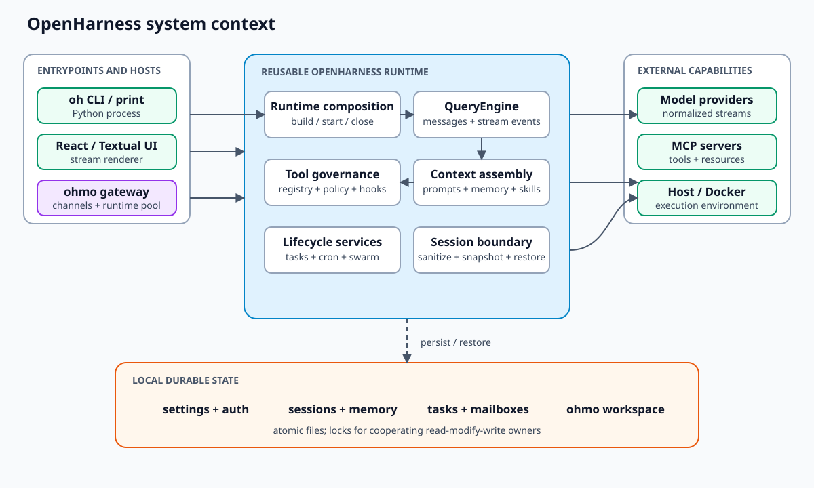

# Architecture decision guide

This directory explains why OpenHarness is shaped the way it is, what each boundary owns, and
where the design is intentionally incomplete. It complements, rather than replaces, the
[current-state architecture overview](../ARCHITECTURE.md) and the
[source-oriented runtime flows](../developer/flows/README.md).

All claims use one of these confidence labels:

- **Observed** — directly supported by current source or tests.
- **Inferred** — a design intent strongly suggested by several observed choices.
- **Proposed** — a future direction, not a current capability or compatibility promise.

## Start here

| Question | Document | Primary evidence |
| --- | --- | --- |
| How is a runtime assembled, used, and closed? | [Runtime composition and agent loop](RUNTIME_AND_AGENT_LOOP.md) | `ui/runtime.py`, `engine/query.py`, engine/UI tests |
| What state exists, who owns it, and what is concurrency-safe? | [State, concurrency, and recovery](STATE_CONCURRENCY_AND_RECOVERY.md) | session, memory, tasks, swarm, cron, and ohmo storage |
| Where can extensions execute, and which trust checks apply? | [Extensions and trust boundaries](EXTENSIONS_AND_TRUST.md) | plugins, skills, hooks, MCP, permissions, sandbox |
| Why are `openharness` and `ohmo` separate? | [Product boundaries and deployment shapes](PRODUCT_BOUNDARIES.md) | package entrypoints, runtime injection, gateway pool |
| How does the React terminal talk to Python? | [Frontend/backend IPC](frontend_backend_ipc.md) | launcher, backend host, protocol, Ink session hook |
| Which implemented decisions should changes preserve or supersede? | [Architecture decision records](decisions/README.md) | seven accepted current-state decisions and revisit triggers |
| Where are security and privacy boundaries enforced? | [Threat model](../security/THREAT_MODEL.md) | engine, permissions, plugins, channels, sandbox, persistence |

Additional static diagrams show the [security trust zones](diagrams/security-trust-zones.svg),
[data-handling flow](diagrams/data-handling-flow.svg),
[bridge lifecycle](diagrams/bridge-session-lifecycle.svg),
[gateway operations](diagrams/gateway-operations.svg), and repository-autopilot
[architecture](diagrams/autopilot-architecture.svg) and
[state machine](diagrams/autopilot-state-machine.svg).

For a quick component inventory and state-location table, use
[`docs/ARCHITECTURE.md`](../ARCHITECTURE.md). For implementation call order, use the
[`docs/developer/flows`](../developer/flows/README.md) guides. For prioritized remediation work,
use the [improvement backlog](../developer/IMPROVEMENTS.md).

## Architectural forces

OpenHarness is balancing five forces:

1. **Provider portability.** The engine consumes normalized stream events, while each API client
   owns wire-format conversion and replay semantics.
2. **Tool safety.** Model intent is untrusted. Registry lookup, immutable sensitive-path denial,
   configurable permissions, hooks, and optional sandbox routing form separate control layers.
3. **Interactive streaming.** The same engine feeds print mode, a Python UI, the React terminal,
   background workers, and `ohmo` gateways without making the engine depend on any renderer.
4. **Local-first durability.** Settings, sessions, memory, tasks, and coordination state use local
   files so the runtime can operate without a server, at the cost of weaker multi-host semantics.
5. **Extensibility without making project code trusted by default.** Skills are instructions;
   plugins may contain executable Python and hooks. The latter require a stronger opt-in boundary.

## Decision summary

These are descriptions of current decisions, not immutable promises.

| Decision | Benefit | Cost / trade-off | Revisit when |
| --- | --- | --- | --- |
| Keep `build_runtime()` as the composition root | One lifecycle owner and consistent assembly across hosts | High fan-in and a responsibility hotspot | Builders can be extracted behind the same `RuntimeBundle` contract |
| Keep the tool loop provider-neutral | One permission/hook/tool lifecycle for every provider | Provider adapters must preserve subtle tool replay rules | A provider cannot map into the normalized message/event model without loss |
| Use files plus atomic replacement for local durable state | Inspectable, portable, serverless persistence | No transactions across files; limited multi-host coordination | Deployments require shared storage or stronger consistency |
| Use process-local async runtimes | Low overhead and natural streaming/cancellation | Capacity, backpressure, and eviction limits are largely undefined | Gateway concurrency has measured service-level targets |
| Separate `ohmo` from reusable core | Core can serve coding-agent and embedded use cases | A few reverse imports currently violate the intended direction | Adapter protocols remove all `openharness` → `ohmo` imports |
| Use stdin/stdout NDJSON for the terminal | Simple single-user parent/child transport, no server | One frontend per backend; protocol is not independently versioned | Remote or multi-client UI access becomes a requirement |

## Cross-cutting invariants

Changes are unsafe unless these invariants remain true:

- A `RuntimeBundle` is started and closed on its owning event loop.
- Assistant tool-use blocks and user tool-result blocks remain provider-valid and replayable.
- Unknown tools never become dynamic dispatch into arbitrary code.
- Sensitive credential paths remain denied before configurable allow rules or permission modes.
- Project plugins remain disabled unless `allow_project_plugins` is explicitly enabled.
- The reusable core does not gain new application-specific dependencies on `ohmo`.
- Every acquired MCP connection, sandbox, subprocess, task, and owned API client has a cleanup
  owner.
- Persisted state changes remain atomic; read-modify-write state also needs an exclusive lock.
- Stream event ordering remains meaningful to every renderer and gateway consumer.

## How to use these documents in a change

1. Find the owning boundary in the system context and the relevant decision document.
2. Confirm the claim against current source and the nearest tests; documentation can lag.
3. Identify which invariant, durable format, trust boundary, or lifecycle edge changes.
4. Update the decision, consequence, limitation, and evidence sections if the architecture moved.
5. Use [Testing and validation](../TESTING.md) to verify all affected seams.

Documentation-only changes should still be checked for local links, SVG/XML validity, stale source
paths, and disagreement with current registries. `scripts/check_docs.py` automates those structural
checks; prose semantics and Mermaid syntax still require review.
