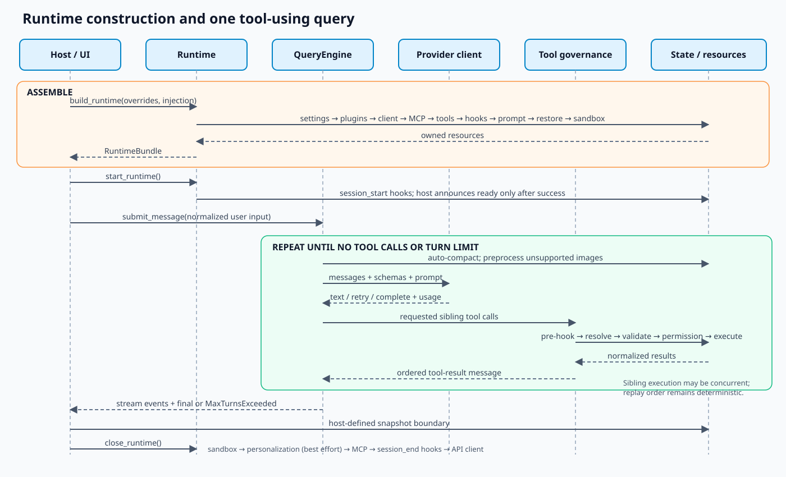

# Runtime composition and agent loop

**Confidence: Observed unless marked otherwise.** This document describes the runtime assembled by
`src/openharness/ui/runtime.py` and executed by `src/openharness/engine/query.py`.

## Boundary and responsibilities

`build_runtime()` is the composition root. It creates a complete `RuntimeBundle` and already
acquires external resources such as MCP connections and, when configured, a Docker sandbox.
`start_runtime()` then emits the session-start lifecycle event; hosts declare readiness only after
that hook succeeds. `close_runtime()` owns normal teardown. UI hosts, print mode, task workers, and
`ohmo` reuse this contract.

The composition root owns wiring, not domain policy:

| It should own | It should delegate |
| --- | --- |
| Settings/override order | Provider-specific HTTP and stream parsing |
| Resource construction and ownership | Tool implementations |
| Registries and dependency injection | Permission decisions |
| Startup and teardown ordering | Session serialization details |
| Restore/sanitize boundaries | UI rendering and channel formatting |

This distinction matters because `runtime.py` already has high fan-in. Adding policy there makes a
local feature change cross provider, persistence, extension, and UI contracts.

## Assembly and execution

The observed assembly order is contractual in practice:

1. Load settings, materialize the active provider profile, and merge explicit CLI/runtime
   overrides.
2. Resolve the working directory and extra skill/plugin roots.
3. Discover enabled plugins. Project plugin execution remains gated by settings.
4. Resolve or accept an injected API client.
5. Load MCP configuration, connect servers, and adapt their tools.
6. Create the built-in registry, then register enabled plugin tools.
7. Detect provider metadata and create application state.
8. Build hooks, the system prompt, permission checker, and `QueryEngine`.
9. Sanitize and restore messages/tool metadata when resuming.
10. Start the Docker sandbox when configured.
11. Return a bundle. The host calls `start_runtime()` before declaring readiness.

On close, sandbox isolation is stopped first, personalization extraction is best-effort, MCP
connections are closed, session-end hooks run, and the API client is closed. An injected client is
tagged as external in the bundle, but current `close_runtime()` still calls an available `close()`;
callers must therefore treat injection ownership carefully.

The Docker sandbox registry is module-global (`sandbox/session.py`), not stored in the bundle. One
process therefore has one active sandbox slot. Starting or closing multiple sandbox-enabled bundles
in the same process is not an isolated per-session operation.

## The query state machine

Each submitted user message becomes a `QueryContext` plus a shared mutable conversation list. One
turn proceeds as follows:

1. Estimate context and run automatic compaction if needed.
2. Convert image blocks to descriptions when the selected model lacks vision support.
3. Send normalized messages, system prompt, tool schemas, token limit, and effort to the provider
   client.
4. Forward text deltas, retry notices, status, and usage as stream events.
5. Store the completed assistant message.
6. If the assistant requested no tools, finish the query.
7. Otherwise run pre-tool hooks on each raw requested call; then resolve the tool, validate input,
   evaluate permission metadata, execute allowed sibling calls with `asyncio.gather`, normalize
   failures, run post-tool hooks for executed calls, and append one provider-valid user tool-result
   message.
8. Repeat until the model stops requesting tools or the turn limit is reached.

The model can request sibling tools in one assistant message. They execute concurrently, but their
results are reconstructed in request order before replay. This reduces latency for independent
tools while preserving deterministic provider message structure. It does **not** imply that tools
are free of conflicts: two mutating calls can still target the same path or external resource.

## Protocol invariants

### Conversation validity

- A provider request receives sanitized `ConversationMessage` objects.
- Every persisted/replayed tool result references a tool-use ID.
- Compaction must not orphan tool-use blocks or their results.
- A failed tool call becomes an error `ToolResultBlock`; it does not abort sibling result replay.
- Reaching `max_turns` preserves the pending continuation state so `/continue` can resume.

These constraints are tested most directly in `tests/test_engine/` and `tests/test_services/test_compact.py`.

### Event ordering

Renderers rely on a causal sequence: start/status events precede deltas, tool-start precedes
tool-complete, and a final assistant completion follows its deltas. Compaction uses a child task and
queue so progress can be yielded without allowing the compactor to write directly to a renderer.

### Error boundaries

| Failure | Current handling | Consequence |
| --- | --- | --- |
| Provider transient failure | Provider emits retry metadata or raises a normalized error | UI can report retry progress |
| Provider rejects completion-token limit | Query retries with an extracted lower limit | One turn is retried rather than consumed |
| Prompt too long | One reactive compaction attempt | Avoids an unbounded retry loop |
| Unknown tool | Pre-hook runs, then an error tool result is recorded | Model can recover in the same query |
| Permission or pre-hook denial | Denied/error tool result | Denial remains visible to model and UI; post-hook does not run |
| Tool exception escapes execution | Outer loop normalizes an error result | Sibling tools still produce replayable results; post-hook does not run for that call |
| Turn budget exhausted | `MaxTurnsExceeded` | Host reports stoppage and may offer continuation |
| Teardown extraction failure | Suppressed as best-effort | Cleanup continues, personalization may lag |

## Decisions and trade-offs

### D1 — normalized streaming clients

**Decision.** Provider clients translate wire events into a shared stream/message contract.

**Why.** Permissions, hooks, tools, compaction, persistence, and UIs should not fork per provider.

**Trade-off.** Provider-specific capabilities must fit the shared block/event model. Thinking
blocks, tool IDs, usage, finish reasons, retry semantics, and multi-turn replay need explicit
adapter tests; matching a provider name is not proof of compatibility.

### D2 — one mutable conversation owned by `QueryEngine`

**Decision.** The engine keeps ordered in-memory history and persists snapshots at host-defined
boundaries.

**Why.** Streaming and tool replay need immediate, ordered mutation without a database round trip.

**Trade-off.** Concurrent submissions to the same engine are not a documented safe operation.
Hosts must serialize a conversation or provide a separate engine per session.

### D3 — concurrent sibling tools

**Decision.** Sibling tool calls are gathered concurrently.

**Why.** Independent reads, network calls, and agents need not add their latency serially.

**Trade-off.** The engine cannot infer resource conflicts from arbitrary tool inputs. Permission
approval is a safety gate, not transaction isolation. Tools or higher-level orchestration must own
conflict prevention.

### D4 — composition through a concrete bundle

**Decision.** Hosts consume `RuntimeBundle` instead of a global service locator.

**Why.** Dependencies and cleanup ownership stay visible and test clients/backends can be injected.

**Trade-off.** The bundle has broad reach and adding fields can couple hosts to internal services.
New fields should represent lifecycle-owned capabilities, not convenience access to unrelated
policy.

## Current limitations

- `runtime.py` and `query.py` are responsibility hotspots; broad edits have large regression
  surfaces.
- The shared provider contract has no formal external stability policy.
- The maximum safe long-session history and compaction quality envelope are not benchmarked.
- Concurrent mutating sibling tools have no general conflict detector or transaction mechanism.
- Pre-tool hooks receive raw calls before lookup, validation, and permission denial; configured
  hooks are therefore part of the trusted policy boundary and must handle hostile input safely.
- Cancellation is cooperative across provider clients and tools; blocking third-party extension
  code can delay it.
- Runtime startup connects MCP servers sequentially and can inherit slow external startup latency.
- Resource acquisition inside `build_runtime()` is not wrapped in a single rollback stack; a
  failure after MCP connection but before a bundle is returned can bypass normal bundle teardown.
- Docker sandbox state is a process-wide singleton, so concurrent sandbox-enabled bundles in one
  process do not have independent lifecycle ownership.
- Cleanup is best-effort for some observers, and there is no persisted recovery journal proving
  which teardown phases completed after process death.

## Future improvements

These are **proposed**, not implemented:

1. Extract provider resolution, extension assembly, prompt construction, and sandbox lifecycle into
   focused builders while preserving `RuntimeBundle` and order.
2. Add a per-engine submission guard with an explicit busy/queue policy.
3. Add tool conflict metadata (resource keys or declared write scopes) before considering safe
   serialization of conflicting sibling calls.
4. Define cancellation deadlines and cleanup metrics for clients, MCP transports, tools, and
   subprocesses.
5. Make runtime assembly transactional with an async exit stack so partial startup failures close
   already-acquired resources.
6. Move sandbox ownership into `RuntimeBundle`, or explicitly reject multiple sandbox-enabled
   bundles in one process.
7. Publish provider contract fixtures covering replay, thinking, images, tool errors, and usage.
8. Benchmark compaction fidelity and memory growth over long histories before changing storage.

## Change checklist

- Trace composition through every host that calls `build_runtime()`.
- Trace loop changes through permissions, hooks, sandbox routing, stream events, compaction,
  persistence, continuation, and every provider converter.
- Test the denial/error path as well as the successful path.
- Verify resource acquisition has a matching close path on cancellation and startup failure.
- Update this document when call order, ownership, or a stated limitation changes.
