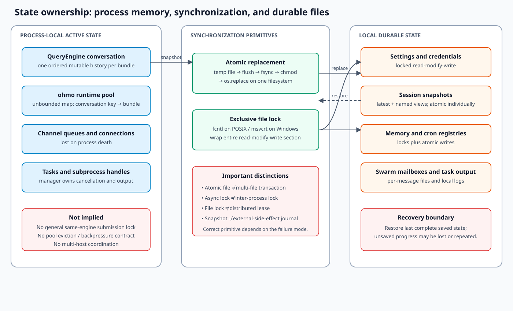

# State, concurrency, and recovery

**Confidence: Observed unless marked otherwise.** OpenHarness is local-first: most durable state is
stored as files, while active engines, queues, connections, and task handles live in one process.
This document distinguishes atomicity, mutual exclusion, session isolation, and durability because
they solve different failure modes.

## Ownership map

| State | Owner | Scope | Write strategy | Recovery behavior |
| --- | --- | --- | --- | --- |
| Settings/profiles | `config.settings` | User config root | lock + atomic replace | Reload last complete JSON |
| Credentials | `auth.storage` | User config root/keyring | lock + atomic replace where file-backed | Reject or recover last complete file |
| Core sessions | `SessionBackend` / `session_storage` | Project hash | atomic snapshots | Load latest or selected session |
| ohmo sessions | `OhmoSessionBackend` | Workspace + session key | atomic snapshots | Restore latest matching conversation |
| Project/personal memory | memory manager | Project or ohmo workspace | lock + atomic files/index | Re-scan durable entries |
| Cron registry | cron service/scheduler | User data root | lock + atomic registry updates | Scheduler reloads registry |
| Tasks | task manager | Process + task files/logs | process handles and persisted metadata | Completed output survives; process recovery is limited |
| Swarm mailboxes | mailbox owner | Team/agent directory | lock + temp/rename per message | Unread files remain discoverable |
| Active conversation | `QueryEngine` | One runtime bundle | ordered in-memory mutation | Host snapshot restores last save point |
| ohmo runtime pool | `OhmoSessionRuntimePool` | Gateway process | dictionary keyed by conversation | Recreated from snapshots after restart |
| Channel bus | message bus/channel manager | Gateway process | in-memory async queues | Queued messages are lost on process death |

## Persistence primitives

### Atomic replacement

`atomic_write_text()` writes a same-directory temporary file, flushes and `fsync`s it, applies the
target mode, and calls `os.replace()`. A concurrent reader sees the old or new file, not a partial
payload. This is crash safety for one file; it is not a transaction across several files.

Session saving illustrates the distinction. Core sessions write `latest.json` and then
`session-<id>.json` as two separate atomic operations. Either file is complete, but process death
between writes can leave the two views at different revisions. Loaders tolerate some missing or
invalid entries, yet there is no commit record joining both files.

### Exclusive file locking

Read-modify-write registries use `exclusive_file_lock()` around the entire critical section. POSIX
uses `fcntl.flock`; Windows uses a one-byte `msvcrt` lock. Atomic replacement prevents torn files;
the lock prevents two writers from reading the same old value and overwriting each other.

Not every atomic write has a lock. Snapshot files are commonly single-writer by host convention.
If two processes write the same session target, last replacement wins. That convention must not be
mistaken for enforced ownership.

### Sanitization at persistence boundaries

Session storage serializes normalized conversation messages and a selected subset of tool metadata.
Runtime objects such as clients, managers, callbacks, and locks are not durable state. On restore,
messages are validated/sanitized and runtime-only dependencies are rebuilt. This keeps snapshots
portable but means new metadata fields need an explicit compatibility and filtering decision.

## Concurrency model

### One engine, one ordered conversation

`QueryEngine` owns a mutable message list. Within one query, model streaming is sequential by turn;
sibling tool calls may be concurrent. There is no general transaction or lock around simultaneous
calls to `submit_message()` on the same engine. The supported mental model is one active submission
per conversation.

### Multiple independent sessions

Independent runtime bundles can make progress on the same event loop because provider, MCP, tool,
and channel work is asynchronous. Independence is only complete when their filesystem and external
resource targets do not overlap. Docker sandbox state is an exception: its active session is stored
in a module-level singleton, so sandbox-enabled bundles in one process are not independently owned.

`ohmo` maps a derived channel/thread/conversation key to one `RuntimeBundle`. This preserves
conversation continuity and allows different keys to use different runtimes. The current pool is an
unbounded process-local dictionary with no per-key construction/submission lock, eviction policy,
or idle timeout. Therefore simultaneous inbound messages for the same new key can race to create or
mutate a bundle unless the upstream channel path serializes them. That serialization is not a pool
invariant and should not be assumed by new adapters.

### Background work and coordination

Tasks and swarm agents deliberately escape the foreground query lifetime. Their managers own
subprocess handles, output, cancellation, and status; file mailboxes provide process-to-process
coordination. Mailbox writes and read-state updates use locks and replacement so cooperating local
processes do not consume partial JSON.

This architecture is suitable for local coordination, not a distributed queue. Locks are host/file
system mechanisms, there is no lease or fencing token, and clock-based filenames/status can be
affected by host behavior.

### Scheduler

The cron scheduler polls durable job definitions and launches due work. Persistence lets schedules
survive restarts, but execution is tied to a running scheduler process. The design does not provide
exactly-once delivery: a crash around launch/update boundaries can create missed or repeated work,
and multiple scheduler processes require careful ownership.

## Failure and recovery matrix

| Failure | Protected today | Residual risk |
| --- | --- | --- |
| Crash while rewriting one atomic file | Reader sees old or new complete file | Directory entry itself is not explicitly fsynced |
| Two settings/credential writers | Exclusive lock serializes update | Unsupported/network filesystems may weaken lock behavior |
| Crash between two related snapshot writes | Each file remains valid | `latest` and named snapshot may disagree |
| Process death during a model turn | Last saved snapshot remains | Unsaved deltas/tool work are lost; external side effects may already exist |
| Duplicate scheduled launch | Job registry survives | No universal idempotency key for task side effects |
| Gateway restart | ohmo reconstructs sessions lazily | In-memory queue, pool, and transient progress are lost |
| Concurrent same-session messages | No general engine/pool guard | History interleaving, duplicate construction, or snapshot last-write-wins |
| Multiple sandbox-enabled bundles | One process-global active sandbox slot | One bundle can replace or stop another bundle's sandbox |
| Worker becomes unreachable | File status/output may remain | No distributed lease/fencing or automatic adoption contract |

## Decisions and trade-offs

### D1 — local files instead of a database

**Decision.** Durable state uses human-inspectable files under user/workspace roots.

**Benefits.** No server dependency, easy backup, simple local development, and direct recovery
inspection.

**Costs.** Cross-file transactions, schema migration, indexing, contention, multi-host access, and
retention must be implemented separately. Large histories and high write rates are not the target
envelope.

### D2 — snapshots instead of an append-only event log

**Decision.** Sessions persist normalized snapshots plus named/latest views.

**Benefits.** Restore is simple and bounded to one document.

**Costs.** Partial turn reconstruction, auditing, deduplication, and exact recovery of external
effects are limited. Snapshot compatibility is not formally versioned.

### D3 — file mailboxes for swarm coordination

**Decision.** Agent mailboxes are directories of atomic JSON messages.

**Benefits.** Separate local processes can coordinate without a broker, and state is inspectable.

**Costs.** Polling and directory scans do not offer broker-grade backpressure, acknowledgement,
leases, retention, or multi-host semantics.

## Current limitations

- Persisted session/tool metadata and several registries lack a unified schema-version policy.
- Atomic writes do not make multi-file updates transactional.
- The ohmo runtime pool is unbounded and does not enforce same-key serialization.
- Docker sandbox state is process-global rather than owned per runtime bundle.
- In-memory buses and queues have no documented capacity/backpressure envelope.
- Cron is not an exactly-once scheduler and relies on a long-running local process.
- There are no checked-in load tests for mailbox contention, long sessions, task fan-out, or pool
  churn.
- Retention/garbage collection policies for sessions, task output, and runtime bundles are uneven.
- File locks are advisory/cooperative and depend on filesystem/platform behavior.

## Future improvements

These are **proposed** and should be driven by measurements:

1. Add schema versions and idempotent migrations to sessions and persisted tool metadata.
2. Add per-session async locks or bounded queues at the gateway/runtime-pool boundary, including a
   defined response when a conversation is busy.
3. Add idle eviction and maximum active-session limits with graceful snapshot/close behavior.
4. Record idempotency/run identifiers around scheduled launches and document at-least-once versus
   at-most-once behavior explicitly.
5. Add queue-depth, pool-size, task-count, lock-wait, and recovery-failure metrics.
6. Build repeatable stress tests before adopting a database or broker; migrate only the state whose
   measured consistency/scale requirements justify it.
7. Consider a small transaction manifest when multiple files must represent one committed snapshot.

## Change checklist

- Identify the single writer and every competing process for the target state.
- Use atomic replacement for rewritten files and an exclusive lock for read-modify-write sequences.
- Test corrupt, missing, legacy, and interrupted state, not only a current valid fixture.
- Preserve a recovery path after cancellation or process death.
- Define queue bounds, ownership, and cleanup for every new background task.
- Never claim distributed safety from a local async lock or advisory file lock.
