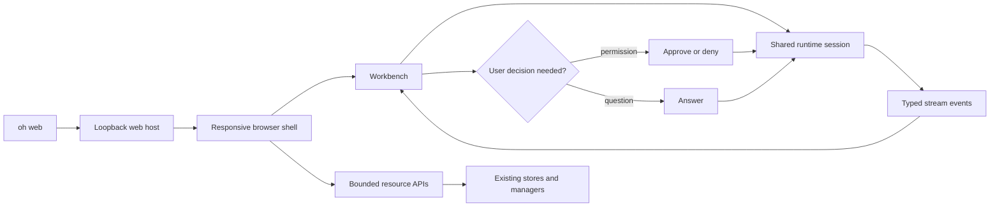

# OpenHarness local web UI specification

Status: **Approved for staged implementation on `kevin/web-ui`**

This document defines a browser UI for the reusable `oh` application. It is a local-first host for
the existing OpenHarness runtime, not a second agent engine and not an `ohmo` administration UI.
Every implementation stage must end with a critical review, corrective pass, focused validation,
and an incremental commit and push.

## Product outcome

The web UI should let a developer use and operate the main `oh` workflows without translating the
entire product into slash commands. It must retain the same provider, permission, hook, sandbox,
tool, session, and persistence semantics as the terminal and headless hosts.

Success means a user can:

1. start `oh web`, open a clean responsive workspace, and understand runtime health immediately;
2. stream a conversation, inspect tool activity, answer questions and permission prompts, attach
   images, interrupt work, and see completion or failure clearly;
3. start, inspect, resume, and distinguish sessions without losing the current workspace context;
4. inspect and change model/profile, effort, turn, output, and permission controls through the
   canonical command/runtime path;
5. inspect the installed capability surface: tools, skills, commands, plugins, hooks, MCP servers,
   tasks, bridge sessions, cron jobs, memory, and autopilot state;
6. perform safe, high-frequency management actions while risky or credential-bearing setup remains
   explicit, validated, and locally scoped;
7. use the interface at desktop, tablet, mobile, keyboard-only, zoomed, or reduced-motion settings.

The first release is single-user and local-only. Multi-user hosting, remote ingress, account
management, and `ohmo` channel/gateway operations are intentionally out of scope.

## Evidence and boundaries

The implementation must preserve these current owners:

| Concern | Authoritative owner | Web responsibility |
| --- | --- | --- |
| Runtime composition and cleanup | `src/openharness/ui/runtime.py` | Construct one bundle per browser runtime and close it on disconnect/shutdown |
| Model/tool loop | `src/openharness/engine/query_engine.py`, `engine/query.py` | Render normalized events; never duplicate loop or permission logic |
| UI request/event contract | `src/openharness/ui/protocol.py` | Extend shared typed models only when both terminal and web consumers remain compatible |
| Terminal process transport | `src/openharness/ui/backend_host.py` | Reuse host behavior through a transport-neutral session controller, not stdout parsing in the browser |
| Settings/providers/auth | `src/openharness/config/`, `api/`, `auth/` | Expose redacted views and invoke owning commands/services for changes |
| Sessions and memory | `src/openharness/services/session_*`, `memory/` | List/read through public stores; preserve atomic write and schema ownership |
| Extensions | `skills/`, `plugins/`, `hooks/`, `mcp/` | Present trust and connection state; never import project code merely to preview it |
| Tasks, cron, bridge, autopilot | Their existing managers/stores | Use bounded presentation snapshots and owner APIs for actions |

The dependency direction remains browser → web host → reusable OpenHarness services. Core code may
not import `ohmo`, and browser code may never read local files directly.

## Information architecture

The desktop shell uses a narrow persistent rail, a contextual secondary panel, and one primary
canvas. Mobile uses a top bar plus bottom navigation; detail panels become full-height drawers.

| Area | Primary job | Key content/actions |
| --- | --- | --- |
| Workbench | Converse and supervise active work | transcript, streaming response, composer, images, tools, permission/question prompts, interrupt, todos |
| Sessions | Continue prior work | recent/named sessions, project scope, timestamps, model, resume/new session |
| Runtime | Choose how the agent operates | provider/profile, model, auth status, effort, turns, fast mode, permission mode, sandbox and output style |
| Capabilities | Understand what the agent can use | tools, commands, skills, plugins, hooks, MCP connections/resources, trust/source labels |
| Work | Observe delegated and scheduled work | tasks, bridge sessions, cron jobs, statuses, logs/outputs, cancel/retry where owner supports it |
| Knowledge | Inspect durable context | memory entry points, indexed records, session memory and safe refresh/search actions |
| Autopilot | Operate repository work intake | policy/health summary, task cards, recent runs, validation and dashboard link |

Global search opens a command palette across navigation, slash commands, sessions, and installed
capabilities. It does not silently execute the selected item; execution choices are labelled.

## Core user flow



## Interaction contract

### Workbench

- The composer is the dominant action and remains available while history scrolls.
- Enter submits; Shift+Enter inserts a newline. Submission is disabled while empty or when a
  non-idempotent request is already being accepted.
- Streaming text updates in bounded batches. A visible Stop action interrupts the active request.
- Tool calls appear as compact timeline rows with name, status, duration when known, redacted input,
  bounded output, and an explicit error state. Detail opens without losing transcript position.
- Permission prompts are modal dialogs with tool, reason, target summary, Allow once, Deny, and any
  supported edit-specific response. The safer action receives initial focus.
- Questions use labelled fields and preserve entered text if submission fails.
- Disconnect shows whether the runtime is still active, reconnecting, or closed; the UI never
  implies an interrupt succeeded until the backend confirms it.

### Resource areas

- Lists use search and visible active filters, stable ordering, result counts, useful empty states,
  and a detail drawer on wide screens.
- Read operations load automatically. Mutations use the narrow owner API and return an audit-friendly
  success/error message.
- Destructive actions such as task cancellation, cron deletion, plugin trust changes, or memory
  deletion require a consequence-specific confirmation.
- Credential entry is never echoed back after submission. Bootstrap and status responses expose
  only configured/missing state, profile labels, and redacted endpoint details.

## Visual direction

The visual language is a calm technical workbench rather than a generic card dashboard.

- **Typography:** `Inter`-compatible system sans for interface text and a system monospace stack for
  commands, paths, tool payloads, and token metrics. Six roles cover display, page heading, section
  title, body, label, and code/caption.
- **Color:** a graphite/ink neutral foundation with a restrained electric-cyan action color and warm
  amber for attention. Success, warning, error, and information always pair color with an icon or
  label. Light and dark themes share semantic tokens.
- **Surfaces:** a continuous canvas, quiet dividers, and only two elevation levels. Dense operational
  content uses rows and timelines instead of a wall of identical cards.
- **Shape:** 10–14px radii for containers, 8px controls, and crisp one-pixel borders. The composer and
  active decision dialogs carry the strongest emphasis.
- **Motion:** 120–180ms opacity/transform transitions clarify navigation and drawers. Streaming,
  progress, and focus remain understandable when `prefers-reduced-motion` disables transitions.

## Responsive behavior

| Width | Navigation | Primary layout | Detail behavior |
| --- | --- | --- | --- |
| ≥ 1200px | icon + label rail | canvas plus 300–360px context panel | inline contextual panel |
| 768–1199px | compact icon rail | full canvas; context panel on demand | right drawer |
| < 768px | top identity + bottom navigation | one full-width task at a time | full-screen sheet with explicit back/close |

The composer respects mobile safe areas. Tables become prioritized definition lists; secondary
metadata collapses behind disclosure. No core action depends on hover or a hardware keyboard.

## Accessibility requirements

- Semantic landmarks, sequential headings, real buttons/links/inputs, and a skip-to-content link.
- Complete keyboard operation with visible focus, predictable Escape behavior, and focus return
  after dialogs/drawers close.
- `aria-live` regions for connection state, completed actions, and permission requests; streaming
  token updates are not announced token by token.
- Minimum 44px touch targets on compact layouts and text contrast meeting WCAG AA.
- Status is never color-only. Tool inputs/outputs and transcripts remain selectable and zoom-safe.
- Theme follows system by default and supports explicit light/dark selection.

## Web host architecture

### Process and lifecycle

`oh web` starts one Python process that owns:

1. a loopback-only HTTP server for packaged static assets and bounded REST resources;
2. a WebSocket endpoint for the typed interactive session protocol;
3. one transport-neutral runtime session controller for the web-host launch;
4. explicit shutdown of active requests, runtime bundles, MCP clients, sandbox ownership, and the
   HTTP server.

The initial host binds `127.0.0.1` only. It selects an available port by default, generates a
high-entropy launch token, optionally opens the browser, and prints the local URL. The token is
carried in the URL fragment for frontend bootstrap and then in an authorization message/header so
it is not sent in HTTP referrers or access logs.

The initial release permits one controlling WebSocket connection. A reconnect presenting the same
launch token may reclaim the controller after the prior socket is closed; a concurrent second tab is
rejected with a clear “already connected” response. This avoids duplicate prompts and prevents
multiple runtime bundles from competing for process-global sandbox state. Multi-observer or
multi-runtime support requires a separate runtime-scoped sandbox design.

The server uses `aiohttp.web` on the same asyncio loop as the runtime. This adds one explicit HTTP
dependency but avoids a hand-written HTTP parser, split loop/thread ownership, and separate HTTP and
WebSocket ports. `WebUiServer` owns the `AppRunner`, socket, controller, and shutdown ordering.

### Transport

The WebSocket uses the JSON objects already modelled by `FrontendRequest` and `BackendEvent`, without
the terminal-only `OHJSON:` line prefix. A shared session controller owns request serialization,
modal futures, interrupt behavior, and runtime cleanup; stdin/stdout and WebSocket adapters only own
transport.

REST resources are presentation snapshots, not alternate persistence formats:

```text
GET  /api/bootstrap
GET  /api/sessions
GET  /api/capabilities
GET  /api/work
GET  /api/knowledge
GET  /api/autopilot
POST /api/actions/{bounded-action-name}
WS   /api/session
```

Resource payloads are versioned, bounded, credential-redacted, and same-origin only. The action
endpoint uses an explicit allowlist and Pydantic request models; it never maps arbitrary strings to
Python functions or shell commands.

The URL fragment is consumed and removed from browser history immediately. The browser sends the
token in an `Authorization: Bearer` header for REST and as the first WebSocket authentication
message because browser WebSocket APIs cannot set arbitrary headers. No runtime events are sent
before that message succeeds. Static hashed assets are public on loopback; all data and mutation
routes require authorization.

### Frontend

The new browser frontend is a React + TypeScript + Vite application with no server-side rendering.
Its implementation directory is created in Stage 1. It owns:

- routes, responsive shell, component/state rendering, accessibility, and browser reconnection;
- typed mirrors of the Python protocol and resource schemas;
- no provider keys, filesystem access, persistence migrations, or policy decisions.

The production build is packaged into the Python wheel. Development mode can proxy to the Python
host, but production is always same-origin.

The build output lives inside the Python package at `openharness/_web` and follows the same
source-build discipline as the terminal frontend. CI uses Node 20, `npm ci`, TypeScript, Vitest,
and a Vite production build.

## Security and privacy requirements

1. Bind only to loopback; reject non-loopback configuration in the first release.
2. Require the launch token before WebSocket or resource access and compare it in constant time.
3. Validate `Origin` and reject cross-site WebSocket/POST requests.
4. Set CSP, `X-Content-Type-Options`, `Referrer-Policy: no-referrer`, and no-store headers for API
   responses. Do not load fonts, scripts, telemetry, or images from third-party origins.
5. Cap request bodies, image attachments, WebSocket messages, resource list sizes, and buffered
   events. Slow or disconnected clients must not grow unbounded queues.
6. Never expose API keys, auth tokens, raw credential files, unrestricted environment values, or
   sensitive-path contents. Reuse existing redaction and permission boundaries.
7. Preserve project-plugin opt-in. Merely opening Capabilities must not execute disabled project
   plugin code.
8. Treat Markdown/model output as untrusted. Render without raw HTML and sanitize links/protocols.
9. Browser refresh/disconnect must not convert an uncertain tool effect into an automatic retry.
10. A controlling-socket disconnect resolves open permission and edit prompts conservatively,
    interrupts the active request after a short bounded reconnect grace period, and retains only a
    bounded presentation transcript. Durable session state remains owned by the session backend.

## State and failure behavior

| State | User-visible behavior | Recovery |
| --- | --- | --- |
| Booting | stable shell skeleton and “Starting local runtime” | backend error includes actionable retry/CLI path |
| Ready/idle | composer enabled and runtime summary current | normal operation |
| Streaming | buffered response, Stop enabled, resource mutations disabled if conflicting | interrupt or wait |
| Permission/question | modal announced and background transcript remains visible | respond; disconnect resolves safely as deny/cancel |
| HTTP resource failure | area-level error with retained prior data and Retry | refetch only that resource |
| WebSocket reconnecting | composer disabled, elapsed reconnect state visible | bounded retry then explicit reconnect/new runtime choice |
| Runtime closed | transcript remains readable | start a new runtime or resume a durable session |
| Empty resource | explanation plus next useful local command/action | navigate to setup or create flow |

## Capability depth

“Cover” does not mean every CLI string becomes an unrestricted web mutation. Each area declares one
of three support depths and displays that depth in context:

| Depth | Meaning | Examples |
| --- | --- | --- |
| Operate | Read and perform the common action through an owning typed API | chat, interrupt, session resume, model/profile selection, permissions, task cancel, cron enable/disable/run |
| Configure | Create/edit validated persisted configuration without returning stored secrets | provider profile fields, new credential submission, MCP server configuration, selected settings |
| Inspect | Present bounded state and direct the user to the canonical CLI for uncommon/risky changes | hook source, plugin trust explanation, raw sandbox policy, destructive memory migration |

Every main information-architecture area must reach at least Inspect; the high-frequency workflows
named in Product outcome must reach Operate. Provider/MCP forms that accept secrets reach Configure
only after request-body bounds, no-store handling, redacted responses, and dedicated tests exist.

## Delivery stages and review gates

### Stage 0 — specification and contract

- Feature inventory, information architecture, visual system, transport, trust boundary, and staged
  acceptance criteria.
- **Review gate:** no claimed feature lacks an owner; no browser path bypasses core policy; no
  deployment assumption silently enables remote access.

Stage 0 critical review resolved these issues before implementation:

- replaced “one runtime per browser session” with one controller and one controlling connection to
  preserve sandbox, prompt, and cleanup ownership;
- selected `aiohttp.web` rather than a custom HTTP parser or split-loop server;
- defined fragment-to-header/first-message authentication that browser APIs can actually perform;
- separated Operate, Configure, and Inspect depth so broad coverage does not imply unsafe generic
  dispatch or pretend that read-only status is full management;
- made packaging, Node version, frontend unit tests, and production build explicit gates.

### Stage 1 — local host and application shell

- `oh web` entrypoint, loopback server, token/origin/security headers, packaged placeholder build,
  typed bootstrap snapshot, responsive navigation shell, overview health, and unit/component tests.
- **Review gate:** unauthorized/cross-origin access is denied; startup/shutdown has one cleanup
  owner; mobile and keyboard navigation work; no credentials appear in bootstrap payloads.

Stage 1 implementation review found and corrected four issues before publication:

- framework-generated error responses now receive the same CSP, framing, referrer, permissions,
  and cache policy as successful responses;
- the responsive navigation drawer traps focus, closes with Escape, and restores focus to its
  launcher instead of leaving keyboard users at the document root;
- route scrolling observes `prefers-reduced-motion`, and desktop/mobile navigation share one
  semantic route model rather than separate feature inventories;
- Node dependencies are pinned for the repository's Node 20 contract, production dependencies
  audit clean, and CI rebuilds the wheel-packaged bundle to detect stale assets.

The Stage 1 host is intentionally status-only: it does not construct a `RuntimeBundle`, accept
prompts, or expose generic mutations. Rendered desktop/mobile browser evidence remains a Stage 4
release gate; the in-app browser surface was unavailable during this stage's automated review, so
component, responsive-source, production-build, and live HTTP checks are recorded without claiming
a completed visual audit.

### Stage 2 — interactive workbench

- Transport-neutral runtime controller, WebSocket adapter, transcript/streaming/tools, composer,
  images, interrupt, permission/question dialogs, session list/resume, and runtime selectors.
- **Review gate:** event ordering matches the terminal; modal futures cannot deadlock; disconnect and
  cancellation are conservative; restored sessions and provider tool replay remain valid.

Stage 2 implementation review found and corrected these issues before publication:

- the terminal host now accepts injected typed request/event adapters while retaining stdin/stdout
  defaults, so the browser does not clone the tool loop, modal futures, selectors, or cleanup;
- one controlling socket can be reclaimed during a bounded grace window; concurrent tabs are
  rejected only after authenticating, while expiry denies approvals, cancels questions, interrupts
  the active turn, and closes the shared runtime;
- browser event copies remove raw base URLs, recursively redact secret-key fields and common inline
  credential formats, truncate presentation strings at 64 KB, and retain only 256 disconnected
  events; WebSocket startup waits for bootstrap to consume and remove the fragment token first;
- image count, per-file, aggregate raw-byte, and WebSocket limits now agree; runtime shutdown stays
  closed unless the user explicitly requested a new session; and all decision dialogs resolve on
  Escape, contain focus, and restore focus on close.

The resulting Stage 2 surface operates streamed chat, tool details, images, interruption,
permission/edit/question decisions, session resume/new-session flows, and provider/model/policy/
effort/turn/output selectors through existing runtime commands. Markdown remains rendered as safe
plain text until the release-hardening sanitizer gate is implemented.

### Stage 3 — operational capability areas

- Capabilities, Work, Knowledge, and Autopilot resource APIs and screens; safe supported mutations
  routed through existing owners.
- **Review gate:** lists are bounded and lazy; disabled project plugins remain unexecuted; every
  mutation has an explicit allowlist, validation, authorization, failure state, and test.

Stage 3 now provides searchable/filterable screens for capability inventory, task/bridge/cron work,
memory previews, and Autopilot intake/activity. Lists expose counts, bounded details, retained-data
refresh errors, and useful empty states; immediate execution and stop/toggle operations require
consequence-specific confirmation. The only mutations are task stop, bridge stop, cron toggle/run,
and manual Autopilot enqueue.

Stage 3 review found and corrected these issues before publication:

- resource responses now pass through the final browser redactor instead of relying solely on each
  adapter's field selection;
- a locked or unavailable credential store degrades provider status to `unknown` without taking
  down the rest of Capabilities or exposing exception details;
- invalid owner targets return a non-reflective error instead of echoing caller-controlled text;
- Work and Autopilot mutation controls visibly lock while the shared runtime is processing an
  active turn, preventing a resource action from competing with in-flight agent work;
- disabled project plugins are counted without importing Python, lists and previews are bounded,
  all mutation bodies reject extra fields, and frontend tests cover search/filter, confirmation,
  success, failure, and manual intake behavior.

Rendered desktop/mobile browser evidence remains a Stage 4 release gate; it is not claimed by
component tests or responsive source review.

### Stage 4 — hardening and release readiness

- Accessibility audit, responsive/browser verification, CSP/Markdown review, packaging validation,
  docs/runbook, frontend build/type/test gates, and full Python regression suite.
- **Review gate:** requirement-by-requirement completion audit with rendered evidence; no stage is
  considered complete because a narrower unit test passed.

Stage 4 implementation now includes:

- a focus-trapped `Cmd/Ctrl+K` palette across navigation, canonical session summaries, slash
  commands, and installed capabilities; command choices prepare a draft instead of silently
  executing it, while session resume is explicitly labelled;
- the specified `/api/sessions` snapshot with at most 20 canonical IDs and no messages, system
  prompts, tool metadata, or local paths;
- GFM rendering for completed assistant messages and plans with raw HTML disabled, unsafe link
  protocols rendered as inert text, external links isolated, and model-authored images prevented
  from causing network requests;
- automated axe checks for the shell, palette, Sessions, Runtime, and all four operational resource
  screens; keyboard focus restoration, arrow-key tabs/results, reduced motion, and mobile layouts
  remain covered by components and responsive CSS;
- a shared focus-trapped detail drawer for bounded capability, work, memory, and Autopilot fields,
  with a mobile bottom-sheet treatment; Autopilot dashboard export remains a canonical CLI workflow
  because serving generated workspace HTML would widen the local host's file/XSS boundary;
- a zero-finding full npm audit after upgrading to fixed Node-20-compatible Vite and Vitest
  versions, plus production bundle regeneration.

The in-app browser connector was unavailable again during Stage 4, so actual desktop/mobile paint,
contrast, and overflow screenshots remain unverified and must not be inferred from jsdom, axe, or
responsive-source checks.

## Test strategy

- Python unit tests for auth/origin/body bounds, snapshot redaction, action allowlists, lifecycle,
  disconnect, and resource adapters.
- Shared protocol tests proving terminal compatibility and WebSocket JSON parity.
- Frontend unit tests for reducers/components, async states, dialogs, keyboard behavior, and unsafe
  Markdown/link handling.
- Browser E2E for launch/bootstrap, navigation, responsive layouts, streaming fake backend,
  permission/interrupt, reconnect, and session resume.
- Packaging test proving built assets are present in the wheel and served with correct MIME/security
  headers.
- Normal suites remain offline and use fake API clients. Real provider evaluation remains opt-in.

## Acceptance traceability

Every main area must have all five forms of evidence before completion:

1. an owning source adapter and typed schema;
2. a reachable responsive screen with loading, empty, success, and error behavior;
3. deterministic Python and frontend tests;
4. rendered browser verification at desktop and mobile widths;
5. user/developer documentation naming supported actions and intentional limitations.
