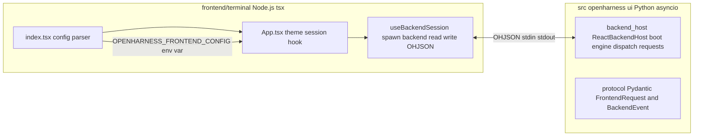

# Frontend ↔ Backend IPC Architecture

**Confidence: Observed.** Directly supported by source code, configuration, and tests.

## Overview

The React terminal UI (`frontend/terminal`) communicates with the OpenHarness engine through a **single parent/child process pair** using stdin/stdout pipes with a custom newline-delimited JSON protocol prefixed with `OHJSON:`. There is **no WebSocket layer**. The Python backend runs as a child process spawned by the TypeScript frontend, and all data exchange happens over that pipe.



**Key evidence:** `src/openharness/ui/react_launcher.py`, `frontend/terminal/src/hooks/useBackendSession.ts`, `src/openharness/ui/backend_host.py`, `src/openharness/ui/protocol.py`.

## Why no WebSocket?

- The frontend is an **Ink application** (React for terminals), not a browser app, so there's no native HTTP server.
- tsx runs the TypeScript source directly — no build step required.
- stdin/stdout with a newline-delimited JSON protocol is simpler and lower-latency than a socket-based approach for a single parent/child relationship.

## The launch chain

```
uv run oh
  → pyproject.toml: `oh = "openharness.cli:app"` (line 49)
  → src/openharness/cli.py: main() @app.callback(invoke_without_command=True) (~line 2180)
       if no subcommand and not --print/--task-worker:
           asyncio.run(run_repl(...))
```

| Condition | Branch | Entry function |
|-----------|--------|----------------|
| Subcommand given | returns immediately | — |
| `--dry-run` flag | dry-run preview, **returns** | `_build_dry_run_preview()` (~line 396) |
| `--continue` / `--resume` | restores session, calls `run_repl` with `restore_messages=` | ~lines 2480-2495 |
| `--print/-p 'prompt'` given | runs single-shot prompt and exits | `run_print_mode()` (~line 2503) |
| `--task-worker` (hidden) | stdin-driven headless worker loop | `run_task_worker()` (~lines 2521-2534) |
| **default** (interactive TTY, no flags) | enters the interactive REPL path | `run_repl(...)` at ~line 2537 |

### The print mode bypasses the frontend entirely

`run_print_mode()` builds a `RuntimeBundle` inline and streams events to stdout as text or stream-JSON. It is used when running `oh -p "Explain this codebase"`.

## run_repl → TUI decision

**File:** `src/openharness/ui/app.py`, lines 40-89

```python
async def run_repl(*, ..., backend_only: bool = False, ...):
    if backend_only:
        await run_backend_host(...)   # runs ONLY the engine (no frontend)
        return

    exit_code = await launch_react_tui(  # spawns the React/Ink frontend as a child process
        prompt=prompt, cwd=cwd, model=model, max_turns=max_turns, effort=effort, ...
    )
```

The `--backend-only` flag (hidden CLI option at ~line 2356) is used by the frontend itself to re-invoke `oh --backend-only` as a child process.

## react_launcher.py — building the bridge

**File:** `src/openharness/ui/react_launcher.py`, lines 81-176

### Step A — build the backend command (lines 81-113)

```python
def build_backend_command(*, ..., permission_mode=None):
    command = [sys.executable, "-m", "openharness", "--backend-only"]
    if cwd:     command.extend(["--cwd", cwd])
    if model:   command.extend(["--model", model])
    # ... max_turns, effort, base_url, system_prompt, api_key, api_format, permission_mode
    return command  # e.g. ["python3", "-m", "openharness", "--backend-only", "--cwd", "/repo"]
```

### Step B — resolve npm/tsx (lines 22-56)

`_resolve_npm()` returns the `npm` executable; `_resolve_tsx()` prefers `<frontend>/node_modules/.bin/tsx` directly so Ink's raw-mode stdin survives on Windows/WSL.

### Step C — install deps if missing (lines 137-146)

```python
if not (frontend_dir / "node_modules").exists():
    await asyncio.create_subprocess_exec(npm, "install", "--no-fund", "--no-audit", cwd=str(frontend_dir))
```

### Step D — set env var and spawn frontend process (lines 148-176)

The **only** bridge between Python and Ink is a single JSON env var:

```python
env = os.environ.copy()
env["OPENHARNESS_FRONTEND_CONFIG"] = json.dumps({
    "backend_command": build_backend_command(
        cwd=cwd or str(Path.cwd()), model=model, max_turns=max_turns, effort=effort,
        base_url=base_url, system_prompt=system_prompt, api_key=api_key,
        api_format=api_format, permission_mode=permission_mode,
    ),
    "initial_prompt": prompt,                 # None when launched from `oh` directly
    "theme": _resolve_theme(),
})

tsx_cmd = _resolve_tsx(frontend_dir)  # e.g. ("frontend/terminal/node_modules/.bin/tsx",)
process = await asyncio.create_subprocess_exec(
    *tsx_cmd, "src/index.tsx", cwd=str(frontend_dir), env=env,
    stdin=None, stdout=None, stderr=None,   # ← stdin/stdout inherit from parent (Ink TTY)
)
return await process.wait()
```

**Configuration file:** There is no external config defining connection settings. Everything flows through:
1. `OPENHARNESS_FRONTEND_CONFIG` env var (JSON) set by `react_launcher.py` before spawn
2. CLI flags passed to the backend child via `build_backend_command()` (`--cwd`, `--model`, `--max-turns`, etc.)

## Frontend side — parsing config and spawning the backend

### index.tsx — entry point

**File:** `frontend/terminal/src/index.tsx`, lines 1-81

```tsx
import {render} from 'ink';
...
const config = JSON.parse(process.env.OPENHARNESS_FRONTEND_CONFIG ?? '{}') as FrontendConfig;

process.on('exit', restoreTerminal);
process.on('SIGINT', () => { restoreTerminal(); process.exit(130); });

render(<App config={config} />, {stdin: stdinStream});
```

It parses `OPENHARNESS_FRONTEND_CONFIG` and passes it as the initial prop to `<App />`. Ink takes over the TTY.

### types.ts — FrontendConfig type

**File:** `frontend/terminal/src/types.ts`, lines 1-4

```typescript
export type FrontendConfig = {
    backend_command: string[];
    initial_prompt?: string | null;
};
```

### App.tsx — bootstrapping the session

**File:** `frontend/terminal/src/App.tsx`, lines 74-76, 81

```tsx
const session = useBackendSession(config, () => exit());
...
render(<App config={config} />, {stdin: stdinStream});   // actually at index.tsx line 81
```

### useBackendSession.ts — the full IPC loop

**File:** `frontend/terminal/src/hooks/useBackendSession.ts`, lines 1-462

#### Step A — spawn the backend child (lines 115-177)

```tsx
const [command, ...args] = config.backend_command;   // e.g. ["python3", "-m", "openharness", "--backend-only", ...]
const child = spawn(command, args, {
    stdio: ['pipe', 'pipe', 'inherit'],   // stdin/stdout to parent, stderr inherited by Ink TTY
    env: process.env,                      // passes OPENHARNESS_FRONTEND_CONFIG down (redundant but harmless)
    detached: useDetachedGroup,            // POSIX-only detached process group
    windowsHide: true,
});

const reader = readline.createInterface({input: child.stdout});
reader.on('line', (line) => {
    if (!line.startsWith(PROTOCOL_PREFIX)) {   // "OHJSON:"
        queueTranscriptItem({role: 'log', text: line});
        return;
    }
    const event = JSON.parse(line.slice(PROTOCOL_PREFIX.length)) as BackendEvent;
    handleEvent(event);
});

child.on('exit', (code) => { ... });
// killChild on SIGINT/SIGTERM/exit to clean up the detached process group
```

#### Step B — send requests from Ink components back to the child (lines 107-113)

```tsx
const sendRequest = (payload: Record<string, unknown>): void => {
    const child = childRef.current;
    if (!child || child.stdin.destroyed) return;
    child.stdin.write(JSON.stringify(payload) + '\n');
};
```

Every user action goes through this single `sendRequest()` call. Examples:
- User submits text: `{type:'submit_line', line: '...', images: [...]}` (App.tsx ~line 477)
- Ctrl+C while busy: `{type:'interrupt'}` (App.tsx ~line 230)
- Permission Y/N: `{type:'permission_response', request_id, allowed:true/false}` (App.tsx ~lines 303-318)
- `/resume`: `{type:'select_command', command:'resume'}` which the backend turns into a select_request

#### Step C — handle events from backend (lines 179-435)

The `handleEvent()` switch handles these event types: `ready`, `state_snapshot`, `tasks_snapshot`, `transcript_item`, `status`, `compact_progress`, `assistant_delta` (debounced ~30fps), `assistant_complete`, `line_complete`, `tool_started/completed`, `clear_transcript`, `select_request`, `modal_request` (permission/edit_diff/question), `error`, `todo_update`, `swarm_status`, `plan_mode_change`, `shutdown`.

#### Step D — on `ready`, fire the initial prompt if any

```tsx
if (event.type === 'ready') {
    setReady(true);
    setStatus(event.state ?? {});
    ...
    if (config.initial_prompt && !sentInitialPrompt.current) {
        sentInitialPrompt.current = true;
        sendRequest({type: 'submit_line', line: config.initial_prompt});  // initial prompt from env
        setBusy(true);
    }
}
```

## Backend side — ReactBackendHost runs the harness engine

**File:** `src/openharness/ui/backend_host.py`, lines 45-931

### Protocol prefix (line 45)

```python
_PROTOCOL_PREFIX = "OHJSON:"   # matches PROTOCOL_PREFIX in useBackendSession.ts
```

### The run loop (lines 92-188)

```python
async def run(self) -> int:
    self._bundle = await build_runtime(model=..., effort=..., ...)   # boot the engine
    await start_runtime(self._bundle)

    # Emit "ready" with current state, task list, and slash commands
    await self._emit(BackendEvent.ready(self._bundle.app_state.get(), ..., ...))
    await self._emit(self._status_snapshot())

    reader = asyncio.create_task(self._read_requests())  # stdin loop
    try:
        while self._running:
            request = await self._request_queue.get()
            if request.type == "shutdown": break
            if request.type == "interrupt": ...
            if request.type in ("permission_response", "question_response"): continue
            if request.type == "list_sessions": ...
            if request.type == "select_command": await self._handle_select_command(...)
            if request.type == "apply_select_command": ...
            if request.type != "submit_line": error()
            # ... run the line through handle_line(bundle, line, ...)
```

### The __init__ tracks pending permission/future objects (lines 76-90)

```python
self._request_queue: asyncio.Queue[FrontendRequest] = asyncio.Queue()
self._permission_requests: dict[str, asyncio.Future[bool]] = {}
self._edit_approval_requests: dict[str, asyncio.Future[str]] = {}
self._question_requests: dict[str, asyncio.Future[str]] = {}
```

### Emitting events (lines 844-854 in backend_host.py)

```python
async def _emit(self, event: BackendEvent) -> None:
    payload = _PROTOCOL_PREFIX + event.model_dump_json() + "\n"
    buffer = getattr(sys.stdout, "buffer", None)
    if buffer is not None:
        buffer.write(payload.encode("utf-8"))
        buffer.flush()
```

Events are flushed byte-by-byte to `sys.stdout` (binary buffer for speed). The frontend reader strips the `"OHJSON:"` prefix and JSON-parses.

## The typed protocol contract

**File:** `src/openharness/ui/protocol.py`, lines 1-247

### FrontendRequest — messages from Ink → Python (lines 37-57)

```python
class FrontendRequest(BaseModel):
    type: Literal[
        "submit_line", "permission_response", "question_response",
        "list_sessions", "select_command", "apply_select_command",
        "interrupt", "shutdown",
    ]
    line: str | None = None          # user text (for submit_line)
    command: str | None = None       # /provider, /resume, etc.
    value: str | None = None         # selected option value
    request_id: str | None = None    # for permission_response/question_response
    allowed: bool | None = None      # yes/no from modal
    permission_reply: str | None = None  # "once"/"always"/"reject"
    answer: str | None = None        # question response text
    images: list[FrontendImageAttachment] = Field(default_factory=list)
```

### BackendEvent — messages from Python → Ink (lines 90-135)

```python
class BackendEvent(BaseModel):
    type: Literal[
        "ready", "state_snapshot", "tasks_snapshot", "transcript_item",
        "compact_progress", "assistant_delta", "assistant_complete",
        "line_complete", "tool_started", "tool_completed", "clear_transcript",
        "modal_request", "select_request", "todo_update", "plan_mode_change",
        "swarm_status", "error", "shutdown",
    ]
```

## User input flow (end-to-end example)

When the user types a prompt in the Ink terminal:

```
User types "Explain this codebase" in Ink terminal
  ↓ sendRequest({type:'submit_line', line:'...', images:[]})
  ↓ child.stdin.write(JSON + '\n')
  ↓ ReactBackendHost._request_queue.put(FrontendRequest)
  ↓ handle_line(bundle, 'Explain this codebase')
  ↓ engine query → tool calls → responses (QueryEngine / QueryLoop)
  ↓ _emit(assistant_delta), _emit(tool_started), etc. back over stdout as OHJSON: lines
  ↓ useBackendSession parses and renders in Ink components
```

## Configuration summary

There is **no external config file** defining connection settings between frontend and backend. Everything flows through two mechanisms:

| Mechanism | Set by | Contains |
|-----------|--------|----------|
| `OPENHARNESS_FRONTEND_CONFIG` env var | `react_launcher.py` before spawning tsx | `backend_command`, `initial_prompt`, `theme` |
| Backend CLI flags | `build_backend_command()` inside the env var | `--cwd`, `--model`, `--max-turns`, `--effort`, `--base-url`, `--system-prompt`, `--api-key`, `--api-format`, `--permission-mode` |

User-level settings live at `~/.openharness/settings.json` and are loaded by `load_settings()` inside the backend host, but they do not affect the frontend↔backend channel.

## Alternative UI: Textual fallback

**File:** `src/openharness/ui/textual_app.py`, lines 1-496

An alternative UI built on the Textual framework (`textual.app.App`). It does **not** use the OHJSON protocol — it directly drives `build_runtime()` and `handle_line()` from within its own app, rendering through Rich/Textual widgets. It is referenced in the codebase but not wired into `run_repl()` as the default path; only the Ink-based React TUI (`react_launcher.py`) is the active frontend today.

## Related files at a glance

| Layer | File | Purpose |
|-------|------|---------|
| Entry point | `pyproject.toml` (lines 48-50) | `oh = "openharness.cli:app"` console script |
| CLI dispatcher | `src/openharness/cli.py` (~line 2180) | `main()` → selects TUI vs print mode |
| TUI launcher | `src/openharness/ui/app.py` (lines 40-89) | Decides backend-only vs full TUI |
| Frontend spawn | `src/openharness/ui/react_launcher.py` (~lines 81-176) | Builds backend command, sets env var, spawns tsx |
| Backend host | `src/openharness/ui/backend_host.py` (lines 45-931) | Runs engine, reads OHJSON from stdin, emits events to stdout |
| Protocol models | `src/openharness/ui/protocol.py` (lines 1-247) | Pydantic FrontendRequest and BackendEvent types |
| Frontend entry | `frontend/terminal/src/index.tsx` (~lines 1-81) | Parses env var, renders `<App>` with Ink |
| IPC hook | `frontend/terminal/src/hooks/useBackendSession.ts` (lines 1-462) | Spawns backend child, reads/writes OHJSON lines |
| Frontend types | `frontend/terminal/src/types.ts` (~lines 1-4) | `FrontendConfig` TypeScript interface |
| Alternative UI | `src/openharness/ui/textual_app.py` (lines 1-496) | Textual-based fallback (not currently active as default) |
