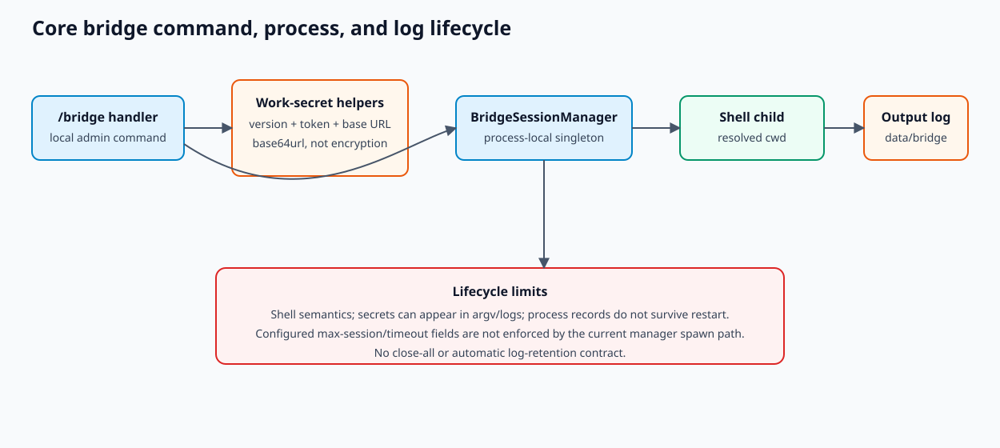

# Core bridge sessions and work secrets

The core `openharness.bridge` package is a local command/session bridge exposed through `/bridge`
and projected into UI state. It is distinct from `ohmo/gateway/bridge.py`, which routes chat
messages.

## Components

| Component | Responsibility |
| --- | --- |
| `bridge/types.py::WorkSecret` | versioned ingress token + API base URL record |
| `bridge/work_secret.py` | base64url encode/decode and SDK WebSocket URL construction |
| `bridge/session_runner.py::spawn_session()` | starts a shell command in a resolved cwd |
| `bridge/manager.py::BridgeSessionManager` | process registry, output capture, list/read/stop |
| `commands/registry.py::_bridge_handler()` | `/bridge` command dispatch |
| `ui/protocol.py` | bridge session snapshots in backend state |

## Work-secret format

`encode_work_secret()` serializes compact JSON and applies URL-safe base64 without padding.
`decode_work_secret()` restores padding, parses JSON, requires `version == 1`, and validates a
non-empty `session_ingress_token` plus string `api_base_url`.

Base64 is transport encoding, not encryption, signing, or tamper protection. Anyone who can read a
work secret can recover the ingress token. Do not print, log, commit, or place it in a public URL.

`build_sdk_url()` chooses `ws` and `/v2` when the base URL contains localhost/127.0.0.1; otherwise it
chooses `wss` and `/v1`. It removes `http://` or `https://` text and appends
`/session_ingress/ws/<session-id>`. This string heuristic is not a general URL validator.

## Spawn and output lifecycle

1. `/bridge spawn <command>` calls `BridgeSessionManager.spawn()`.
2. `spawn_session()` resolves cwd and delegates to `utils/shell.py::create_shell_subprocess()` with
   merged stdout/stderr.
3. The manager records the handle in a process-local singleton dictionary.
4. It creates `<data-root>/bridge/<session-id>.log` and starts `_copy_output()`.
5. `/bridge list` derives running/completed/failed from `process.returncode`.
6. `/bridge output <id>` reads the last bounded portion of the known log.
7. `/bridge stop <id>` terminates, waits three seconds, then kills if needed.

The command is shell-interpreted. `/bridge` is a trusted local administrative capability, not a
safe remote command surface. Process records do not survive restart, although old log files can
remain on disk.

## Concurrency and limitations

- The default manager is module-global and process-local.
- Session IDs generated by the command use time-of-day and are not a durable uniqueness protocol.
- `BridgeConfig.max_sessions` and timeout fields describe an intended configuration surface but are
  not enforced by `BridgeSessionManager.spawn()` in the current path.
- Output copy tasks are retained in a dictionary and normal runtime shutdown does not expose a
  bridge-manager `close_all()` contract.
- Logs have no automatic retention or redaction.
- A process crash can leave child/process/log state requiring manual cleanup.

## Safe use

- Run only reviewed commands in an expected cwd.
- Keep the default permission mode and local-only command boundary.
- Treat work secrets and output logs as credentials/private data.
- Stop sessions before deleting worktrees or data roots.
- Avoid embedding secrets in command text because it may appear in UI state and process listings.

## Tests

`tests/test_bridge/test_core.py` covers secret round-trip, URL construction, spawn/kill, and merged
stderr. `tests/test_bridge/test_session_flow.py` covers a local session flow. Changes to UI
projection also require `tests/test_ui` and command registry coverage.
