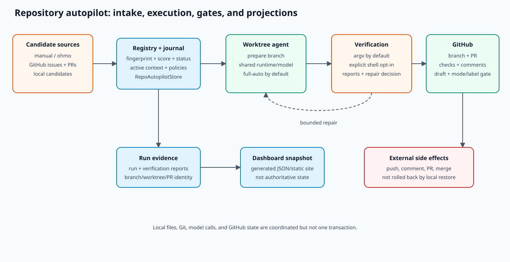

# Autopilot developer reference

Repository autopilot turns local/manual/GitHub candidate work into an ordered task card, executes a
model in an isolated worktree by default, verifies the result, and optionally opens, monitors,
repairs, and merges a PR under policy.

## Reading path

1. [Architecture and ownership](ARCHITECTURE.md)
2. [State machine](STATE_MACHINE.md)
3. [Policy and safety](POLICY_AND_SAFETY.md)
4. [Worktree, PR, and CI lifecycle](WORKTREE_PR_AND_CI.md)
5. [Recovery, idempotency, and dashboard](RECOVERY_AND_DASHBOARD.md)
6. [Dashboard data, rendering, and publication](DASHBOARD.md)
7. [Operator runbook](../../operations/AUTOPILOT.md)

## Source map

| Boundary | Source | Primary tests |
| --- | --- | --- |
| Models/statuses | `src/openharness/autopilot/types.py` | `tests/test_services/test_autopilot.py` |
| Store/intake/execution | `src/openharness/autopilot/service.py::RepoAutopilotStore` | service + `tests/test_autopilot` |
| CLI/slash commands | `src/openharness/cli.py`, `commands/registry.py` | command/CLI tests |
| Paths | `config/paths.py::get_project_autopilot_*` | config/service tests |
| Worktrees | `swarm/worktree.py::WorktreeManager` | swarm + autopilot tests |
| Cron | `RepoAutopilotStore.install_default_cron()` | cron/service tests |
| Dashboard exporter | `export_dashboard()`, `_build_dashboard_snapshot()` | autopilot dashboard export test |
| Dashboard source/workflow | `autopilot-dashboard/`, `.github/workflows/autopilot-*.yml` | dashboard build/workflow review |

## Core invariants

- Registry and journal evidence remain consistent enough to diagnose every transition.
- Untrusted issue/PR/candidate text never becomes shell syntax without explicit policy.
- Worktree/branch ownership is card-specific and primary checkout changes are not discarded.
- Verification commands are argv-based by default; shell semantics require explicit opt-in.
- PR draft state and configured auto-merge mode/label are checked from current remote state before
  merge; declared release human-gate fields are not currently enforced.
- Comments and PR creation are idempotent or reusable across retries.
- Terminal failure preserves reports and does not claim completed/merged.
- Generated `docs/autopilot` files are exporter output, not hand-maintained source.
