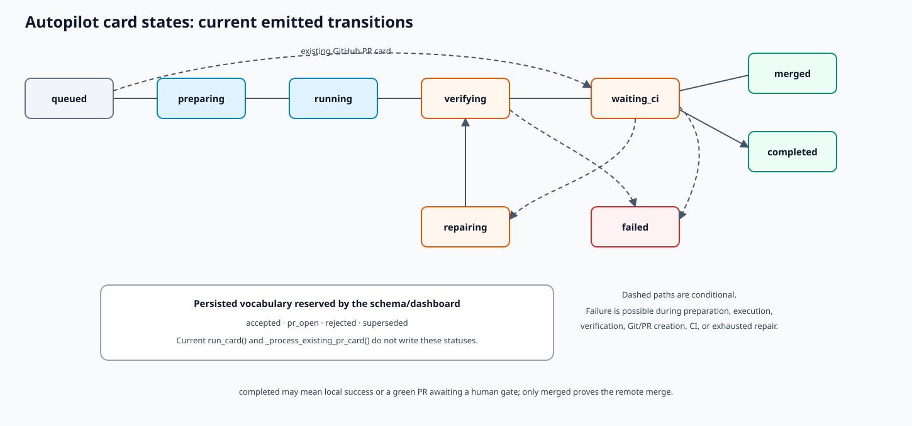

# Autopilot state machine

`RepoTaskStatus` is a persisted literal contract. Status changes should go through
`RepoAutopilotStore.update_status()` so timestamps, metadata, journal, and active context remain
coherent.



## Status meanings

| Status | Meaning | Typical owner |
| --- | --- | --- |
| `queued` | candidate exists but has not been accepted for execution | intake |
| `accepted` | reserved intermediate approval state; current normal execution does not write it | schema/dashboard |
| `preparing` | branch/worktree and execution context are being prepared | `run_card()` |
| `running` | first model attempt is active | agent path |
| `verifying` | local verification is active | verification path |
| `pr_open` | reserved PR state; current service moves directly to `waiting_ci` | schema/dashboard |
| `waiting_ci` | remote checks have not reached terminal success/failure | CI poller |
| `repairing` | a bounded model repair attempt is underway | repair path |
| `completed` | local work passed, or a green PR is waiting for a human gate | terminal/human-gate state |
| `merged` | pull request was merged | remote terminal state |
| `failed` | execution/verification/CI/Git terminal failure | orchestrator |
| `rejected` | reserved declined-work state; no current service transition writes it | schema/dashboard |
| `superseded` | reserved obsolete-work state; no current service transition writes it | schema/dashboard |

`RepoTaskStatus` and dashboard columns intentionally contain more states than the current
orchestrator emits. Do not document a reserved state as observed lifecycle behavior without adding
its owning transition and tests.

## Common transition paths

### Local completion

```text
queued → preparing → running → verifying → completed
```

If no repository/Git path is available or policy chooses local handling, successful verification
can end at `completed` with reports but no PR.

### PR and CI

```text
queued → preparing → running → verifying → waiting_ci → merged
waiting_ci → repairing → verifying → waiting_ci
queued GitHub-PR card → waiting_ci → merged/completed/failed
```

Human-gated success becomes `completed` with `human_gate_pending=true` and linked PR metadata.

### Failure

Execution, Git, permission, merge-conflict, or exhausted repair/CI failure can lead to `failed`.
Local/CI failures eligible under policy can first lead to `repairing`. A failure record should retain
attempt count, summary, report paths, branch/worktree, and PR identity when known.

## Transition evidence

For each transition, preserve:

- registry status and `updated_at`;
- JSONL journal entry with card ID and reason;
- card metadata such as last note/failure/CI summary;
- run and verification report paths;
- worktree/branch/commit/PR identity;
- comments used to communicate progress externally.

The dashboard is a projection and may lag; it is not authoritative state.

## Change hazards

- Adding/renaming a status changes persisted registry, dashboard columns, sort order, and tests.
- Moving a transition can duplicate GitHub comments or bypass attempts/human gates.
- Treating `completed` as equivalent to `merged` loses external-state semantics.
- Treating “no checks” as immediate success bypasses the configured grace/settle behavior.
- Restart/resume must recognize progress already present on a branch or existing PR.
