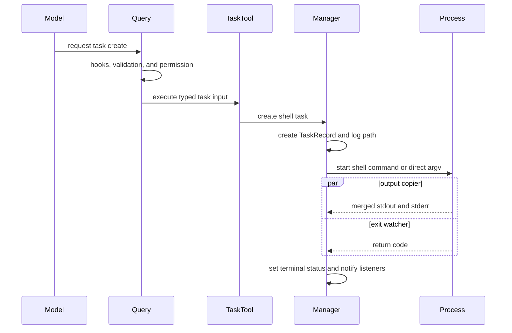
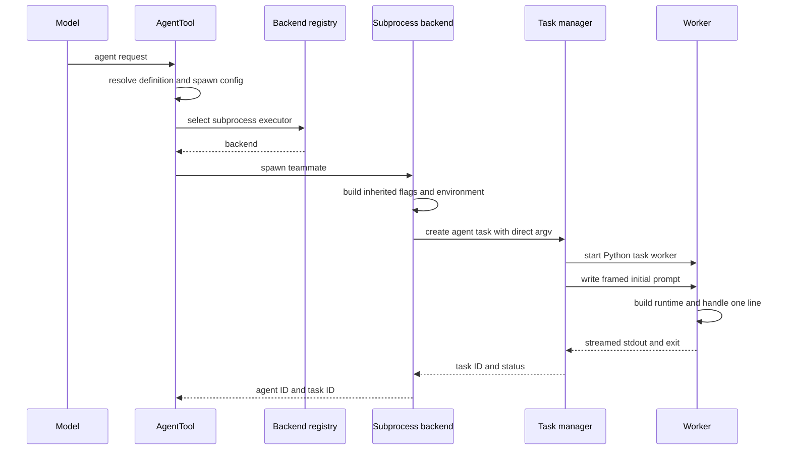

# Background tasks, agents, and swarm coordination

## Question answered

What happens when the model invokes `task_create`, `agent`, or `send_message`, and how are child
processes observed, restarted, stopped, and reported back to the parent conversation?

## Two related layers

- `tasks/` owns subprocess records, stdin/stdout, output files, status transitions, restart, and
  cleanup.
- `swarm/` owns teammate identity, backend selection, teams, mailboxes, permissions, and worktrees.

The model-facing `agent` tool currently chooses the subprocess swarm backend explicitly so the child
has a normal `BackgroundTaskManager` task ID that `task_get`, `task_output`, `task_stop`, and
`send_message` can use.

## Shell task path



Shell tasks are mutating model tools and therefore pass through the normal permission lifecycle
before creation. The task manager accepts either a shell-evaluated command or a direct argv list,
never both. Task-specific environment values are merged over the parent environment.

## Agent tool path



### Function-level spawn and observation sequence

1. `_execute_tool_call()` governs `TaskCreateTool.execute()` or `AgentTool.execute()` exactly like
   any other mutating model tool.
2. `TaskCreateTool.execute()` calls `BackgroundTaskManager.create_shell_task()`, which creates a
   `TaskRecord`, calls `_start_process()`, and owns `_copy_output()` plus `_watch_process()` tasks.
3. `AgentTool.execute()` resolves optional plugin `AgentDefinition` metadata, constructs
   `TeammateSpawnConfig`, and gets `SubprocessBackend` from the backend registry.
4. On the default path, `SubprocessBackend.spawn()` calls `build_inherited_cli_flags()` and
   `build_inherited_env_vars()`, then asks `BackgroundTaskManager.create_agent_task()` to launch a
   direct argv. `get_teammate_command()` may resolve a Python interpreter, in which case the argv
   includes `-m openharness --task-worker`, or an installed executable that receives
   `--task-worker` directly. A caller-supplied custom command keeps shell semantics and does not
   receive inherited environment injection.
5. `run_task_worker()` builds a normal runtime, reads one plain or JSON-framed line, calls
   `handle_line()`, writes selected stream events to stdout, and closes the runtime in `finally`.
6. `_watch_process()` waits for exit while `_copy_output()` drains merged output. It updates the
   record before `_notify_completion_listeners()` fires `subagent_stop` observers.
7. `TaskGetTool`, `TaskOutputTool`, and `TaskStopTool` read or mutate that same manager record.
   `SendMessageTool.execute()` uses `write_to_task()` for task IDs or
   `SubprocessBackend.send_message()` for `name@team` IDs.
8. `_ensure_writable_process()` calls `_restart_agent_task()` for a terminal agent task, but never
   for a plain shell task.

Agent definitions can contribute model, system prompt, permission hints, and other metadata. The
subprocess backend prefers a direct argv launch, avoiding shell quoting and Windows path translation
problems. A caller-provided custom command retains shell semantics and does not receive automatically
injected inherited environment variables.

The child command enters the same CLI through `python -m openharness --task-worker`. Worker mode
builds a normal runtime without the React UI, reads one plain or JSON-framed stdin line, calls
`handle_line()`, renders output to stdout, and exits. The task manager captures stdout/stderr in the
task log.

## Task records and lifecycle

`BackgroundTaskManager` keeps in-process dictionaries of `TaskRecord`, live processes, watcher
tasks, output/input locks, process generations, and completion listeners. The record contains ID,
type, status, cwd, command/argv, output path, timestamps, return code, environment additions, prompt,
and user-facing metadata.

Status transitions are:

```text
running → completed (exit 0)
running → failed    (nonzero exit)
running → killed    (task_stop)
terminal → running  (agent follow-up restart)
```

The watcher drains stdout concurrently with waiting for process exit, closes stdin, updates status,
and notifies listeners. Output reads return a bounded tail from the task log.

## Follow-up messages and restart semantics

`send_message` accepts either a task ID or `name@team` agent ID:

- plain task ID calls `BackgroundTaskManager.write_to_task()`;
- swarm agent ID asks the registered backend to send a structured `TeammateMessage`.

Messages to subprocess teammates are serialized as one JSON line. If a local-agent process has
already exited, the task manager restarts it from the stored command/argv, appends a restart notice,
increments metadata, and writes the new message. The prior model conversation is not preserved in
that new process; the task record explicitly notes that limitation.

Plain shell tasks cannot be restarted for input.

## Parent-session carry-over

The query loop records successful `agent` results in tool metadata (`async_agent_tasks` and activity
summaries). This metadata is whitelisted into session snapshots, enabling the parent to remember
pollable children across compaction/resume. Completion listeners fire the `subagent_stop` hook.

In coordinator print mode, the caller can wait for outstanding recorded agents, read their output,
and submit a final synthesis turn. Normal interactive users inspect tasks with slash commands or
model tools.

## Teams, mailboxes, and alternate backends

The swarm backend registry includes subprocess and in-process executors and contains pane-backend
detection for tmux/iTerm2-related flows. Auto-detection normally falls back to subprocess; the model's
current `agent` tool selects subprocess directly for task-tool compatibility.

Team registries map task IDs to named teams. In-process teammate messaging uses filesystem mailboxes;
subprocess messaging uses the task stdin path. Worktree and permission-sync modules provide further
coordination boundaries for team lifecycle. Do not assume every backend shares the same transport or
pollable task representation.

## Cleanup and failure behavior

- Spawn errors return an error `ToolResult`; the parent loop remains valid.
- `task_stop` sends terminate, waits briefly, then kills and marks the record.
- Cancellation/close kills tracked processes, closes stdin, and awaits watcher tasks.
- Direct argv and shell command paths stay distinct for portability and caller intent.
- Output is bounded when read into the parent/model context.
- A completion-listener failure is logged and does not corrupt task status.

## Where to change behavior

| Concern | Owner | Also inspect |
| --- | --- | --- |
| Model-facing task API | `src/openharness/tools/task_*_tool.py`, `src/openharness/tools/agent_tool.py` | permissions and query metadata |
| Process/status/log lifecycle | `src/openharness/tasks/manager.py` | platform/sandbox helpers |
| Child CLI command/inheritance | `src/openharness/swarm/subprocess_backend.py`, `src/openharness/swarm/spawn_utils.py` | CLI worker mode |
| Backend selection | `src/openharness/swarm/registry.py` | pollability and UI expectations |
| Messaging | `src/openharness/tools/send_message_tool.py`, selected backend, and mailbox | restart semantics |
| Team/worktree lifecycle | `src/openharness/swarm/team_lifecycle.py`, `src/openharness/swarm/registry.py`, `src/openharness/swarm/worktree.py` | cleanup and permissions |

## Source and symbol reference

| Boundary | File | Symbol |
| --- | --- | --- |
| Shell task model tool | `src/openharness/tools/task_create_tool.py` | `TaskCreateTool.execute()` |
| Agent model tool | `src/openharness/tools/agent_tool.py` | `AgentTool.execute()` |
| Records/process ownership | `src/openharness/tasks/manager.py` | `BackgroundTaskManager` |
| Process start/watch/output | `src/openharness/tasks/manager.py` | `_start_process()`, `_watch_process()`, `_copy_output()` |
| Agent restart/input | `src/openharness/tasks/manager.py` | `write_to_task()`, `_ensure_writable_process()`, `_restart_agent_task()` |
| Backend spawn/messaging | `src/openharness/swarm/subprocess_backend.py` | `SubprocessBackend.spawn()`, `send_message()`, `shutdown()` |
| Inherited child settings | `src/openharness/swarm/spawn_utils.py` | `build_inherited_cli_flags()`, `build_inherited_env_vars()` |
| Headless child runtime | `src/openharness/ui/app.py` | `run_task_worker()` |
| Follow-up routing | `src/openharness/tools/send_message_tool.py` | `SendMessageTool.execute()` |
| Parent carryover | `src/openharness/engine/query.py` | `_record_tool_carryover()` |
| Global cleanup | `src/openharness/tasks/manager.py` | `shutdown_task_manager()`, `BackgroundTaskManager.aclose()` |

## Verification map

- `tests/test_tasks/test_manager.py`: create, output, stop, stdin, restart, listeners, cleanup.
- `tests/test_tools/test_task_tools.py`: model-tool integration and pollability.
- `tests/test_swarm/test_subprocess_backend.py`: direct argv, inherited flags/env, portability.
- `tests/test_swarm/test_in_process.py`: in-process identities, mailboxes, shutdown.
- `tests/test_swarm/test_team_lifecycle.py`: teams and coordinated cleanup.
- `tests/test_ui/test_coordinator_drain.py`: waiting for child results before final synthesis.
- `tests/test_engine/test_query_engine.py`: async-agent carry-over metadata.
