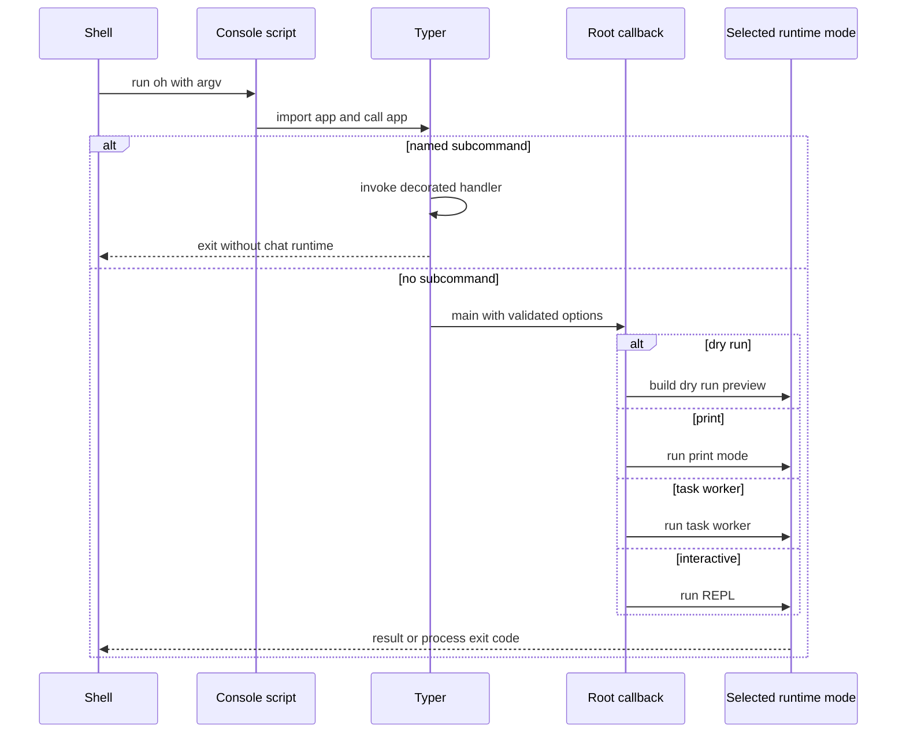

# How the `oh` command reaches `cli.py`

## Question answered

Why does typing `oh` call `src/openharness/cli.py`, and how does that turn into an interactive,
print, worker, or subcommand execution?

For task-oriented installation and usage, start with the [`oh` user guide](../../guides/OH_USER_GUIDE.md).
This document focuses on the implementation path.

## End-to-end path



## 1. Packaging declares the executable names

`pyproject.toml` maps four console-script names:

```toml
[project.scripts]
openharness = "openharness.cli:app"
oh = "openharness.cli:app"
openh = "openharness.cli:app"
ohmo = "ohmo.cli:app"
```

The value uses `module:object` syntax. Installing the `openharness-ai` distribution tells the Python
installer to generate an executable named `oh` that imports `app` from `openharness.cli` and calls
it. `openharness`, `oh`, and `openh` are aliases for the same object; `ohmo` points at its own Typer
application.

In a Unix virtual environment the generated launcher is conceptually:

```python
#!/path/to/venv/bin/python
from openharness.cli import app

raise SystemExit(app())
```

The launcher is generated state, not repository source. `uv run oh` resolves the project virtual
environment and runs this console script. In an activated environment, normal shell `PATH` lookup
finds `.venv/bin/oh`. Windows installers create launcher executables; `openh` exists partly because
PowerShell can resolve `oh` to its built-in `Out-Host` alias.

## 2. Typer owns argument parsing and dispatch

`src/openharness/cli.py` creates the root `typer.Typer` object with
`invoke_without_command=True`. It also creates nested applications for `mcp`, `plugin`, `auth`,
`provider`, `config`, `cron`, and `autopilot`, then attaches them with `app.add_typer()`.

Decorators register Python functions as command handlers:

```python
@app.command("setup")
def setup_cmd(...):
    ...

@provider_app.command("list")
def provider_list():
    ...
```

Consequently, `oh setup` selects `setup_cmd()`, while `oh provider list` first enters the provider
sub-application and then selects `provider_list()`. The root callback immediately returns when
`ctx.invoked_subcommand` is set, so a subcommand does not also launch a chat session.

## 3. The root callback selects a runtime mode

With no subcommand, Typer calls `main()` and passes validated option values. The callback performs
CLI-only work first: logging configuration, permission-mode override, theme persistence, dry-run
validation, and session lookup for `--continue` or `--resume`.

It then dispatches:

| Invocation | Selected path | Runtime behavior |
| --- | --- | --- |
| `oh --dry-run` | `_build_dry_run_preview()` | Resolves metadata without model/tool execution |
| `oh -p "prompt"` | `run_print_mode()` | Builds one runtime, handles one prompt, closes it |
| `oh --task-worker` | `run_task_worker()` | Reads one stdin message for a background agent |
| `oh` | `run_repl()` | Launches the React terminal by default |
| `oh --backend-only` | `run_repl(backend_only=True)` | Runs the Python backend protocol directly |

Typer is synchronous at this boundary, so `main()` uses `asyncio.run()` for asynchronous runtime
functions.

### Function-level dispatch sequence

1. The generated console wrapper imports `openharness.cli:app` from the mapping in
   `pyproject.toml` and calls the `Typer` object.
2. Typer parses argv and invokes `cli.main(ctx, ...)` because `app` was created with
   `invoke_without_command=True`.
3. `main()` returns immediately when `ctx.invoked_subcommand` is set. A nested application such as
   `provider_app` therefore owns `oh provider ...` without falling through into chat startup.
4. `_build_dry_run_preview()` is synchronous and never calls `build_runtime()`; it resolves and
   reports configuration metadata only.
5. `run_print_mode()`, `run_task_worker()`, and `run_repl()` are async boundaries entered through
   one `asyncio.run()` call. Print and worker modes build and close their runtime directly;
   interactive normal mode delegates runtime ownership to the backend host process.
6. `run_repl(backend_only=False)` launches the frontend. The frontend-generated backend command
   re-enters this same callback with `--backend-only`, and only that second invocation calls
   `run_backend_host()`.

The callback signature is wider than the currently forwarded runtime contract. In particular,
`--name`, `--verbose`, `--settings`, `--bare`, `--allowed-tools`, `--disallowed-tools`, and
`--mcp-config` are parsed but not consumed by the selected execution paths. Also,
`--append-system-prompt` affects dry-run preview assembly but is not forwarded by print or React
runtime construction. When adding or repairing a root option, trace it through the selected mode,
the React backend command when applicable, `build_runtime()`, and tests; presence in help output is
not evidence of effective behavior.

There is a second-level forwarding gap in print mode: `main()` passes `permission_mode` into
`run_print_mode()`, but `run_print_mode()` omits it from its `build_runtime()` call. Consequently
`--permission-mode` and the `--dangerously-skip-permissions` alias do not change the one-shot
runtime's effective mode; persisted settings still do. This differs from interactive backend
forwarding and must be tested per mode.

## 4. Interactive mode is a two-process path

`run_repl()` normally calls `launch_react_tui()`. The launcher:

1. Locates the packaged or repository `frontend/terminal` directory.
2. Installs Node dependencies if `node_modules` is absent.
3. Builds a backend command beginning with
   `python -m openharness --backend-only` plus the active CLI overrides.
4. Puts that command and frontend configuration in `OPENHARNESS_FRONTEND_CONFIG`.
5. Starts `tsx src/index.tsx` attached to the current terminal.

The React process then spawns the Python backend command. This means ordinary `oh` first enters
Python, starts the TypeScript UI, and the TypeScript UI starts a second Python process that owns the
actual runtime. See [Terminal UI protocol](TERMINAL_UI_PROTOCOL.md).

Saved `--continue` or `--resume` messages are loaded by the first process, but `run_repl()` does not
pass restore data into `launch_react_tui()` or `build_backend_command()`. The normal React path
therefore starts a fresh backend history. The in-session `/resume` command works because it loads
messages in the already-running backend. This is an argument-propagation gap at the process
boundary, not a session-storage failure.

## 5. `python -m openharness` is the alternate entrypoint

`src/openharness/__main__.py` imports the same `app` object and calls it. Therefore these reach the
same Typer application:

```bash
oh
openh
openharness
python -m openharness
```

Only the launch mechanism differs: installed console-script wrapper versus package `__main__.py`.

## Where to change behavior

| Change | Owning file | Also verify |
| --- | --- | --- |
| Add/rename installed command | `pyproject.toml` | wheel install and platform launchers |
| Add root option or top-level subcommand | `src/openharness/cli.py` | CLI help and entrypoint tests |
| Change interactive/print/worker selection | `src/openharness/cli.py`, `src/openharness/ui/app.py` | all three launch paths |
| Change React backend arguments | `src/openharness/ui/react_launcher.py` | backend host and TypeScript protocol |
| Change `python -m` behavior | `src/openharness/__main__.py` | direct module invocation |

## Source and symbol reference

| Stage | File | Symbol | Contract to preserve |
| --- | --- | --- | --- |
| Installed aliases | `pyproject.toml` | `[project.scripts]` | All three core aliases resolve to `openharness.cli:app` |
| Typer application | `src/openharness/cli.py` | `app` | `invoke_without_command=True` keeps no-subcommand startup valid |
| Root dispatch | `src/openharness/cli.py` | `main()` | Subcommand short-circuit, option validation, one event-loop owner |
| Static preview | `src/openharness/cli.py` | `_build_dry_run_preview()` | No model, tool, MCP connection, or subagent execution |
| Interactive selection | `src/openharness/ui/app.py` | `run_repl()` | Frontend versus backend recursion guard and exit propagation |
| Print worker | `src/openharness/ui/app.py` | `run_print_mode()` | Machine-safe stdout and runtime cleanup |
| Background worker | `src/openharness/ui/app.py` | `run_task_worker()` | One stdin request, no React process, deterministic shutdown |
| React launch | `src/openharness/ui/react_launcher.py` | `launch_react_tui()` | Packaged/dev asset lookup and child exit status |
| Backend argv | `src/openharness/ui/react_launcher.py` | `build_backend_command()` | Explicit option forwarding without logging secrets |
| Module entry | `src/openharness/__main__.py` | module body | `python -m openharness` calls the same Typer object |

## Verification map

- `tests/test_commands/test_cli.py`: Typer/dry-run and CLI behavior.
- `tests/test_entrypoints/`: top-level commands and import safety.
- `tests/test_ui/test_react_launcher.py`: backend command construction and mode selection.
- `tests/test_install/test_windows_alias.py`: Windows `openh` installation behavior.

Useful checks:

```bash
uv run oh --help
uv run oh --dry-run --output-format json
uv run python -m openharness --help
uv run pytest -q tests/test_entrypoints tests/test_commands/test_cli.py tests/test_ui/test_react_launcher.py
```
