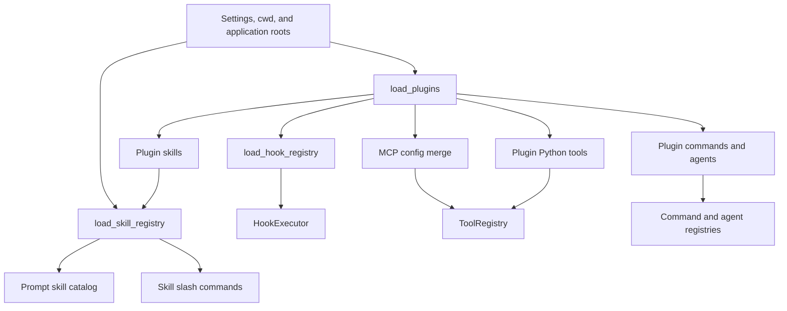

# Skills, plugins, commands, hooks, and tool discovery

## Question answered

Which extension definitions are visible in a session, in what order do they load, and when do they
become prompt text, slash commands, tools, hooks, agents, or MCP servers?

## Extension assembly overview

### Function-level discovery sequence

1. `build_runtime()` normalizes application-provided roots and calls
   `load_plugins(settings, cwd, extra_roots=...)` exactly once for initial assembly.
2. `discover_plugin_paths_for_settings()` combines user roots, opt-in project roots, and explicit
   application roots; `load_plugin()` parses a manifest and each contribution directory.
3. `_load_plugin_tools()` imports Python modules only for enabled plugins and instantiates public
   `BaseTool` subclasses. This is executable code and therefore part of the project-plugin trust
   boundary.
4. `load_skill_registry()` registers bundled, user, extra, project, then enabled-plugin skills.
   Each `SkillRegistry.register()` updates every lookup key, making the last definition win.
5. `load_hook_registry(settings, plugins)` normalizes settings hooks first and plugin hooks after
   them; `HookRegistry.register()` preserves insertion, while `HookRegistry.get()` returns hooks by
   descending priority with stable order for ties.
6. `load_mcp_server_configs()` copies settings servers and adds enabled plugin servers under a
   `<plugin>:<server>` key with `setdefault()`.
7. `create_default_tool_registry()` installs built-ins and MCP adapters; `build_runtime()` then
   registers enabled plugin tools, so plugin tool names can replace prior names.
8. `create_default_command_registry(plugin_commands=...)` installs built-ins, user-invocable skill
   commands, and enabled plugin commands. `AgentTool.execute()` separately resolves agent
   definitions from the current plugin set.

## Skills: discovery and precedence

`load_skill_registry()` registers definitions in this order:

1. Runtime-bundled skills.
2. User skills from the OpenHarness config root and compatibility roots under `~/.claude/skills`
   and `~/.agents/skills`.
3. Application-provided extra skill directories, such as an `ohmo` workspace.
4. Project directories from Git root toward cwd (`.openharness/skills`, `.agents/skills`,
   `.claude/skills`) when project skills are enabled.
5. Skills contributed by enabled plugins.

`SkillRegistry.register()` assigns all available keys (name, command name, display name, aliases) to
the latest definition. Later sources and directories therefore override earlier definitions.
Project discovery walks upward to the Git root, or to the user's home when no Git root is found,
and rejects absolute or `..` configured paths.

The system prompt lists skills whose `disable-model-invocation` is false. The model loads full skill
content by calling the `skill` tool. A `user-invocable` skill is also resolved as `/<folder-name>`;
its frontmatter can select a temporary model and provide an argument hint.

## Plugins: discovery and trust

Plugin paths are discovered from:

- the user plugin directory under the OpenHarness config root;
- `.openharness/plugins` in the current project only when `allow_project_plugins=true`;
- explicit application roots, such as an `ohmo` workspace.

The loader accepts `plugin.json` or `.claude-plugin/plugin.json`. `enabled_plugins` overrides the
manifest's `enabled_by_default`. A loaded plugin can describe skills, commands, agent definitions,
hooks, MCP servers, and Python tools.

The trust boundary is important: project plugin Python files, command hooks, and stdio MCP servers
can execute code. Project plugins remain undiscovered by the active runtime unless the user opts in.
Do not bypass that check merely to make a project extension appear.

## Where each plugin contribution goes

| Contribution | Loaded by | Runtime destination |
| --- | --- | --- |
| Skills | plugin loader + skill registry | system prompt catalog and `skill`/slash resolution |
| Commands | plugin loader | root command registry, namespaced by plugin/path |
| Agents | plugin loader | agent-definition lookup used by `agent` tool |
| Hooks | plugin loader + hook registry | `HookExecutor` lifecycle/tool events |
| MCP servers | MCP config merge | `McpClientManager`, namespaced `<plugin>:<server>` |
| Python tools | dynamic module loader | `ToolRegistry` after built-ins/MCP |

Python tool files are loaded only for enabled plugins. Each public `BaseTool` subclass with required
metadata is instantiated without constructor arguments. Import/constructor failures are logged at
debug level and skipped, so optional dependencies should fail with clear diagnostics in their own
module or tests.

## Hook loading and hot refresh

Hooks originate in settings and plugin hook files. The hook registry normalizes event names and
orders entries by descending priority while preserving registration order for ties. The runtime
constructs one `HookExecutor` and, for normal sessions, `handle_line()` refreshes its registry before
each line. This permits settings/plugin hook changes without rebuilding the provider client.

Supported events include session start/end, user prompt submission, pre/post tool use, pre/post
compact, notification, stop, and subagent stop. Only pre-tool aggregated results currently block a
tool invocation.

## Commands versus model tools

Slash commands run locally before the model loop. A handler returns `CommandResult`, which may print
text, change state, rebuild a client, submit a generated prompt, or continue pending tool results.
Plugin commands and skill commands are instruction templates; they do not bypass normal model/tool
permissions when they submit work.

Model tools are serialized in every provider request. Adding a plugin command does not create a
model-callable tool, and adding a skill does not execute code by itself. Keep these surfaces distinct
when diagnosing “extension loaded but not invoked.”

Agent definitions have a narrower current path than the other plugin contributions.
`AgentTool.execute()` calls `coordinator.agent_definitions.get_agent_definition()`, whose lazy plugin
load uses persisted settings plus `os.getcwd()` but does not receive the runtime's
`extra_plugin_roots`. User plugins and trusted project plugins can therefore contribute agents,
while an application-only extra root (for example an ohmo workspace plugin root) is not guaranteed
to participate in agent lookup. This is a current integration gap, not intended precedence.

## Application extra roots

`build_runtime()` accepts `extra_skill_dirs` and `extra_plugin_roots`. Plain OpenHarness normally
uses none. `ohmo` supplies workspace skill and plugin directories, so personal extensions join the
same registries without moving them into project or user-global locations.

Extra plugin roots are treated as application-authorized roots. The caller, not project discovery,
owns their trust decision.

## Failure and collision behavior

- Invalid plugin manifests are skipped.
- Disabled plugins can expose parsed metadata to management views but do not load Python tools.
- Unsafe project skill paths are ignored.
- Later skill keys replace earlier keys.
- Later tool registration replaces a same-name tool.
- Plugin MCP servers are namespaced; settings servers are not overwritten by plugin merge.
- A malformed hook/command/agent file may be skipped or fail its focused loader path; test optional
  formats before relying on them.

## Source and symbol reference

| Extension surface | File | Symbol |
| --- | --- | --- |
| Plugin root policy | `src/openharness/plugins/loader.py` | `discover_plugin_paths_for_settings()` |
| Manifest and contributions | `src/openharness/plugins/loader.py` | `load_plugins()`, `load_plugin()` |
| Plugin Python imports | `src/openharness/plugins/loader.py` | `_load_plugin_tools()` |
| Skill precedence | `src/openharness/skills/loader.py` | `load_skill_registry()`, `discover_project_skill_dirs()` |
| Skill key collision | `src/openharness/skills/registry.py` | `SkillRegistry.register()` |
| Hook normalization/order | `src/openharness/hooks/loader.py` | `load_hook_registry()`, `HookRegistry.register()`, `HookRegistry.get()` |
| MCP namespacing | `src/openharness/mcp/config.py` | `load_mcp_server_configs()` |
| Built-in/MCP tools | `src/openharness/tools/__init__.py` | `create_default_tool_registry()` |
| Slash commands | `src/openharness/commands/registry.py` | `create_default_command_registry()`, `lookup_skill_slash_command()` |
| Model-selected skills | `src/openharness/tools/skill_tool.py` | `SkillTool.execute()` |
| Agent definitions | `src/openharness/coordinator/agent_definitions.py`, `tools/agent_tool.py` | `get_all_agent_definitions()`, `get_agent_definition()`, `AgentTool.execute()` |
| Runtime assembly and refresh | `src/openharness/ui/runtime.py` | `build_runtime()`, `handle_line()` |

## Verification map

- `tests/test_skills/test_loader.py`: roots, precedence, metadata, and project safety.
- `tests/test_plugins/test_loader.py`: manifest contributions and enablement.
- `tests/test_plugins/test_lifecycle_flow.py`: installed plugin through skills and MCP execution.
- `tests/test_ui/test_project_plugin_security.py`: default-deny project trust.
- `tests/test_hooks/`: loading, priority, matching, blocking, and execution.
- `tests/test_commands/test_registry.py`: plugin/skill slash command submission.
- `tests/test_ui/test_runtime_plugin_tools.py`: plugin tools in a complete runtime.
