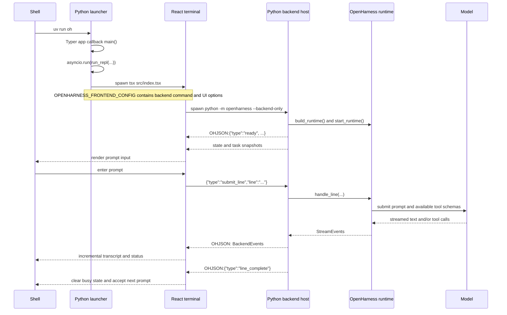
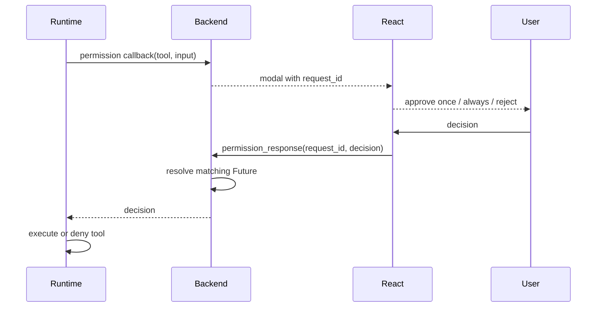

# Interactive `uv run oh`: frontend/backend end-to-end flow

This guide follows the default interactive path from the shell command `uv run oh` to a rendered
answer in the React terminal UI. It is the deep-dive companion to the shorter
[terminal UI protocol overview](TERMINAL_UI_PROTOCOL.md).

The most important fact is that `uv run oh` does not replace Python with TypeScript. It starts a
Python launcher, which starts a TypeScript/React frontend, which starts a second Python process as
the backend. The two long-lived UI processes exchange newline-delimited JSON over the backend's
standard input and output.

## Process model

| Process | Entrypoint | Responsibility |
| --- | --- | --- |
| Initial Python process | `oh = openharness.cli:app` | Resolve CLI options and launch the terminal frontend |
| TypeScript process | `frontend/terminal/src/index.tsx` | Own the terminal, render React, collect user input, and present events |
| Backend Python process | `python -m openharness --backend-only` | Build and own the runtime, execute commands/prompts, and persist state |

The React process is a view and input controller. The backend runtime remains the source of truth
for the conversation, tools, permissions, tasks, session state, and shutdown.

## Complete launch and prompt sequence



## 1. `uv` resolves `oh` to the Typer application

`uv run oh` runs the console script declared in `pyproject.toml`:

```toml
[project.scripts]
oh = "openharness.cli:app"
```

The generated console-script launcher imports the `app` object from `openharness.cli` and invokes
it as a callable (`app()`). There is no `def app` in this module: `app` is a `typer.Typer` instance,
and `Typer.__call__` hands control to Click/Typer's command dispatcher. Typer then invokes the
callback named `main`, which is decorated with `@app.callback(invoke_without_command=True)`.

If a subcommand was selected, `main` returns after Typer dispatches it. With no subcommand, the
callback reaches the default interactive path and calls `asyncio.run(run_repl(...))`.

See [CLI entrypoints](CLI_ENTRYPOINTS.md) for the command registration details.

## 2. The first Python process launches the React terminal

`run_repl` in `src/openharness/ui/app.py` has two modes:

- Normal mode calls `launch_react_tui`.
- `--backend-only` mode calls `run_backend_host` instead.

The normal launcher locates the frontend in the installed package's `_frontend` directory or, in
a source checkout, `frontend/terminal`. It resolves `tsx` from local dependencies, a global binary,
or `npm exec`. A source checkout without `node_modules` is bootstrapped with `npm install`.

The launcher constructs a backend command beginning with:

```text
<current-python> -m openharness --backend-only
```

It appends the applicable working-directory, model, effort, provider, prompt, and permission
options. It then serializes that command and frontend options into `OPENHARNESS_FRONTEND_CONFIG`
and starts `tsx src/index.tsx` with the user's terminal attached.

The launcher waits for the React process. A nonzero frontend exit becomes the launcher's exit code.

## 3. `index.tsx` takes ownership of the terminal

`frontend/terminal/src/index.tsx` parses `OPENHARNESS_FRONTEND_CONFIG`, establishes raw terminal
input, and renders `<App config={config}>`. If inherited stdin is not a TTY, it can fall back to
`/dev/tty`.

Its exit and signal handlers restore the cursor and terminal line state. This matters because a
crashed or interrupted raw-mode program can otherwise leave the shell looking frozen or hide the
cursor.

## 4. React starts the backend Python process

`App` uses `useBackendSession`, which spawns the configured backend command with:

- piped stdin for frontend requests;
- piped stdout for backend protocol events;
- inherited stderr for diagnostics;
- a separate POSIX process group where supported, so cleanup can terminate descendants.

This second Python invocation enters the same Typer callback. The `--backend-only` flag makes
`run_repl` select `run_backend_host`, avoiding a recursive frontend launch.

## 5. The backend builds the authoritative runtime

`ReactBackendHost.run` calls `build_runtime`, supplying callbacks for permission decisions, edit
approval, and user questions. It then starts the runtime and emits `ready`, state, and task
snapshots.

The React input remains disabled until `ready` arrives. Runtime construction and ownership are
covered in [runtime bootstrap](RUNTIME_BOOTSTRAP.md).

## 6. Requests travel as one JSON object per line

React writes a serialized `FrontendRequest` followed by a newline to backend stdin. Common request
types are:

| Request | Purpose |
| --- | --- |
| `submit_line` | Submit text plus optional base64 images |
| `permission_response` | Approve or deny a pending tool |
| `question_response` | Answer a question requested by the runtime |
| `list_sessions` | Populate a resume-session selector |
| `select_command` / `apply_select_command` | Drive interactive slash-command selection |
| `interrupt` | Cancel the active line without terminating the session |
| `shutdown` | Close the backend host |

The backend request reader validates every line with the Pydantic protocol model. Modal responses
are matched by request ID and resolve their awaiting futures immediately. Submit and control
requests enter the host's processing queue.

## 7. `App` decides whether input is local UI work or backend work

For an ordinary prompt, `App.onSubmit` sends `submit_line` and marks the interface busy. It rejects
blank input, duplicate submission while busy, and submission before the backend is ready.

Some commands need terminal-specific selection UI. For example, `/resume` and selectable commands
first ask the backend for choices, render a selector, and then submit the selected result. All
actual runtime mutation still occurs in Python.

Images are validated and encoded in the frontend. The backend reconstructs a conversation message
containing a `TextBlock` and `ImageBlock` values before passing it to the runtime.

## 8. The backend turns a submitted line into runtime events

`ReactBackendHost._process_line` first emits the user's transcript item. It calls the shared
`handle_line` path used by other OpenHarness interfaces and converts the resulting `StreamEvent`
objects into protocol events.

The backend writes each event under a reserved prefix:

```text
OHJSON:{"type":"assistant_delta","text":"..."}
```

Only stdout lines beginning with `OHJSON:` are parsed as protocol messages. Other backend stdout
is preserved as a log transcript item. Keeping diagnostics on stderr or outside the prefix prevents
an incidental print from corrupting the protocol.

Important backend events include:

| Event | Frontend effect |
| --- | --- |
| `assistant_delta` | Append streamed text to the current assistant message |
| `assistant_complete` | Finish that assistant message, but keep the turn busy |
| `tool_started` / `tool_completed` | Render tool activity and results |
| `compact_progress` | Show compaction status |
| `state_snapshot` / `tasks_snapshot` | Refresh authoritative runtime state |
| `modal` / `select` | Open an interactive decision surface |
| `error` | Render a failure |
| `line_complete` | End the complete agent turn and clear busy state |

`assistant_complete` deliberately does not end the spinner: a model message can be followed by one
or more tool calls and another model turn. `line_complete` is the sole end-of-line signal.

To reduce terminal render churn, assistant deltas and transcript events are buffered briefly before
being committed to React state.

## 9. Permissions and questions make a round trip without deadlocking the prompt



Permission and edit-approval prompts are serialized with a backend lock, preventing overlapping
modals. They time out as denied after 300 seconds. “Always” edit approval is remembered for the
backend session. Runtime questions use the same request-ID/future pattern.

This direct future resolution is important: modal responses do not wait behind the still-running
prompt that is blocked on the answer.

## 10. Interrupt and shutdown are different operations

While busy, Escape or Ctrl-C sends `interrupt`. The backend cancels only the active request, emits
an interrupted transcript/status plus `line_complete`, and remains ready for another prompt.

While idle, Ctrl-C sends `shutdown` and exits the frontend. Frontend cleanup terminates the backend
process or process group if it is still alive. Backend EOF also initiates shutdown. In every backend
exit path, the runtime is closed so clients, MCP connections, tasks, and persistence hooks can
finish cleanup.

## 11. Session persistence remains backend-owned

The frontend transcript is presentation state, not the durable conversation record. After a line,
the runtime snapshots the sanitized conversation and approved metadata. Resuming reconstructs fresh
clients, tools, and hooks around that saved state. See
[prompt, memory, tools, and compaction end to end](PROMPT_MEMORY_TOOLS_COMPACTION_E2E.md).

## Ownership and debugging map

| If the failure is... | Start at |
| --- | --- |
| `oh` does not enter interactive mode | `pyproject.toml`, `src/openharness/cli.py` |
| `tsx` or frontend assets are not found | `src/openharness/ui/react_launcher.py` |
| Terminal raw mode, key handling, or rendering is wrong | `frontend/terminal/src/index.tsx`, `App.tsx` |
| Backend never becomes ready | `src/openharness/ui/backend_host.py`, `ui/runtime.py` |
| A request or event is rejected | `src/openharness/ui/protocol.py`, `useBackendSession.ts` |
| A prompt runs but its tools or memory are wrong | `src/openharness/engine/`, `src/openharness/memory/` |
| Exit leaves a child process or broken terminal | `react_launcher.py`, `useBackendSession.ts`, `index.tsx` |

## Source and test map

Primary source:

- `pyproject.toml`
- `src/openharness/cli.py`
- `src/openharness/ui/app.py`
- `src/openharness/ui/react_launcher.py`
- `src/openharness/ui/backend_host.py`
- `src/openharness/ui/protocol.py`
- `src/openharness/ui/runtime.py`
- `frontend/terminal/src/index.tsx`
- `frontend/terminal/src/App.tsx`
- `frontend/terminal/src/hooks/useBackendSession.ts`

Focused verification:

```bash
uv run pytest -q tests/test_ui/test_react_launcher.py tests/test_ui/test_react_backend.py
cd frontend/terminal && npx tsc --noEmit
```

The launcher tests verify default frontend dispatch and backend flags. Backend tests cover request
validation, image conversion, commands, permissions, edit approval, interruption and recovery, and
event output. Frontend type checking guards the shared protocol consumers; terminal exit-sequence
tests cover cursor, newline, and signal cleanup.
