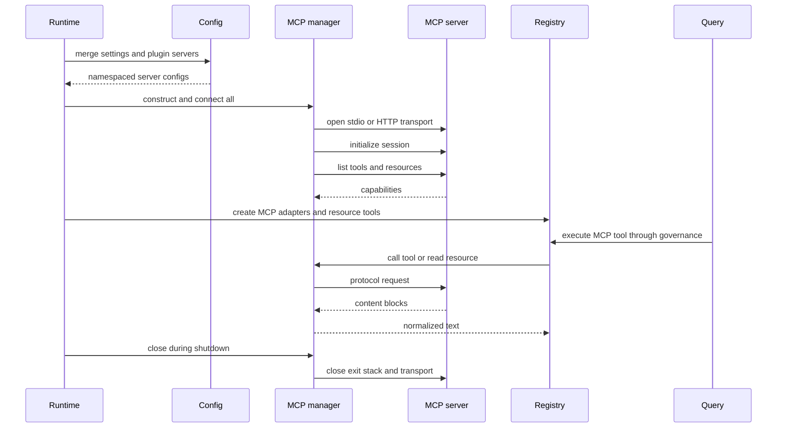

# MCP integration lifecycle

## Question answered

How does an MCP server configuration become a connected session, a model-visible tool, or a readable
resource during prompt handling?

## End-to-end lifecycle



### Function-level connection and invocation sequence

1. `build_runtime()` calls `load_mcp_server_configs(settings, plugins)` and constructs
   `McpClientManager` with the merged mapping.
2. `McpClientManager.connect_all()` iterates each config independently and dispatches to
   `_connect_stdio()` or `_connect_http()`; unsupported union members become failed statuses.
3. Each transport helper owns an `AsyncExitStack`, creates an MCP SDK `ClientSession`, calls
   `initialize()`, and delegates capability normalization to `_register_connected_session()`.
4. `_register_connected_session()` requires `session.list_tools()`. It tolerates the protocol's
   method-not-found response for `list_resources()` so tool-only servers remain connected.
5. `create_default_tool_registry(mcp_manager)` reads `list_tools()` and creates one
   `McpToolAdapter` per capability, plus `ListMcpResourcesTool` and `ReadMcpResourceTool`.
6. Normal `_execute_tool_call()` governance validates the dynamically generated input model before
   `McpToolAdapter.execute()` calls `McpClientManager.call_tool()`.
7. Resource reads call `McpClientManager.read_resource()` explicitly; resources are never silently
   inserted into the prompt.
8. `close_runtime()` awaits `McpClientManager.close()`, which closes every retained exit stack and
   clears session/stack maps.

## 1. Configuration sources and precedence

`load_mcp_server_configs(settings, plugins)` begins with `settings.mcp_servers`. For each enabled
plugin, it adds definitions using `<plugin-name>:<server-name>` and `setdefault()`. A plugin therefore
cannot overwrite a same-named settings entry, and namespacing avoids collisions between plugins.

The Pydantic configuration union declares stdio, HTTP, and WebSocket shapes. In the current manager
implementation, `connect_all()` actively supports stdio and streamable HTTP. Other configured types,
including WebSocket, receive a failed status stating that the transport is unsupported in the current
build; do not document configuration acceptance as proven runtime connectivity.

Project-local plugins are excluded unless `allow_project_plugins=true`. This prevents an untrusted
workspace from silently launching a plugin-provided stdio process.

## 2. Connection and capability discovery

For each stdio server, the manager creates `StdioServerParameters` from command, args, env, and cwd,
then enters the MCP stdio client context. For HTTP it creates an `httpx.AsyncClient` with configured
headers and enters the streamable HTTP context.

Both paths create an MCP `ClientSession`, call `initialize()`, then discover capabilities:

- `list_tools()` is required for a successful connection;
- `list_resources()` is attempted, but “Method not found” is accepted for tool-only servers;
- tool JSON schemas and resource metadata are normalized into OpenHarness dataclasses;
- live sessions and transport exit stacks are retained by server name;
- status changes from `pending` to `connected` with tool/resource inventories.

Connection failures are caught per server, their partially opened stacks are closed best-effort, and
the status becomes `failed`. One unavailable server does not prevent other servers or built-ins from
loading.

## 3. Tool adaptation

During registry creation, each discovered MCP tool becomes `McpToolAdapter`:

```text
MCP server "github", tool "search_issues"
        → OpenHarness tool "mcp__github__search_issues"
```

Server/tool segments are sanitized for stable model-facing names. The adapter dynamically constructs
a Pydantic model from the MCP JSON Schema, preserving required versus optional fields and mapping
basic JSON types. Its execution dumps validated arguments without `None` optionals and calls:

```python
manager.call_tool(server_name, original_tool_name, arguments)
```

Because it is a normal `BaseTool`, MCP invocation passes through pre-tool hooks, registry lookup,
Pydantic validation, permission policy, stream events, output bounding, post-tool hooks, and
tool-result replay. MCP adapters are not marked read-only by default, because the remote operation's
effects cannot be inferred safely from its name.

## 4. Resources are explicit tool calls

Resources are not injected automatically into the system prompt. The model receives two built-ins:

- `list_mcp_resources`: returns the discovered server/name/URI inventory;
- `read_mcp_resource`: validates server and URI, then calls `manager.read_resource()`.

The latter joins text content or blob representations into a normal `ToolResult`, which returns to
the model through the same query loop.

## 5. Runtime status, auth, and reconnect

`RuntimeBundle.mcp_summary()` and UI state expose server state, transport, auth presence, and counts.
The `/mcp` command reads this status. `mcp_auth` or `/mcp auth` updates persisted HTTP headers or
stdio environment values and can update/reconnect the active manager.

The top-level `oh mcp list` management command currently assumes each loaded config is a dictionary
and calls `.get()`, while `load_settings()` materializes typed Pydantic config models. It can raise
`AttributeError` even when runtime MCP configuration is valid. Use `oh config show` and in-session
`/mcp` while diagnosing this known CLI presentation defect; do not treat it as connection evidence.

Credentials must be redacted from configuration displays and diagnostics. `auth_configured` is a
boolean signal; it must not contain actual header/env values.

`reconnect_all()` closes current sessions, resets statuses to pending, and reconnects from the
manager's current configuration. Calls against missing/disconnected sessions raise
`McpServerNotConnectedError`, which the adapter converts to an error `ToolResult`.

## 6. Shutdown and failure behavior

`close_runtime()` calls `mcp_manager.close()`. The manager closes every `AsyncExitStack`, suppresses
expected close/cancellation runtime errors, and clears stacks and sessions. A runtime must not leave
stdio child processes or HTTP sessions alive after shutdown.

Call and resource-read exceptions are normalized as “server not connected/call failed” errors. Tool
result stringification handles text blocks, non-text JSON, structured content, and empty output.

## Where to change behavior

| Concern | Owner | Also inspect |
| --- | --- | --- |
| Config shape | `src/openharness/mcp/types.py`, settings schema | CLI/config redaction and tests |
| Config/plugin merge | `src/openharness/mcp/config.py` | project plugin trust and namespacing |
| Transport/session lifecycle | `src/openharness/mcp/client.py` | cleanup, reconnect, real flow tests |
| Model tool schema/name | `src/openharness/tools/mcp_tool.py` | provider schema conversion and permissions |
| Resource operations | `src/openharness/tools/list_mcp_resources_tool.py`, `src/openharness/tools/read_mcp_resource_tool.py` | manager status and error mapping |
| Runtime registration | `src/openharness/tools/__init__.py`, `src/openharness/ui/runtime.py` | failed/connected server combinations |

## Source and symbol reference

| Boundary | File | Symbol |
| --- | --- | --- |
| Typed transport configs | `src/openharness/mcp/types.py` | `McpStdioServerConfig`, `McpHttpServerConfig`, `McpWebSocketServerConfig` |
| Settings/plugin merge | `src/openharness/mcp/config.py` | `load_mcp_server_configs()` |
| Connection owner | `src/openharness/mcp/client.py` | `McpClientManager.connect_all()`, `_connect_stdio()`, `_connect_http()` |
| Capability registration | `src/openharness/mcp/client.py` | `_register_connected_session()`, `list_tools()`, `list_resources()` |
| Runtime invocation | `src/openharness/mcp/client.py` | `call_tool()`, `read_resource()`, `reconnect_all()`, `close()` |
| Dynamic tool adapter | `src/openharness/tools/mcp_tool.py` | `McpToolAdapter`, `_input_model_from_schema()` |
| Resource inventory | `src/openharness/tools/list_mcp_resources_tool.py` | `ListMcpResourcesTool.execute()` |
| Resource read | `src/openharness/tools/read_mcp_resource_tool.py` | `ReadMcpResourceTool.execute()` |
| Auth mutation/reconnect | `src/openharness/tools/mcp_auth_tool.py` | `McpAuthTool.execute()` |
| Composition | `src/openharness/ui/runtime.py` | `build_runtime()`, `close_runtime()` |

## Verification map

- `tests/test_mcp/test_stdio_flow.py`: real local stdio connect/discover/call/read/close.
- `tests/test_mcp/test_http_flow.py`: in-process HTTP server, headers, tools, and resources.
- `tests/test_mcp/test_client_errors.py`: disconnected and transport failures.
- `tests/test_mcp/test_integration.py`: manager/registry integration.
- `tests/test_tools/test_mcp_tool.py`: JSON Schema-to-Pydantic mapping.
- `tests/test_tools/test_mcp_auth_tool.py`: active auth update/reconnect.
- `tests/test_plugins/test_lifecycle_flow.py`: plugin MCP namespacing and execution.
- `tests/test_ui/test_project_plugin_security.py`: project stdio server trust boundary.
