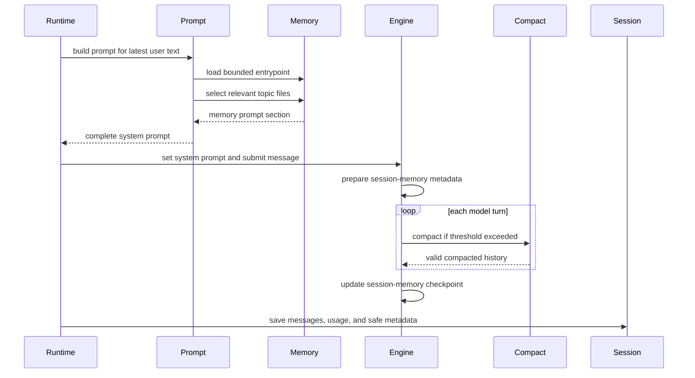

# Memory, sessions, and compaction

## Question answered

When a prompt is handled, which “memory” is read, which state is persisted, and how does context
compaction preserve a long-running task?

OpenHarness has several related but distinct state layers. Treating them as one memory system causes
the most common maintenance mistakes.

For the complete path from prompt ingestion through tool-result replay and post-turn persistence,
see [Prompt, memory, tools, and compaction end to end](PROMPT_MEMORY_TOOLS_COMPACTION_E2E.md).

## State layers

| Layer | Purpose | Lifetime | Primary owner |
| --- | --- | --- | --- |
| Conversation messages | Provider-visible user/assistant/tool history | Current/restored session | `QueryEngine` |
| Tool carry-over metadata | Goals, files, skills, agents, checkpoints | Current/restored session | query loop + session storage |
| Session snapshot | Resume/export record of messages, usage, prompt, metadata | Across process restarts | `SessionBackend` |
| Session memory file | Compact task-state checkpoint used during compaction | Across turns/session work | `src/openharness/services/session_memory/__init__.py` |
| Project durable memory | Reusable repository knowledge and index | Across sessions for a project | `memory/` |
| Personalization rules | Best-effort local environment preferences | Across sessions | `personalization/` |
| Auto-dream output | Optional consolidated durable memory | Across sessions | `src/openharness/services/autodream/` |

## Prompt-time read path



### Function-level state sequence

1. `handle_line()` calls `build_runtime_system_prompt(settings, latest_user_prompt=...)` for every
   ordinary line and command-generated prompt.
2. `build_runtime_system_prompt()` calls `load_memory_prompt()` when project memory is enabled.
   That function bounds `MEMORY.md`, calls `select_relevant_memories()` for topic files, and updates
   selected-entry usage metadata best-effort.
3. `QueryEngine.submit_message()` calls `_prepare_session_memory()`, which delegates to
   `prepare_session_memory_metadata()` and attaches a checkpoint path/status to tool carryover.
4. `run_query()` calls `auto_compact_if_needed()` before every provider request. The compactor may
   call `microcompact_messages()` and then model-backed compaction before returning a replacement
   list that preserves tool-use/result pairing.
5. `submit_message()`'s `finally` calls `_update_session_memory()`, which delegates to
   `update_session_memory_file()` even when the streamed turn is cancelled or errors.
6. `handle_line()` calls the active `SessionBackend.save_snapshot()` after normal completion and in
   its max-turn path. The default backend delegates to `save_session_snapshot()`.

Project memory is therefore not appended as a chat message. It is rebuilt into the system prompt
for the latest user request. `MEMORY.md` is always bounded by configured line/byte limits, while
topic files are scanned and relevance-selected using the latest prompt. Selected entries have usage
metadata updated best-effort.

The default project memory root is derived from the resolved project path:

```text
OPENHARNESS_DATA_DIR/memory/<project-name>-<sha1-prefix>/
├── MEMORY.md
└── <topic>.md
```

The path hash prevents projects with the same basename from sharing memory accidentally.

## Durable memory writes

The `/memory` command uses a `MemoryCommandBackend`. Plain OpenHarness uses the project memory
functions; `ohmo` injects a workspace-specific backend. An entry is Markdown with YAML frontmatter
including schema version, stable ID, type/scope/category, signature, timestamps, and lifecycle flags.

Writes use a file lock plus atomic replacement. Duplicate content signatures refresh an existing
entry instead of creating another file. Removal is a soft delete (`disabled: true`) and removes the
index reference. The migration command can dry-run or apply schema normalization with backup.

When `memory.auto_extract_enabled` is true, `QueryEngine` asks the configured provider to extract a
bounded set of durable records after a turn. Extraction failure is stored in tool metadata and does
not fail the user turn. Auto-dream is separately scheduled after the turn when enabled.

## Session-memory checkpoints

Before query execution, `_prepare_session_memory()` exposes file-backed session-memory metadata to
compaction. After query execution, `_update_session_memory()` writes an updated task checkpoint from
messages and tool carry-over state. This checkpoint is designed to preserve active goal, artifacts,
verified work, and next-step context when older conversation content must be summarized.

Session memory is controlled by both `memory.enabled` and `memory.session_memory_enabled`. It is not
the same as the resumable JSON session snapshot.

## Compaction inside the query loop

At the start of every model turn, `run_query()` calls `auto_compact_if_needed()`:

1. Estimate the current request size using messages, system prompt, and configured context window.
2. If under threshold, keep history unchanged.
3. If over threshold, first microcompact eligible old tool-result payloads.
4. If still over threshold, summarize older messages with the provider while retaining recent turns
   and carry-over checkpoints.
5. Emit `CompactProgressEvent` updates for UI/gateway consumers.
6. Replace the loop's message list with the compacted list.

If the provider still returns a context-length error, the loop performs one forced reactive
compaction and retries when compaction changed the history. Pre/post compact hooks surround the
compaction lifecycle.

Tool outputs also have an earlier pressure valve: oversized results are written to an artifact and a
bounded reference is placed in conversation history.

## Session snapshot write path

After a handled prompt, command-submitted prompt, continuation, or max-turn stop, `handle_line()`
calls the configured `SessionBackend.save_snapshot()` with:

- resolved cwd, model, and the system prompt used;
- sanitized messages;
- cumulative usage;
- stable session ID;
- a whitelist of JSON-safe carry-over metadata.

The default backend writes both `latest.json` and `session-<id>.json` under a project-hashed session
directory. Live objects such as MCP managers, hook executors, and callbacks are intentionally not
persisted. Only keys required for safe continuation are selected and recursively sanitized.

## Resume path

`oh --continue` loads `latest.json`; `oh --resume <id>` loads a named snapshot. The CLI passes saved
messages and tool metadata into `run_repl()`. When that invocation is already in backend-only mode,
`build_runtime()` validates/sanitizes messages, overlays restored metadata onto current defaults,
and builds fresh live resources (client, MCP, hooks, tools). Persisted runtime objects are never
trusted as live dependencies.

`QueryEngine.has_pending_continuation()` detects history ending in user-role tool results after an
assistant tool request. `/continue` re-enters `run_query()` without adding a new user message.

There is a current process-boundary exception: top-level `oh --continue` and `oh --resume` load
snapshot data in `cli.main()`, but the normal React `run_repl()` branch does not pass restore data to
the backend command. The in-session `/resume` handler loads through `SessionBackend` inside the live
backend and works. Do not diagnose this known React handoff gap as corrupted snapshot storage.

## `ohmo` differences

`ohmo` uses `OhmoSessionBackend` rooted in its workspace. Gateway snapshots are additionally indexed
by a hash of the chat/thread session key so the runtime pool can restore the correct conversation.
`ohmo` injects personal memory through its custom prompt/backend and normally sets
`include_project_memory=False`, preventing normal repository-memory prompt recall in personal
sessions.

That last switch governs normal project-memory prompt reads, not every memory-related write/path.
The shared `QueryEngine` still creates session-memory checkpoints under the core cwd-hashed data
directory. Optional automatic extraction calls the project-memory extractor even inside ohmo,
although manual `/memory extract` rejects the personal backend. Several shared `/memory`
subcommands (`validate`, `session`, `team`, and `agent`) also use core path helpers. Personal memory
is read as a bounded runtime-construction snapshot rather than relevance-selected on each prompt.
See the [full `oh`/`ohmo` concepts comparison](../OH_AND_OHMO_SHARED_CONCEPTS.md) for the exact
boundaries and current limitations.

See [`ohmo` integration](OHMO_INTEGRATION.md) for the application composition path.

## Invariants and failure behavior

- System-prompt memory is bounded; topic selection is based on the current prompt.
- Session snapshots sanitize message shapes on both save and load.
- Only whitelisted tool metadata is persisted.
- Memory writes are locked and atomic.
- Compaction must preserve valid assistant tool-use/user tool-result ordering.
- Extraction/consolidation is best-effort and cannot invalidate a completed user turn.
- Plain OpenHarness project-memory prompt reads and ohmo personal-memory prompt reads remain
  isolated by default; session-memory and optional automatic-extraction exceptions are documented
  above.

## Source and symbol reference

| State transition | File | Symbol |
| --- | --- | --- |
| Per-line prompt refresh | `src/openharness/ui/runtime.py` | `handle_line()` |
| System prompt composition | `src/openharness/prompts/context.py` | `build_runtime_system_prompt()` |
| Bounded memory prompt | `src/openharness/memory/memdir.py` | `load_memory_prompt()` |
| Topic selection | `src/openharness/memory/relevance.py` | `select_relevant_memories()` |
| Durable memory writes | `src/openharness/memory/manager.py` | `add_memory_entry()`, `remove_memory_entry()` |
| Turn-scoped state owner | `src/openharness/engine/query_engine.py` | `QueryEngine.submit_message()`, `_prepare_session_memory()`, `_update_session_memory()` |
| Session-memory file API | `src/openharness/services/session_memory/__init__.py` | `prepare_session_memory_metadata()`, `update_session_memory_file()` |
| Proactive/reactive compaction | `src/openharness/services/compact/__init__.py` | `auto_compact_if_needed()` |
| Microcompaction | `src/openharness/services/compact/__init__.py` | `microcompact_messages()` |
| Snapshot interface | `src/openharness/services/session_backend.py` | `SessionBackend`, `OpenHarnessSessionBackend` |
| Default file persistence | `src/openharness/services/session_storage.py` | `save_session_snapshot()`, `load_session_snapshot()`, `load_session_by_id()` |
| In-session restore | `src/openharness/commands/registry.py` | `_resume_handler()` inside `create_default_command_registry()` |

## Verification map

- `tests/test_memory/`: schema, scanning, relevance, migration, and prompt loading.
- `tests/test_services/test_session_storage.py`: save/load/list/export and metadata persistence.
- `tests/test_services/test_compact.py`: proactive/reactive compaction and checkpoints.
- `tests/test_services/test_autodream.py`: optional consolidation.
- `tests/test_engine/test_query_engine.py`: per-turn session memory and extraction integration.
- `tests/test_ohmo/test_ohmo_session_storage.py`: workspace/session-key persistence.
- `tests/test_ohmo/test_prompts.py`: personal versus project memory isolation.
