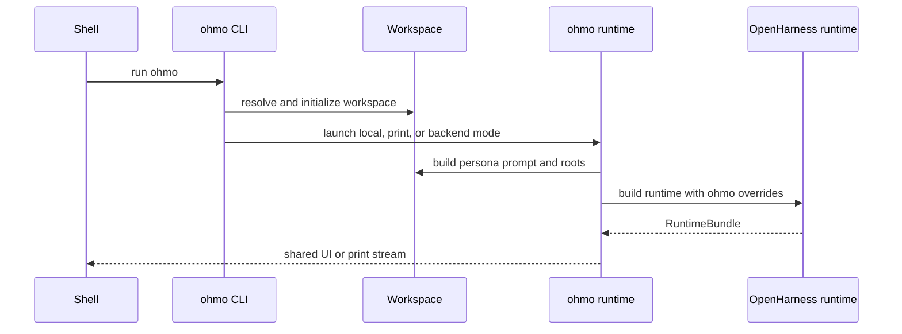
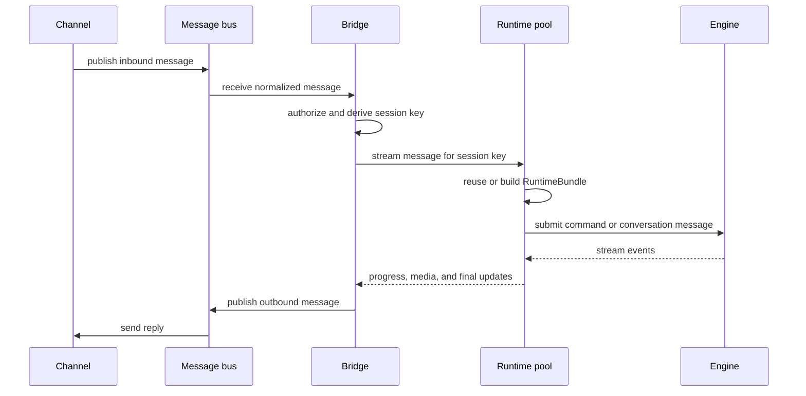

# How `ohmo` composes OpenHarness

## Question answered

What belongs to `ohmo`, what is reused from OpenHarness, and how does a chat-platform message become
an isolated OpenHarness session and outbound reply?

For deeper source-level treatment of each subsystem and workflow, use the
[`ohmo` developer reference](../ohmo/README.md).

## Product boundary

OpenHarness owns the reusable engine, provider clients, tools, permissions, hooks, skills/plugins,
MCP, commands, channels, UI backend, and session protocol. `ohmo` is an application layer that
supplies:

- a persistent personal workspace and persona files;
- personal memory, sessions, skills, and plugins;
- a gateway configuration and process lifecycle;
- channel-to-session routing and runtime pooling;
- remote command restrictions, progress formatting, and application-specific tools.

The intended dependency direction is `ohmo` → `openharness`. Existing optional reverse imports in a
few channel/cron integration points are documented boundary debt, not a pattern for new code.

## Local CLI/TUI composition

`ohmo` is declared as its own console script and also supports `python -m ohmo`. Its Typer callback
selects the shared React frontend/backend path or a print path, much like `oh`, but injects
application-specific arguments.

`run_ohmo_backend()` delegates to OpenHarness `run_backend_host()` with:

- `build_ohmo_system_prompt()` as the custom base prompt;
- active provider profile chosen by ohmo configuration;
- `OhmoSessionBackend`;
- workspace skill and plugin roots;
- workspace memory command backend;
- `include_project_memory=False`;
- auto-dream context pointing at ohmo memory/session roots.

The shared runtime then constructs the same provider, MCP, tool, permission, hook, command, engine,
and event infrastructure as plain OpenHarness.

## Workspace ownership

The workspace defaults to `~/.ohmo` and contains identity/persona files, user profile, bootstrap
content, personal memory, sessions, skills, plugins, attachments, logs, gateway configuration, and
gateway state. `initialize_workspace()` creates the expected layout and defaults.

`build_ohmo_system_prompt()` starts with the OpenHarness base instructions, then adds soul, identity,
user profile, first-run bootstrap, workspace description, and ohmo personal memory. Project memory
is only included when explicitly requested; normal local and gateway composition disables it again
when calling the shared runtime prompt builder.

This prevents normal project-memory prompt recall from mixing with personal memory. It is not a
universal storage sandbox: shared session-memory, automatic extraction, and some `/memory`
subcommands still use core cwd/config paths.

## Gateway process topology

### Function-level gateway call sequence

1. `OhmoGatewayService.run_foreground()` creates the `MessageBus`, `ChannelManager`,
   `OhmoSessionRuntimePool`, and `OhmoGatewayBridge`, starts the bridge before channels, and owns
   heartbeat/restart tasks plus shutdown ordering.
2. A channel adapter publishes `InboundMessage`; `OhmoGatewayBridge.run()` receives it and calls
   `_should_process_message()` before any model work.
3. `session_key_for_message()` derives the isolation key. The bridge stores one processing task per
   key, cancels/replaces same-key work when required, and runs `_process_message()`.
4. `_process_message()` delegates to `OhmoSessionRuntimePool.stream_message()`. The pool calls
   `_cwd_for_message()` and `get_bundle()` to reuse or create the session runtime.
5. `get_bundle()` loads `OhmoSessionBackend.load_latest_for_session_key()`, calls shared
   `build_runtime()` with persona/memory/extension overrides, restores safe state, calls
   `start_runtime()`, and caches by session key.
6. `stream_message()` handles remote command policy, constructs the multimodal user message, and
   delegates ordinary work to `_stream_engine_message()`.
7. `_stream_engine_message()` iterates `QueryEngine.submit_message()` and
   `_convert_stream_event()` maps engine events into `GatewayStreamUpdate` objects.
8. `_save_snapshot()` persists the post-turn state under both session ID and session-key index. The
   bridge publishes progress immediately and one final `OutboundMessage` with reply/media context.
9. `_refresh_bundle()` snapshots and closes the old bundle before rebuilding after a provider/model
   change; ordinary process shutdown currently relies on process exit rather than a pool-wide
   close-all method.

The foreground service starts bridge, channel manager, restart-notice, and state-heartbeat tasks. On
shutdown it stops/cancels those tasks, stops channels, updates state, removes the PID file, and may
replace the process in-place for an explicit gateway restart.

Detached start launches `python -m ohmo gateway run` with output appended to the workspace gateway
log.

## Session-key routing and isolation

`session_key_for_message()` chooses runtime identity:

- explicit override wins;
- private chat: `<channel>:<chat_id>`;
- private thread: `<channel>:<chat_id>:<thread_id>`;
- shared chat: `<channel>:<chat_id>:<sender_id>`;
- shared thread: `<channel>:<chat_id>:<thread_id>:<sender_id>`.

Including sender identity in shared chats prevents unrelated users from sharing one conversation and
memory context. Channel authorization and Feishu mention/managed-group policy are evaluated before
runtime execution.

The bridge tracks one active processing task per session key. A new message for the same session can
interrupt prior work; `/stop` and restart commands use the same cancellation path. Different session
keys can run concurrently.

## Runtime pool creation and reuse

`OhmoSessionRuntimePool.get_bundle()` reuses an existing bundle when its cwd still matches. For a
new key it:

1. Looks up the latest session-key-specific ohmo snapshot.
2. Calls shared `build_runtime()` with ohmo prompt/backend/memory/extension overrides.
3. Restores sanitized messages and selected tool metadata.
4. Preserves the prior session ID when restoring.
5. Registers request-scoped gateway tools as applicable.
6. Fires session-start hooks and refreshes the prompt for the latest user text.
7. Caches the bundle under the session key.

Managed Feishu groups may select a configured repository cwd. If that directory is missing, the
pool logs a warning and falls back to the gateway's default cwd. A cwd change closes and recreates
the bundle so tools and permissions do not keep using stale roots.

## Message handling through the shared engine

The runtime pool builds a multimodal `ConversationMessage` from inbound text/media. It first checks
the shared command registry and user-invocable skills. Commands marked local-only are rejected
unless remote-admin support is explicitly enabled and the command is allowlisted. Provider/model
commands have gateway-scoped handlers so they update gateway configuration rather than unrelated
plain OpenHarness state.

Ordinary messages call `bundle.engine.submit_message()`. The pool converts engine events:

| OpenHarness event | Gateway update |
| --- | --- |
| assistant delta | accumulated into final reply |
| status/compact progress | localized progress update |
| tool started | concise tool hint |
| tool completed with media | outbound media update |
| error | error update |
| assistant complete | fallback final text if no deltas |

After processing, the pool saves an ohmo snapshot keyed by both session ID and hashed session key.
The bridge sends progress immediately, retains the final update, then publishes one final outbound
message with thread and media metadata.

## Provider refresh and application tools

A gateway-scoped provider/model change may require a full bundle refresh. The pool snapshots current
messages/metadata, closes the old runtime, builds a new runtime with the new profile, restores the
conversation and session ID, starts it, and replaces the cached bundle.

The Feishu group-creation tool is registered only during a validated private `/group` request. The
pool places request context in tool metadata and removes both context and tool after the request,
preventing the application-specific capability from leaking into unrelated prompts.

## Session and memory specialization

`OhmoSessionBackend` implements the core `SessionBackend` contract but writes under the ohmo
workspace. It stores `app: "ohmo"`, session key, cwd, model, prompt, sanitized messages, usage, and
whitelisted tool metadata. It also maintains `latest-<session-key-hash>.json` for gateway restoration.

The custom memory backend redirects the common `/memory` status/list/show/add/remove/edit/migrate
operations and `/dream` store selection to personal memory. Compaction remains shared and
application-neutral. Auto-dream receives ohmo memory/session directories, but session-memory
checkpoints and optional automatic extraction still use core cwd/project paths; manual extraction
is rejected for the custom backend. See
[`oh` and `ohmo` shared concepts](../OH_AND_OHMO_SHARED_CONCEPTS.md#current-memory-boundary-exceptions).

## Failure and security boundaries

- Channel `allow_from` and group/mention policy gate inbound traffic before model execution.
- Shared-chat session keys include sender identity.
- Remote administrative commands are off by default and require both global opt-in and allowlist.
- Provider credentials remain owned by OpenHarness auth/settings; gateway status must not expose them.
- Runtime/API/MCP resources are closed when a bundle is replaced. The current gateway service has
  no explicit pool-wide `close()` path; normal detached shutdown relies on process exit after channel
  and bridge tasks stop. Add an owned close-all lifecycle before embedding the gateway in a
  longer-lived process.
- Image rejection can strip image history and continue pending once, while preserving an error/progress
  trail.
- Normal personal/project prompt recall remains separated by default; shared write/path exceptions
  are documented in the comparative memory reference.

## Where to change behavior

| Concern | Owner | Shared boundary |
| --- | --- | --- |
| Persona/workspace | `ohmo/workspace.py`, `ohmo/prompts.py` | core prompt contract |
| Local UI/print composition | `ohmo/runtime.py`, `ohmo/cli.py` | backend host/runtime APIs |
| Channel process lifecycle | `ohmo/gateway/service.py` | core channels and MessageBus |
| Session routing/cancellation | `ohmo/gateway/router.py`, `ohmo/gateway/bridge.py` | inbound/outbound event models |
| Per-chat runtime | `ohmo/gateway/runtime.py` | `RuntimeBundle`, engine events, commands |
| Persistence | `ohmo/session_storage.py`, `ohmo/memory.py` | session/memory protocols |

## Source and symbol reference

| Responsibility | File | Symbol |
| --- | --- | --- |
| CLI mode dispatch | `ohmo/cli.py` | `main()` |
| Workspace layout | `ohmo/workspace.py` | `get_workspace_root()`, `ensure_workspace()`, `initialize_workspace()` |
| Persona prompt | `ohmo/prompts.py` | `build_ohmo_system_prompt()` |
| Local backend/print composition | `ohmo/runtime.py` | `run_ohmo_backend()`, `run_ohmo_print_mode()` |
| Gateway process ownership | `ohmo/gateway/service.py` | `OhmoGatewayService.run_foreground()` |
| Session-key policy | `ohmo/gateway/router.py` | `session_key_for_message()` |
| Authorization and per-key tasks | `ohmo/gateway/bridge.py` | `OhmoGatewayBridge.run()`, `_should_process_message()`, `_process_message()` |
| Runtime pooling | `ohmo/gateway/runtime.py` | `OhmoSessionRuntimePool.get_bundle()`, `stream_message()` |
| Event conversion | `ohmo/gateway/runtime.py` | `_stream_engine_message()`, `_convert_stream_event()` |
| Bundle rebuild | `ohmo/gateway/runtime.py` | `_refresh_bundle()` |
| Workspace persistence | `ohmo/session_storage.py` | `OhmoSessionBackend`, `save_session_snapshot()` |
| Shared core composition | `src/openharness/ui/runtime.py` | `build_runtime()`, `start_runtime()`, `close_runtime()` |

## Verification map

- `tests/test_ohmo/test_workspace.py`: workspace layout and health.
- `tests/test_ohmo/test_prompts.py`: persona and memory isolation.
- `tests/test_ohmo/test_cli.py`, `tests/test_ohmo/test_loading.py`: entrypoints and composition.
- `tests/test_ohmo/test_ohmo_session_storage.py`: session and session-key persistence.
- `tests/test_ohmo/test_gateway.py`: routing, pool reuse/refresh, commands, events, media,
  cancellation, security, lifecycle, and channel replies.
- `tests/test_channels/`: adapter authorization and message normalization.
