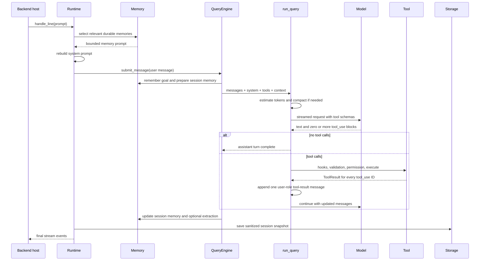

# Prompt, memory, tools, and compaction end-to-end flow

This guide follows one interactive prompt after the Python backend receives it: prompt assembly,
memory selection, provider calls, model-selected tools, tool-result replay, context compaction, and
post-turn persistence. It is the deep-dive companion to [prompt and tool loop](PROMPT_TOOL_LOOP.md)
and [memory, sessions, and compaction](MEMORY_SESSION_COMPACTION.md).

OpenHarness exposes tools and enforces their execution, but it does not independently decide which
tool to call. The provider model receives tool schemas and returns zero or more tool calls. The
engine validates and governs those calls, executes approved tools, appends every result to the
conversation, and asks the model to continue.

## The six state layers

“Memory” is not one object. The runtime uses distinct stores with different lifetimes:

| State | Provider-visible form | Lifetime and owner |
| --- | --- | --- |
| Conversation messages | Request `messages` | Current/resumed session; `QueryEngine` |
| Runtime system prompt | Request `system` | Rebuilt for each submitted line; runtime prompt builder |
| Relevant project memory | Selected text inside `system` | Durable project files; memory service |
| Tool carryover metadata | Context/attachments and snapshot metadata | Current/resumed session; engine and tools |
| Session-memory Markdown | Compaction continuity and task state | Session-scoped file; session-memory service |
| Session snapshot | Sanitized messages plus whitelisted metadata | Resume storage; session storage service |

Optional durable-memory extraction and autodream can write reusable cross-session knowledge. They
are separate from the conversation snapshot and only run when configured.

## Complete prompt lifecycle



## 1. `handle_line` separates commands from prompts

`src/openharness/ui/runtime.py` owns interactive line handling. It reloads the hook registry and
checks plain text for a registered slash command. A command can render locally, refresh runtime
configuration, submit a generated prompt, or continue pending work.

An ordinary line, or a prebuilt multimodal message from the terminal backend, enters the prompt
path. Before submission, the runtime rebuilds the system prompt using the latest user text. This
means memory relevance and environment instructions reflect the current request rather than only
the state at process startup.

## 2. The system prompt is assembled from bounded context

`src/openharness/prompts/context.py` combines the configured base prompt with applicable runtime
context, including:

- environment, working directory, permission mode, and reasoning configuration;
- repository and local instructions;
- available skills and delegation guidance;
- issue, pull-request, and repository context where configured;
- a bounded project-memory entrypoint and memories relevant to the latest prompt.

Relevant memory selection uses a heuristic shortlist of durable memory files. Selected entries are
formatted into the system prompt, and usage is marked on a best-effort basis. Project memory is
therefore guidance in `system`; it is not appended as a fake user or assistant message.

## 3. `QueryEngine.submit_message` establishes turn state

The query engine owns the live conversation list and tool carryover metadata. Submission performs
the following work before the model loop starts:

1. Remember the user's current goal.
2. Prepare session memory when both memory and session memory are enabled.
3. Sanitize existing messages and append the new user message.
4. Fire the `USER_PROMPT_SUBMIT` hook.
5. Construct a `QueryContext` and a working copy of messages.
6. Add coordinator context when applicable.
7. Enter `run_query` and stream its events.

Assistant turn completions and usage events update engine state as they arrive. In a `finally`
path, the engine updates session memory even when the turn fails. Optional durable extraction and
autodream scheduling happen afterward and do not turn a successful user response into a failure if
their background work cannot complete.

## 4. Context pressure is checked before every model turn

The engine estimates tokens from text, tool inputs/results, and images, then applies a 4/3 safety
padding. Unless explicitly overridden, the automatic threshold is:

```text
model context window - 20,000 summary reserve - 13,000 safety buffer
```

For a 200,000-token context window, that default threshold is 167,000 estimated tokens. Checking
inside the loop matters because tool results can push the same submitted line over the threshold
after its first provider response.

Three consecutive automatic-compaction failures disable proactive compaction for the remainder of
that run. A provider-reported context overflow still gets one forced reactive compaction retry.

## 5. Compaction is a pressure-reduction pipeline

Automatic compaction uses the least expensive sufficient stage rather than immediately asking a
model for a summary:

1. **Microcompaction.** Old compactable tool-result contents are replaced with
   `[Old tool result content cleared]`; the latest five are retained.
2. **Deterministic context collapse.** Older oversized text and tool-result blocks are trimmed to a
   bounded head/tail representation.
3. **Session-memory compaction.** When enough history exists, older messages are replaced using the
   persisted session-memory file, or a deterministic older-message summary if that file is not
   available. At least the configured recent count, and never fewer than 12 messages, is preserved.
4. **Full model compaction.** Only when the earlier strategies cannot produce the structured
   result, the compactor asks a model to summarize older history.

Large tool output is also offloaded before this pipeline: the complete payload is saved under the
data directory's `tool_artifacts`, while the conversation keeps an inline preview and artifact
reference.

### Full model compaction in detail

The full compactor first microcompacts and splits older from preserved recent messages. The split
never separates an assistant `tool_use` block from its matching user `tool_result` block. The
preserved segment is sanitized to remove malformed or orphaned protocol content.

The older segment is sent with a strong summarization instruction, the current system prompt (or a
summarizer fallback), no tool schemas, and a maximum 20,000-token output. Image payloads become text
placeholders rather than being sent to the summarizer.

Pre- and post-compaction hooks wrap the operation. The streaming summary has a 25-second timeout,
up to two retries after the initial attempt, and up to three head-truncation retries for
prompt-too-long failures.

The replacement history is ordered as:

1. a compaction boundary marker;
2. summary messages;
3. preserved recent messages;
4. structured continuity attachments;
5. post-hook notes.

Continuity attachments preserve information that prose summarization could otherwise lose: task
focus, verified work, recent attachments and files, plan mode, invoked skills, asynchronous agent
state, work log, and other approved carryover.

Session-memory compaction can complete without a model summarization call. Manual `/compact` uses
the explicit compaction path; automatic and reactive compaction use the same core invariants while
differing in trigger.

## 6. The provider request exposes tools; the model chooses calls

After compaction and image preprocessing, each provider request contains:

- the selected model;
- current conversation messages;
- the current system prompt;
- bounded output-token and reasoning settings;
- every registered tool's API schema from `ToolRegistry.to_api_schema()`.

The provider streams normalized assistant content. The engine appends the complete assistant
message before executing any tool calls. If there are no calls, it fires the stop hook and returns.

One tool call executes sequentially. Multiple calls from the same assistant message execute
concurrently with exception collection, but results are restored to protocol-safe order.

## 7. Every tool call passes the same governance path

For each model-returned tool call, `_execute_tool_call` performs this order:

1. Fire the `PRE_TOOL_USE` hook.
2. Look up the tool in the registry.
3. Validate input against the tool's Pydantic schema.
4. Normalize file and command fields used by permission policy.
5. Ask `PermissionChecker` for allow, deny, or confirmation.
6. If confirmation is required, await the interface permission callback.
7. Execute the tool and receive a `ToolResult`.
8. Offload oversized output and retain a bounded preview when necessary.
9. Record approved carryover metadata such as read files, goals, skills, agents, artifacts,
   verified work, work log, and permission mode.
10. Fire the `POST_TOOL_USE` hook.

Registry misses, invalid input, denied permission, execution errors, and raised exceptions are all
converted into a result for the corresponding tool-use ID. This invariant prevents the provider
conversation from containing an unanswered tool call.

[Tool governance](TOOL_GOVERNANCE.md) describes permission, hooks, and sandbox ownership in more
detail.

## 8. Tool results are replayed to the model

All results belonging to one assistant response are appended together as a user-role message of
tool-result blocks. The loop then starts another model turn with the expanded conversation.

This is how the model observes command output, file contents, failures, or permission denial and
decides what to do next. The sequence repeats until the model returns no tool calls or the configured
maximum number of turns is reached. Reaching the limit raises an explicit error rather than silently
pretending the task completed.

## 9. Post-turn memory and persistence serve different purposes

After the loop, session memory is updated under a project-hashed path resembling:

```text
OPENHARNESS_DATA_DIR/session-memory/<project-hash>/<session-id>.md
```

It is bounded to 12,000 characters and records task continuity such as current goal, next step,
verified work, active artifacts, and recent messages. It is designed to make compaction survivable,
not to replace exact conversation history.

Durable project memory lives separately under:

```text
OPENHARNESS_DATA_DIR/memory/<project-hash>/
```

The runtime also saves `latest.json` and a session-ID snapshot under project-scoped session
storage. Snapshots contain sanitized messages and a metadata allowlist, including permission mode,
read-file state, invoked skills, asynchronous tasks/agents, work log, verified work, task focus, and
compaction checkpoints. Provider clients, tool instances, and hooks are reconstructed fresh on
resume rather than serialized.

## Failure behavior and invariants

| Condition | Behavior |
| --- | --- |
| Automatic compaction fails | Report progress/failure; disable proactive retries after three consecutive failures |
| Provider reports context overflow | Force one reactive compaction and retry once |
| Full-summary stream stalls | Timeout and use bounded retry/fallback behavior |
| One concurrent tool raises | Convert it to a matching result; retain results for the other calls |
| Permission is denied | Return a denial result to the model; do not execute the tool |
| Durable memory extraction fails | Preserve the user turn; record extraction failure metadata |
| Session save occurs | Sanitize messages and persist only whitelisted metadata |

The core protocol invariants are:

- every assistant tool-use ID receives exactly one tool result;
- compaction does not split a tool-use/tool-result pair;
- model summarization cannot call tools;
- the recent working set and structured continuity survive compaction;
- runtime state, not the frontend transcript, is persisted;
- project memory, session memory, and session snapshots are not interchangeable.

## Ownership and debugging map

| If the failure is... | Start at |
| --- | --- |
| Latest user goal or instructions are absent | `ui/runtime.py`, `prompts/context.py` |
| Wrong durable memories enter the prompt | `memory/` selection and prompt formatting |
| Model never requests an expected tool | Provider request/tool schemas and model capability; then prompt wording |
| Tool call is rejected or unsafe | `engine/query.py`, permissions, hooks, sandbox |
| Tool output never reaches the next model turn | result assembly in `engine/query.py` |
| Context grows despite old large outputs | tool artifact offload and `services/compact/` |
| Compaction loses task state | session-memory and structured attachment construction |
| Resume differs from the saved turn | session storage sanitization and runtime reconstruction |

## Source and test map

Primary source:

- `src/openharness/ui/runtime.py`
- `src/openharness/prompts/context.py`
- `src/openharness/engine/query_engine.py`
- `src/openharness/engine/query.py`
- `src/openharness/services/compact/`
- `src/openharness/memory/`
- `src/openharness/services/session_storage.py`

Focused verification:

```bash
uv run pytest -q \
  tests/test_engine/test_query_engine.py \
  tests/test_services/test_compact.py \
  tests/test_memory \
  tests/test_services/test_session_storage.py
```

These suites cover model/tool replay, compaction progress and reactive retry, tool-pair preservation,
session-memory reduction, deterministic collapse, image estimates, hooks, timeouts, prompt memory,
relevance and usage tracking, extraction, and sanitized snapshots.
