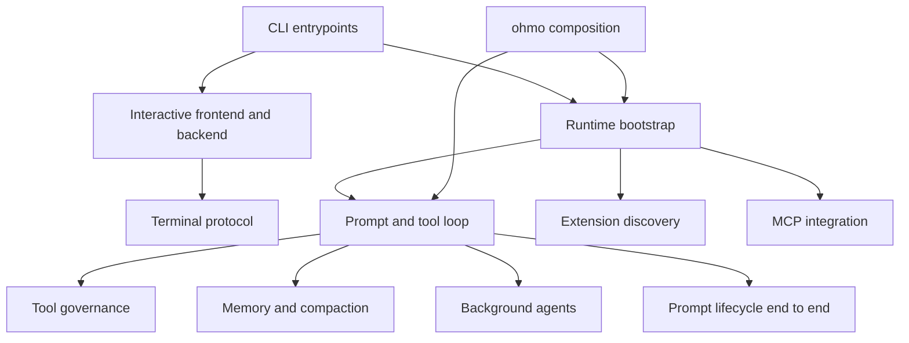

# Critical runtime flows

These documents answer the questions a new OpenHarness contributor usually asks after the first
codebase tour. Each file follows one runtime path from entrypoint to cleanup and identifies the
source, state, failure behavior, and tests that own it.

## Flow-suite map

The arrows show the dependency direction used while debugging: start at the producer and follow the
owned boundary toward the consumer. They are not Python import edges.

## Recommended reading order

1. [How the `oh` command reaches Python](CLI_ENTRYPOINTS.md)
2. [How one runtime is assembled and closed](RUNTIME_BOOTSTRAP.md)
3. [How an interactive `uv run oh` session crosses the React/Python boundary](INTERACTIVE_OH_FRONTEND_BACKEND_E2E.md)
4. [How a prompt uses memory, tools, compaction, and persistence end to end](PROMPT_MEMORY_TOOLS_COMPACTION_E2E.md)
5. [How one prompt becomes model and tool turns](PROMPT_TOOL_LOOP.md)
6. [How permissions, hooks, and sandboxing govern a tool](TOOL_GOVERNANCE.md)
7. [How project memory, session memory, snapshots, and compaction interact](MEMORY_SESSION_COMPACTION.md)
8. [How MCP servers become model-callable tools and resources](MCP_INTEGRATION.md)
9. [How skills, plugins, hooks, commands, and tools are discovered](EXTENSION_DISCOVERY.md)
10. [How the terminal protocol is structured](TERMINAL_UI_PROTOCOL.md)
11. [How `ohmo` composes and specializes OpenHarness](OHMO_INTEGRATION.md)
12. [How background tasks and agents are spawned and observed](BACKGROUND_AGENTS.md)

## Find the flow by symptom

| Symptom or question | Flow |
| --- | --- |
| The shell cannot find `oh`, or a new CLI option is ignored | [CLI entrypoints](CLI_ENTRYPOINTS.md) |
| `uv run oh` starts, hangs, interrupts, or exits incorrectly across its processes | [Interactive frontend/backend end to end](INTERACTIVE_OH_FRONTEND_BACKEND_E2E.md) |
| A prompt uses the wrong memory, loses tool results, or exceeds its context | [Prompt, memory, tools, and compaction end to end](PROMPT_MEMORY_TOOLS_COMPACTION_E2E.md) |
| A setting/profile/plugin does not appear in a session | [Runtime bootstrap](RUNTIME_BOOTSTRAP.md) |
| The model responds once but a tool result is not replayed | [Prompt and tool loop](PROMPT_TOOL_LOOP.md) |
| A tool is unexpectedly denied, approved, or unsandboxed | [Tool governance](TOOL_GOVERNANCE.md) |
| Context disappears, resumes incorrectly, or compacts unexpectedly | [Memory, sessions, and compaction](MEMORY_SESSION_COMPACTION.md) |
| An MCP server connects but its tool is missing or fails | [MCP integration](MCP_INTEGRATION.md) |
| A skill/plugin definition is shadowed or not loaded | [Extension discovery](EXTENSION_DISCOVERY.md) |
| Python emits an event that the React terminal does not render | [Terminal UI protocol](TERMINAL_UI_PROTOCOL.md) |
| `ohmo` uses the wrong workspace, session, memory, or chat thread | [`ohmo` integration](OHMO_INTEGRATION.md) |
| A subagent cannot be polled, messaged, restarted, or stopped | [Background agents](BACKGROUND_AGENTS.md) |

## How to use these documents

The diagrams are navigation aids, not substitutes for source. Before changing a flow:

1. Open the primary source files listed by the document.
2. Read the nearest tests named in its verification section.
3. Re-check cross-flow links; most regressions occur at a boundary rather than inside one class.
4. Use [Testing and validation](../../TESTING.md) to expand from focused tests to the affected suite.

Every substantive flow includes four kinds of evidence:

- a GitHub-renderable Mermaid diagram showing process or call order;
- a function-level call sequence, including async ownership and cleanup where relevant;
- a source-symbol map naming the owning file and callable rather than only a directory;
- focused tests whose assertions cover the described boundary.

The documents describe the current repository implementation, not a pinned historical commit. When
an entrypoint, lifecycle, state owner, or cross-language protocol changes, update the corresponding
flow in the same change and validate every referenced symbol still exists.
