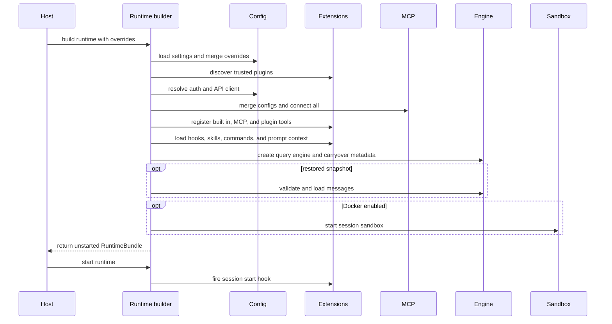

# Runtime bootstrap and shutdown

## Question answered

What does OpenHarness construct before the first model call, who owns those objects, and how are
they cleaned up?

`src/openharness/ui/runtime.py::build_runtime()` is the composition root. It turns configuration and
application overrides into a `RuntimeBundle` used by CLI, React backend, print mode, workers, and
`ohmo`.

## Construction sequence

### Function-level construction ledger

The order in `build_runtime()` is intentional and observable:

1. `load_settings().merge_cli_overrides()` resolves disk, environment, profile, and process-scoped
   values before any component consumes configuration.
2. `load_plugins()` runs before MCP, tools, hooks, commands, and prompt assembly because every one
   of those surfaces may receive plugin contributions.
3. `_resolve_api_client_from_settings()` resolves active-profile auth and returns the concrete
   streaming client unless the caller injected `api_client`.
4. `load_mcp_server_configs()` and `McpClientManager.connect_all()` establish connection status and
   capability lists before `create_default_tool_registry()` adapts MCP tools/resources.
5. Plugin Python tools register after built-ins and MCP adapters; the registry's last write wins on
   a duplicate tool name.
6. `HookReloader` or `load_hook_registry()` produces the registry used by `HookExecutor`.
7. `build_runtime_system_prompt()` loads skills, project context, memory, and application-provided
   roots before `QueryEngine` is constructed.
8. Restored metadata overlays JSON-safe defaults. Restored messages pass through
   `ConversationMessage.model_validate()` and `sanitize_conversation_messages()` before
   `QueryEngine.load_messages()`.
9. Docker startup happens only after the engine and session ID exist. A failure here returns no
   `RuntimeBundle`; `build_runtime()` currently has no internal partial-construction unwind, so an
   MCP/client resource opened earlier in the function may rely on lower-level failure cleanup or
   process exit. Treat this as lifecycle debt when adding another post-connect failure point.
10. `create_default_command_registry()` and the completed objects are packaged into
    `RuntimeBundle`; `start_runtime()` remains a separate lifecycle step.

## 1. Settings and overrides

`build_runtime()` calls `load_settings().merge_cli_overrides(...)`. The explicit inputs include
model, max turns, effort, base URL, custom system prompt, API key, API format, active profile, and
permission mode. The original override dictionary is retained on `RuntimeBundle` so later slash
commands can reload disk settings without losing process-scoped CLI choices.

The working directory and extra skill/plugin roots are expanded and resolved early. That normalized
`cwd` becomes the base for prompt context, permission paths, tools, sessions, and application state.

## 2. Provider client selection

If the caller injects an `api_client` (mainly tests/embedding), it is used directly. Otherwise
`_resolve_api_client_from_settings()` materializes the active profile, resolves authentication, and
selects one of:

- `CopilotClient` for the Copilot API format;
- `CodexApiClient` for a Codex subscription profile;
- OAuth-configured `AnthropicApiClient` for Claude subscription auth;
- `OpenAICompatibleClient` for OpenAI-compatible formats;
- API-key `AnthropicApiClient` as the default path.

This is why provider work cannot stop at registry labels: settings, auth, and client construction all
participate before any request conversion occurs.

## 3. Extensions, MCP, and tools

Enabled plugins are discovered before MCP and tool construction. Settings MCP definitions and
plugin MCP definitions are merged into `McpClientManager`, and `connect_all()` runs during bootstrap.
Connection failures become per-server failed statuses rather than aborting every runtime.

`create_default_tool_registry(mcp_manager)` registers built-ins, MCP resource tools, and an adapter
for each connected MCP tool. Enabled plugin Python tools are registered afterward. Since
`ToolRegistry.register()` assigns by name, a later tool with the same name replaces an earlier entry;
name collisions therefore affect behavior and must be reviewed intentionally.

## 4. Hooks, prompt, and engine

The runtime creates a `HookExecutor` with the current hook registry, working directory, provider
client, and default model. It then calls `build_runtime_system_prompt()` with settings, cwd, initial
prompt, extension roots, and project-memory policy.

The resulting `QueryEngine` receives:

- provider client and model settings;
- tool registry and permission checker;
- system prompt and context/compaction limits;
- permission/question callbacks supplied by the selected UI;
- hook executor;
- runtime-only metadata such as MCP manager, bridge manager, session ID, edit approval callback,
  extension roots, image/vision configuration, and continuation checkpoints.

Saved messages are Pydantic-validated and sanitized before `engine.load_messages()`. Persisted tool
metadata overlays safe defaults, preserving continuation state without serializing live managers or
callbacks.

## 5. RuntimeBundle ownership

`RuntimeBundle` is the session-scoped ownership container:

| Field | Responsibility |
| --- | --- |
| `api_client` | Provider streaming transport |
| `mcp_manager` | MCP sessions, tools, resources, and statuses |
| `tool_registry` | Model-callable built-in, MCP, and plugin tools |
| `hook_executor` | Lifecycle and tool policy/observation hooks |
| `engine` | Conversation history, usage, and model/tool loop |
| `commands` | Slash command lookup and handlers |
| `app_state` | UI-facing resolved state snapshot |
| `session_backend` | Persistence implementation, replaceable by `ohmo` |
| extension/memory fields | Application-specific discovery and memory behavior |

`start_runtime()` fires `session_start` hooks after construction. Callers are responsible for
calling it; `build_runtime()` alone does not fire the hook.

## 6. Per-prompt refresh versus full rebuild

Before a normal line, `handle_line()` can reload hooks, rebuild the system prompt for the latest
user text, and synchronize app state without reconstructing every resource. Commands that change the
provider/client set `refresh_runtime`, which triggers client/settings refresh; `ohmo` may close and
rebuild its entire bundle to preserve application-specific state.

## 7. Shutdown order

`close_runtime()` performs best-effort and owned-resource cleanup:

1. Stop the shared Docker sandbox session.
2. Extract local personalization rules from the conversation, without blocking shutdown on failure.
3. Close all MCP sessions/transport stacks.
4. Fire the `session_end` hook.
5. Close the API client when it exposes an asynchronous `close()` method.

Every caller that builds a runtime must use `try/finally` or an equivalent lifecycle so this path
runs. Background task-manager cleanup is owned separately by its singleton lifecycle.

The client is closed even when it was injected through `api_client`; `external_api_client` changes
hook-reload behavior but does not currently exempt the client from `close_runtime()`. Embedders must
therefore pass a client whose `close()` is safe for this ownership model or change the ownership
contract and its tests explicitly.

## Failure boundaries

- Missing provider auth prints profile-specific guidance and exits before engine construction.
- A failed MCP server is recorded in status; connected servers still contribute tools.
- Malformed/disabled plugins are skipped according to loader rules.
- Docker startup may fail runtime construction when explicitly required.
- Failure after MCP/client construction but before returning a bundle has no central rollback path;
  the host cannot call `close_runtime()` without a bundle.
- Failures during personalization extraction are suppressed; MCP/API cleanup still proceeds.

## Where to change behavior

Add domain behavior to its subsystem and keep `runtime.py` as orchestration. New resource types must
define construction, injection, refresh behavior, and cleanup. Any new tool-loop state must be
classified as live runtime-only metadata or JSON-safe persisted continuation metadata.

## Source and symbol reference

| Responsibility | File | Symbol |
| --- | --- | --- |
| Session composition | `src/openharness/ui/runtime.py` | `build_runtime()` |
| Lifecycle hooks | `src/openharness/ui/runtime.py` | `start_runtime()`, `close_runtime()` |
| Runtime ownership container | `src/openharness/ui/runtime.py` | `RuntimeBundle` |
| Provider/auth selection | `src/openharness/ui/runtime.py` | `_resolve_api_client_from_settings()` |
| Dynamic settings refresh | `src/openharness/ui/runtime.py` | `refresh_runtime_client()`, `sync_app_state()` |
| Settings precedence | `src/openharness/config/settings.py` | `load_settings()`, `Settings.merge_cli_overrides()` |
| Plugin discovery | `src/openharness/plugins/loader.py` | `load_plugins()` |
| MCP config and connection | `src/openharness/mcp/config.py`, `client.py` | `load_mcp_server_configs()`, `McpClientManager.connect_all()` |
| Tool assembly | `src/openharness/tools/__init__.py` | `create_default_tool_registry()` |
| Prompt assembly | `src/openharness/prompts/context.py` | `build_runtime_system_prompt()` |
| Engine state | `src/openharness/engine/query_engine.py` | `QueryEngine` |
| Command assembly | `src/openharness/commands/registry.py` | `create_default_command_registry()` |
| Docker lifecycle | `src/openharness/sandbox/session.py` | `start_docker_sandbox()`, `stop_docker_sandbox()` |

## Verification map

- `tests/test_ui/test_runtime_api_key.py`: auth/client construction failures.
- `tests/test_ui/test_runtime_close.py`: API-client cleanup.
- `tests/test_ui/test_runtime_plugin_tools.py`: plugin tool registration.
- `tests/test_ui/test_project_plugin_security.py`: project plugin trust boundary.
- `tests/test_ui/test_runtime_plan_mode.py`: runtime prompt/permission refresh.
- `tests/test_mcp/` and `tests/test_plugins/`: connected extension lifecycles.
