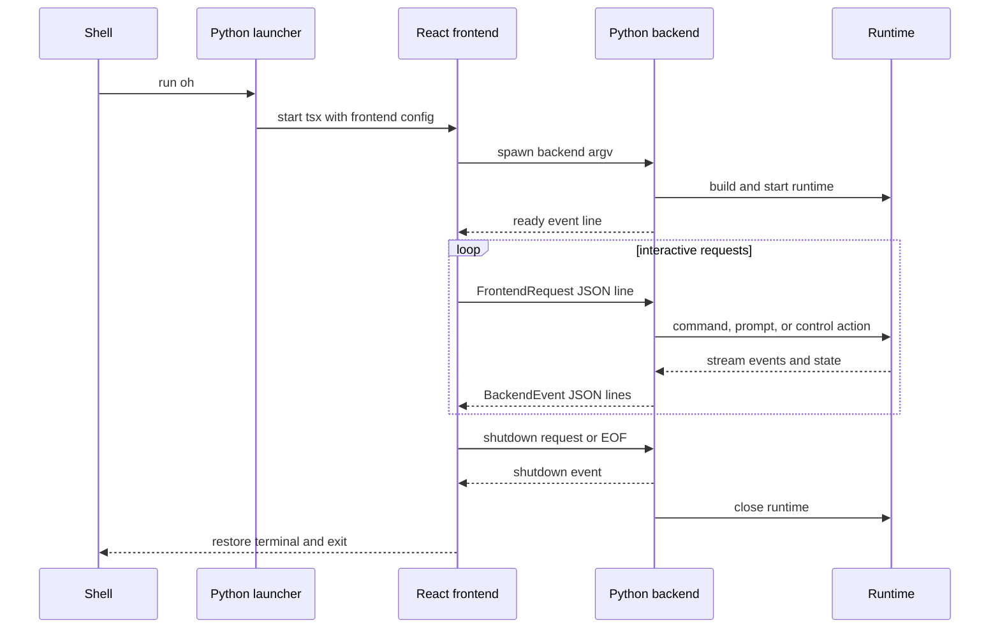

# React terminal and Python backend protocol

## Question answered

How does the TypeScript Ink terminal communicate with the Python runtime, and why does an ordinary
interactive `oh` session involve a frontend process and a backend process?

For the complete shell-to-launch-to-prompt-to-shutdown trace, see
[Interactive `uv run oh`: frontend/backend end-to-end flow](INTERACTIVE_OH_FRONTEND_BACKEND_E2E.md).

## Process topology



The environment variable is a bootstrap channel only. After process creation, stdin and stdout are
the protocol transport; stderr remains diagnostic output and must not be parsed as protocol data.

### Function-level protocol sequence

1. `launch_react_tui()` serializes `FrontendConfig` with `build_backend_command()` into
   `OPENHARNESS_FRONTEND_CONFIG` and starts `tsx src/index.tsx` with inherited terminal stdio.
2. `index.tsx` parses the bootstrap JSON, installs terminal restoration/signal handlers, and renders
   `App`.
3. `useBackendSession()` spawns the backend argv and writes requests as one JSON object per line.
   Its stdout parser accepts the `OHJSON:` protocol prefix and batches high-frequency transcript and
   assistant-delta updates before React state changes.
4. `run_backend_host()` constructs `BackendHostConfig` and `ReactBackendHost`; `run()` builds and
   starts the shared runtime, emits ready/status/task snapshots, then starts `_read_requests()`.
5. `_read_requests()` validates each line with `FrontendRequest`. Prompt work runs through
   `_run_active_request()` so `_interrupt_active_request()` can cancel it without stopping the
   request reader.
6. `_process_line()` calls `_build_user_message_with_images()`, then shared `handle_line()`. Its
   nested `_render_event()` maps each `StreamEvent` to one or more `BackendEvent` values.
7. `_ask_permission()`, `_ask_edit_approval()`, and `_ask_question()` create request-ID keyed futures
   and emit modal events. Response request types resolve those futures directly in the reader,
   avoiding deadlock behind the blocked prompt coroutine.
8. `_emit()` serializes one backend event per line under a write lock. The frontend treats
   `line_complete`, not `assistant_complete`, as the authoritative end of a full tool loop.

## 1. Frontend location and launch

`get_frontend_dir()` first checks `openharness/_frontend` inside an installed wheel, then the
repository's `frontend/terminal`. `pyproject.toml` force-includes the terminal package metadata,
TypeScript config, and source in the Python wheel.

`launch_react_tui()` ensures Node dependencies exist, builds the backend command, serializes it into
`OPENHARNESS_FRONTEND_CONFIG`, and starts `tsx src/index.tsx` with terminal stdio inherited. The
backend command uses the same interpreter and begins:

```text
python -m openharness --backend-only --cwd ...
```

Model, effort, URL, API format, permission mode, and other explicit launch overrides are forwarded
as arguments. The API key can also be forwarded, so diagnostics and process logging must never print
the full command unredacted.

## 2. Protocol models

`src/openharness/ui/protocol.py` is the Python schema authority. `FrontendRequest` accepts request
types such as:

- `submit_line` with text and optional image attachments;
- `permission_response` and `question_response` correlated by request ID;
- selection/list requests;
- `interrupt` and `shutdown`.

`BackendEvent` emits types such as:

- `ready`, state/task/status snapshots;
- transcript items and assistant deltas/completion;
- tool started/completed;
- compact progress;
- modal and selection requests;
- todo, plan-mode, and swarm status;
- error and shutdown.

`frontend/terminal/src/types.ts` mirrors these shapes. Any field/type change is a two-language
contract change, even if Python and TypeScript each compile independently.

## 3. Backend lifecycle

`run_backend_host()` optionally changes to the requested cwd, builds `BackendHostConfig`, constructs
`ReactBackendHost`, and calls `run()`. The host builds/starts a normal `RuntimeBundle`, emits initial
state, then reads newline-delimited JSON requests.

Submitted lines are processed as active async requests so an `interrupt` can cancel the current
turn. Permission and question responses resolve pending futures rather than entering the normal line
queue. Concurrent permission prompts are serialized to prevent one modal replacing another.

The host converts engine `StreamEvent` objects into protocol `BackendEvent` objects. It also emits
transcript rows and a final `line_complete` marker; the frontend uses that marker, rather than an
assistant text event alone, to end the busy state after tool calls.

## 4. Images and multimodal input

The frontend validates image MIME type and base64 data. `_build_user_message_with_images()` creates
a `ConversationMessage` containing one text block plus image blocks and passes that object to
`handle_line()`. Because `user_message` is supplied, slash-command parsing is bypassed. The query
loop/provider then either sends images natively or preprocesses them for a non-vision model.

## 5. Output ownership

The Python backend owns runtime truth: resolved settings, tasks, MCP/bridge status, transcript events,
and permission decisions. The React frontend owns presentation and local interaction state. It must
not infer that an action succeeded merely because it sent a request; it waits for backend events.

Print mode does not use this protocol. It calls the same runtime/handler directly with simple
render callbacks. The Textual UI is another consumer of runtime events and should be checked when
event meaning changes, even though it does not use the React JSON process boundary.

## 6. Shutdown and failure behavior

- Malformed frontend payloads become protocol errors rather than arbitrary calls.
- Interrupt cancels active work and leaves the host able to accept another line.
- Backend shutdown closes runtime-owned MCP, sandbox, hook, and API resources.
- The launcher propagates the frontend process exit code.
- Terminal cleanup restores cursor/newline state so the shell prompt remains usable.

## Where to change behavior

| Concern | Python side | TypeScript side |
| --- | --- | --- |
| Request/event schema | `src/openharness/ui/protocol.py` | `frontend/terminal/src/types.ts` |
| Stream conversion and dialogs | `src/openharness/ui/backend_host.py` | `frontend/terminal/src/App.tsx` |
| Process launch/packaging | `src/openharness/ui/react_launcher.py`, `pyproject.toml` | `frontend/terminal/src/index.tsx`, package config |
| Transcript rendering | emitted protocol events | Ink components in `App.tsx` |

## Source and symbol reference

| Boundary | Python symbol | TypeScript owner |
| --- | --- | --- |
| Bootstrap and backend argv | `react_launcher.py::launch_react_tui()`, `build_backend_command()` | `index.tsx` bootstrap parsing |
| Wire schemas | `protocol.py::FrontendRequest`, `BackendEvent` | `types.ts::FrontendConfig`, `BackendEvent` |
| Backend lifecycle | `backend_host.py::run_backend_host()`, `ReactBackendHost.run()` | `useBackendSession()` child ownership |
| Request parsing/cancellation | `ReactBackendHost._read_requests()`, `_run_active_request()`, `_interrupt_active_request()` | `App.tsx` key/control handlers |
| Prompt conversion | `ReactBackendHost._process_line()`, `_build_user_message_with_images()` | `App.tsx` `submit_line` payload |
| Stream conversion | nested `_render_event()` in `_process_line()` | `useBackendSession()` event reducer |
| Modal correlation | `_ask_permission()`, `_ask_edit_approval()`, `_ask_question()` | `App.tsx` modal response handlers |
| Serialized output | `ReactBackendHost._emit()` | `useBackendSession()` line parser |
| Terminal restoration | launcher exit propagation | `index.tsx::restoreTerminal()` |

## Verification map

- `tests/test_ui/test_react_backend.py`: protocol, cancellation, dialogs, images, events.
- `tests/test_ui/test_react_launcher.py`: process command and runtime selection.
- `tests/test_ui/test_tui_exit_sequence.py`: terminal cleanup.
- `tests/test_ui/test_modes.py`: mode/state propagation.
- `frontend/terminal`: `npx tsc --noEmit` for mirrored types.
- `scripts/react_tui_e2e.py` and `scripts/test_tui_interactions.py`: opt-in interaction checks.
