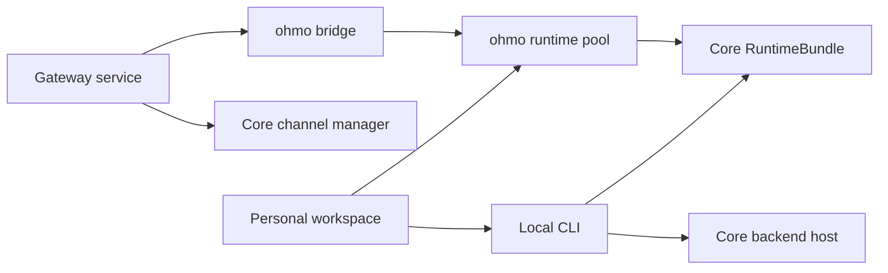

# ohmo architecture and product boundary

## Product role

OpenHarness owns the reusable engine, provider clients, tools, permissions, hooks, MCP, skills,
plugins, channels, UI protocol, and runtime lifecycle. `ohmo` composes those pieces into a personal
workspace and multi-channel application.

The dependency direction is visible in [`ohmo/runtime.py:19`](../../../ohmo/runtime.py#L19): ohmo
imports the core backend host, runtime lifecycle, session protocol, and frontend launcher. The
gateway similarly imports core `MessageBus`, `ChannelManager`, stream events, commands, and
`RuntimeBundle` at [`ohmo/gateway/service.py:30`](../../../ohmo/gateway/service.py#L30) and
[`ohmo/gateway/runtime.py:24`](../../../ohmo/gateway/runtime.py#L24).

New reusable behavior should not be implemented in `ohmo` and then imported by core. The few
existing optional core-to-ohmo imports are documented boundary debt, not an extension pattern.

## Composition surfaces

There are two composition paths:

1. Local terminal/print modes call `run_backend_host()` or `build_runtime()` with an ohmo prompt,
   session backend, personal memory backend, and extra skill/plugin roots. See
   [`ohmo/runtime.py:50`](../../../ohmo/runtime.py#L50) and
   [`ohmo/runtime.py:198`](../../../ohmo/runtime.py#L198).
2. The gateway creates one `RuntimeBundle` per routed conversation key. See
   [`ohmo/gateway/runtime.py:226`](../../../ohmo/gateway/runtime.py#L226).

Both paths preserve core ownership of model streaming and tool execution. `ohmo` adapts inputs and
outputs around that engine rather than forking the loop.

## State ownership

| State | Default owner/location | Key code |
| --- | --- | --- |
| Persona and user profile | `~/.ohmo/soul.md`, `identity.md`, `user.md` | [`workspace.py:197`](../../../ohmo/workspace.py#L197) |
| First-run instructions | `~/.ohmo/BOOTSTRAP.md` | [`workspace.py:239`](../../../ohmo/workspace.py#L239) |
| Personal memory | `~/.ohmo/memory/` | [`memory.py:39`](../../../ohmo/memory.py#L39) |
| ohmo sessions | `~/.ohmo/sessions/` | [`session_storage.py:35`](../../../ohmo/session_storage.py#L35) |
| Gateway config | `~/.ohmo/gateway.json` | [`gateway/config.py:24`](../../../ohmo/gateway/config.py#L24) |
| Gateway PID/state/log | workspace root and `logs/gateway.log` | [`gateway/service.py:108`](../../../ohmo/gateway/service.py#L108) |
| Channel attachments | `~/.ohmo/attachments/` | [`workspace.py:355`](../../../ohmo/workspace.py#L355) |
| Provider credentials/profiles | OpenHarness config/auth stores | [`gateway/provider_commands.py:24`](../../../ohmo/gateway/provider_commands.py#L24) |
| Per-chat live engine | in-memory runtime-pool dictionary | [`gateway/runtime.py:163`](../../../ohmo/gateway/runtime.py#L163) |

The workspace and sessions are application state; provider credentials remain core configuration.
Changing `/provider` updates `gateway.json`, while `/model` updates the selected core provider
profile. This split is implemented at [`provider_commands.py:24`](../../../ohmo/gateway/provider_commands.py#L24).

## Isolation boundaries

### Personal versus project memory

`build_ohmo_system_prompt()` loads ohmo memory and only loads project memory when explicitly asked
at [`ohmo/prompts.py:98`](../../../ohmo/prompts.py#L98). Production local and gateway composition
pass `include_project_memory=False`; tests lock this down at
[`test_prompts.py:40`](../../../tests/test_ohmo/test_prompts.py#L40) and
[`test_gateway.py:1520`](../../../tests/test_ohmo/test_gateway.py#L1520).

This proves the normal prompt-read boundary, not universal write-path isolation. Shared session
memory, automatic extraction, and some `/memory` subcommands still use core cwd/config paths. The
[shared-concepts comparison](../OH_AND_OHMO_SHARED_CONCEPTS.md#current-memory-boundary-exceptions)
documents each exception.

### Conversation isolation

Private chats retain legacy `channel:chat_id` keys. Shared chats add thread and sender identity to
avoid sharing agent memory between people. See [`router.py:19`](../../../ohmo/gateway/router.py#L19)
and routing tests beginning at [`test_gateway.py:59`](../../../tests/test_ohmo/test_gateway.py#L59).

### Remote versus local authority

Remote slash commands are allowed only when the command advertises `remote_invocable`, or when it
advertises remote-admin opt-in and both gateway configuration controls allow it. The checks are at
[`runtime.py:179`](../../../ohmo/gateway/runtime.py#L179) and
[`runtime.py:367`](../../../ohmo/gateway/runtime.py#L367).

### Managed-group context

The Feishu group-creation tool exists only during an internal `/group` request. It is registered and
removed around that turn at [`runtime.py:935`](../../../ohmo/gateway/runtime.py#L935) and
[`runtime.py:979`](../../../ohmo/gateway/runtime.py#L979). Internal group prompts and metadata are
sanitized before persistence at [`runtime.py:764`](../../../ohmo/gateway/runtime.py#L764).

## Lifecycle ownership and known risks

Local runtime paths call `start_runtime()` and `close_runtime()` explicitly. The gateway service
stops bridge and channel-manager tasks at [`service.py:406`](../../../ohmo/gateway/service.py#L406),
but the runtime pool has no pool-wide `close()` method. Live bundles are closed when their CWD
changes or a command refreshes them, not as part of normal gateway shutdown. The short flow guide
and tests treat process exit as the final cleanup boundary.

Synchronous filesystem operations occur inside several async gateway paths, including snapshot
saves at [`runtime.py:764`](../../../ohmo/gateway/runtime.py#L764). They are expected to remain
bounded; larger persistence work would need offloading or an async backend.

## Change-impact checklist

- Workspace shape changes affect initialization, doctor output, prompts, memory, sessions, gateway
  state, and tests.
- Message shape changes affect channel adapters, router keys, bridge metadata, media handling, and
  snapshot restoration.
- Runtime-pool changes must preserve command security, provider refresh, group-tool scoping,
  session-key restore, and cancellation.
- Gateway process changes must preserve cross-platform PID discovery, restart notice delivery,
  channel shutdown, and log/state files.
- Core contracts should change in core first, followed by the ohmo adapter and both core/ohmo tests.
