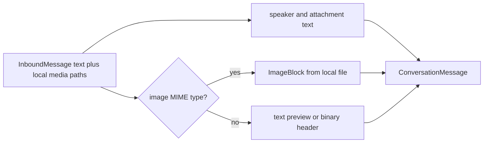

# Attachments and media flow

At the runtime-pool boundary, `InboundMessage.media` is a list of local paths previously materialized
by the channel adapter. ohmo turns those paths into model context, handles providers without vision
support, and maps generated local files back to outbound channel media.

## Inbound conversion

`_build_inbound_user_message()` creates a core `ConversationMessage`
([`runtime.py:1426`](../../../ohmo/gateway/runtime.py#L1426)). Its content-block order is:

1. a group speaker context block, when the transport identifies a group sender;
2. the user's text;
3. textual attachment notes for every local media path;
4. an `ImageBlock` for each path whose inferred MIME type starts with `image/`.

Group speaker attribution is intentionally prompt-visible because session keys isolate speakers but
the model still needs a human-readable identity for the current message
([`runtime.py:1567`](../../../ohmo/gateway/runtime.py#L1567)).

## Attachment notes

`_build_attachment_notes()` labels each path as image, audio, video, or generic file and includes
the filename and full local path ([`runtime.py:1596`](../../../ohmo/gateway/runtime.py#L1596)). The
summary helper at [`runtime.py:1662`](../../../ohmo/gateway/runtime.py#L1662) adds:

- file size and guessed MIME type;
- a bounded normalized UTF-8 preview when the prefix looks text-like;
- otherwise a bounded hexadecimal binary header;
- an unavailable/metadata error note when the file cannot be read.

Images get metadata only because their bytes are represented separately as an `ImageBlock`. Encoding
errors are logged and skipped without discarding the accompanying path/summary note. These previews
become model input and session history, so changes to their bounds or contents have privacy and
prompt-size consequences.

## Provider request and vision compatibility

The runtime client receives a normal core message containing text and image blocks. Whether the
provider can encode the image is a provider-client concern; ohmo does not choose a client based on
the attachment.

If an engine error contains both an image-related signal and an unsupported-capability signal, and
history actually contains images, `_should_retry_without_image_input()` activates
([`runtime.py:1461`](../../../ohmo/gateway/runtime.py#L1461)). The turn then:

1. strips every `ImageBlock` from engine history;
2. retains all existing text, including attachment filenames, paths, and summaries;
3. inserts a fallback text note if a message would otherwise become empty;
4. emits progress explaining that the model lacks image support;
5. calls `continue_pending()` rather than appending a duplicate user message.

The removal helpers begin at [`runtime.py:1513`](../../../ohmo/gateway/runtime.py#L1513). This is a
narrow compatibility retry based on an explicit provider error, not a general retry for every failed
multimodal request.

## Generated tool media

Tool output becomes channel media only when a successful `ToolExecutionCompleted` event has a
metadata `paths` or `media` value. `_extract_tool_media()` accepts a string or list, expands paths,
resolves relative paths against the gateway process cwd, rejects missing/non-files, and deduplicates
the result ([`runtime.py:1076`](../../../ohmo/gateway/runtime.py#L1076)).

The event converter emits a `GatewayStreamUpdate(kind="media")` with those validated paths and a
short caption ([`runtime.py:739`](../../../ohmo/gateway/runtime.py#L739)). Image generation receives a
specialized Chinese caption; other tools use a generic generated-file caption
([`runtime.py:1171`](../../../ohmo/gateway/runtime.py#L1171)). The bridge immediately publishes these
non-final updates as `OutboundMessage.media`
([`bridge.py:373`](../../../ohmo/gateway/bridge.py#L373)).

## Final-reply media fallback

Some model/tool flows mention an absolute image path only in final prose and do not emit structured
tool media. `_extract_final_reply_media()` scans the final reply for supported absolute image paths,
requires each to exist as a file, and excludes paths already sent during the turn
([`runtime.py:1140`](../../../ohmo/gateway/runtime.py#L1140)). Those paths are attached to the final
update with `_final_media_fallback` metadata.

The bridge buffers final text and media until the runtime stream completes, while progress and media
updates are sent immediately. It then publishes exactly one final `OutboundMessage` with thread
metadata preserved for shared-chat replies ([`bridge.py:395`](../../../ohmo/gateway/bridge.py#L395)).

## Important boundaries

- The runtime pool assumes adapters have already downloaded attachments and supplied safe local
  paths. Download limits, authentication, and transport-specific file retrieval belong to the core
  channel adapter.
- A MIME guess is extension-based. An image extension causes `ImageBlock.from_path()` to inspect and
  encode the file, but generic attachment classification is not content validation.
- Local paths and bounded file previews are disclosed to the model by design. Do not add credential
  file discovery or broad directory reads to this path.
- Slash-command dispatch is disabled whenever `message.media` is non-empty
  ([`runtime.py:368`](../../../ohmo/gateway/runtime.py#L368)); attachment-bearing input always enters
  the model path.
- Channel adapters remain responsible for converting outbound local paths into their transport's
  upload/message format.

## Tests to preserve

Gateway tests cover attachment block construction, unsupported-image retry, tool media, final-path
fallback, bridge media publication, and speaker attribution. See
[`tests/test_ohmo/test_gateway.py:755`](../../../tests/test_ohmo/test_gateway.py#L755),
[`test_gateway.py:803`](../../../tests/test_ohmo/test_gateway.py#L803),
[`test_gateway.py:1626`](../../../tests/test_ohmo/test_gateway.py#L1626),
[`test_gateway.py:1688`](../../../tests/test_ohmo/test_gateway.py#L1688), and
[`test_gateway.py:1770`](../../../tests/test_ohmo/test_gateway.py#L1770).
