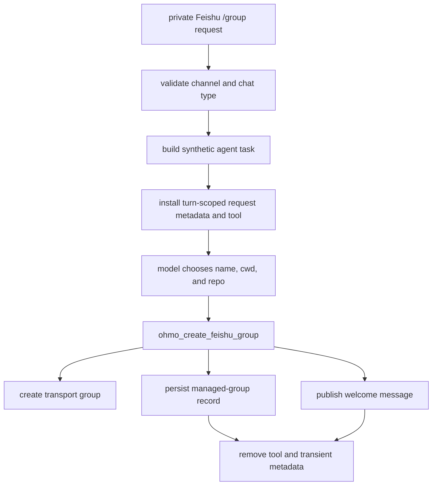

# Commands, managed groups, and notifications

ohmo reuses the core slash-command registry but adds gateway authorization, gateway-scoped provider
state, a tightly scoped Feishu group-creation tool, and a standalone proactive notification helper.
These mechanisms share channel infrastructure but have different security and persistence
boundaries.

## Remote slash-command dispatch

`OhmoSessionRuntimePool.stream_message()` looks up a built-in command, then a skill command, only for
messages without attachments ([`runtime.py:308`](../../../ohmo/gateway/runtime.py#L308)). Before a
handler runs:

1. `command.remote_invocable` must allow remote use; otherwise the command is rejected as local-only.
2. A local-only administrative command can be admitted only when the command explicitly declares
   `remote_admin_opt_in`, gateway config enables remote administration, and its normalized name is in
   `allowed_remote_admin_commands`.
3. `/provider` and `/model` are intercepted as gateway-scoped commands.
4. Other authorized commands receive the lazily built core `CommandContext`.

The three-part admin check is implemented at
[`runtime.py:179`](../../../ohmo/gateway/runtime.py#L179). Enabling the gateway config alone cannot
make an arbitrary local command remotely callable.

## Gateway provider and model commands

Gateway command handling begins at
[`provider_commands.py:24`](../../../ohmo/gateway/provider_commands.py#L24).

`/provider` supports `show`, `list`, and selecting a profile. It reads profile status through core
`AuthManager`, persists the selected name in ohmo `GatewayConfig`, and requests a runtime refresh
when the active profile changes. Credentials remain in core provider/auth state; they are not copied
into the ohmo gateway configuration.

`/model` operates on the profile currently selected by the gateway
([`provider_commands.py:75`](../../../ohmo/gateway/provider_commands.py#L75)). It can show/list, add or
remove pinned allowed models, clear the pinned set, select a model, or reset to the profile default.
Those mutations use `AuthManager.update_profile()`, so model profile state and gateway process state
have separate owners. A changed active model requests a refresh of the current bundle.

Refresh affects the conversation executing the command immediately. Other cached session bundles
are not globally rebuilt by that command; they acquire updated state when their own lifecycle causes
a rebuild.

## `/group` is an agent-assisted workflow

`/group` is parsed by the bridge before ordinary command dispatch
([`bridge.py:534`](../../../ohmo/gateway/bridge.py#L534)). It is allowed only in a Feishu private chat.
The bridge converts it into a synthetic agent task that tells the model to infer a safe name and
optional repo/cwd, inspect local context if necessary, and call one dedicated tool exactly once
([`bridge.py:270`](../../../ohmo/gateway/bridge.py#L270),
[`bridge.py:555`](../../../ohmo/gateway/bridge.py#L555)).

For that turn only, `_set_group_request_context()` registers
`ohmo_create_feishu_group`, records the requesting sender/chat/session, and suppresses treating the
synthetic prompt as a new user goal ([`runtime.py:979`](../../../ohmo/gateway/runtime.py#L979)). The
tool and request metadata are removed in cleanup and sanitized from persisted history. Ordinary
turns do not expose the group-creation tool.

## Group tool safety and side effects

`OhmoCreateFeishuGroupTool.execute()` starts at
[`group_tool.py:117`](../../../ohmo/gateway/group_tool.py#L117). It rejects execution unless all of
these are true:

- turn metadata proves this is the current `/group` request;
- the request has not already used the tool;
- the channel is Feishu and the chat is private;
- the requester has an `open_id`;
- the normalized name is nonempty and at most 100 characters;
- an explicitly selected cwd resolves to an existing directory.

It invokes the injected Feishu group-creation callback, marks the request used, persists a managed
group record, optionally publishes a welcome message, and returns the chat ID and bindings. Note that
the tool's `is_read_only()` currently returns `True` even though the callback creates a remote group
and the tool writes metadata ([`group_tool.py:100`](../../../ohmo/gateway/group_tool.py#L100)). Its
turn-scoped availability and context checks are therefore essential safeguards; changing permission
semantics requires coordinated tool-governance tests.

## Managed-group records and behavior

Records are stored under the ohmo workspace's groups directory using a filename-sanitized channel
chat ID. `save_managed_group_record()` writes the owner, name, UTC creation time, normalized cwd,
repo, binding status, and provenance metadata
([`group_registry.py:69`](../../../ohmo/group_registry.py#L69),
[`group_registry.py:89`](../../../ohmo/group_registry.py#L89)).

The same record has two runtime effects:

- The bridge's default `managed_or_mention` Feishu policy processes every message in a managed
  group, while unmanaged groups require an explicit bot mention
  ([`bridge.py:483`](../../../ohmo/gateway/bridge.py#L483)). Supported normalized policies are `open`,
  `mention`, `managed`, and `managed_or_mention`.
- The runtime pool uses a valid stored cwd for that group's tools and prompt; a missing directory
  falls back to the gateway default cwd ([`runtime.py:889`](../../../ohmo/gateway/runtime.py#L889)).

Group session keys still include sender identity, so managed status changes whether a message is
accepted, not whether multiple people share one agent history.

## Proactive Feishu notifications

`send_feishu_dm()` is separate from the gateway bus/bridge response path
([`notify.py:112`](../../../ohmo/gateway/notify.py#L112)). It delegates blocking SDK work to a worker
thread, loads Feishu `app_id` and `app_secret` from the workspace gateway config, splits text into
roughly 1,800-character chunks at useful newline boundaries, and sends each as a direct message to a
user `open_id` ([`notify.py:40`](../../../ohmo/gateway/notify.py#L40),
[`notify.py:67`](../../../ohmo/gateway/notify.py#L67)).

Missing optional SDK/credentials and unsuccessful API responses become `OhmoNotificationError`.
Because this helper creates its own Feishu client and bypasses `MessageBus`, it does not inherit
bridge session routing, reply threading, progress controls, or cancellation. Callers must own retry,
deduplication, and user consent for proactive messages.

## Tests to preserve

The gateway suite verifies local-only command rejection and explicit admin opt-in, provider/model
commands, `/group` channel restrictions, group tool scope and sanitation, managed-group policy, and
cwd binding. See [`tests/test_ohmo/test_gateway.py:1050`](../../../tests/test_ohmo/test_gateway.py#L1050),
[`test_gateway.py:1559`](../../../tests/test_ohmo/test_gateway.py#L1559),
[`test_gateway.py:2216`](../../../tests/test_ohmo/test_gateway.py#L2216),
[`test_gateway.py:2625`](../../../tests/test_ohmo/test_gateway.py#L2625), and
[`test_gateway.py:2710`](../../../tests/test_ohmo/test_gateway.py#L2710).
