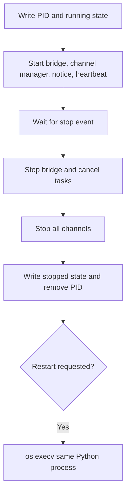

# Gateway configuration and service lifecycle

## Persistent models

`GatewayConfig` is defined at [`ohmo/gateway/models.py:19`](../../../ohmo/gateway/models.py#L19).
It owns the provider profile, enabled channels, routing label, progress/tool-hint flags, permission
and sandbox fields, remote-admin controls, log level, and per-channel dictionaries.

`GatewayState` at [`models.py:44`](../../../ohmo/gateway/models.py#L44) is operational status:
running PID, active runtime count, current profile/channels, and last error. Configuration and state
are separate files; stale state must not override live config.

`load_gateway_config()` returns defaults when `gateway.json` is absent but propagates invalid JSON
or Pydantic validation errors at [`gateway/config.py:24`](../../../ohmo/gateway/config.py#L24).
`save_gateway_config()` writes formatted JSON directly rather than through the repository's atomic
write helper at [`gateway/config.py:41`](../../../ohmo/gateway/config.py#L41).

The model is broader than the currently effective gateway wiring. As of this revision,
`session_routing`, `permission_mode`, and `sandbox_enabled` are created and persisted but are not
read by the service, bridge, router, or runtime pool. Routing is determined directly by
`session_key_for_message()`, while runtime permission/sandbox behavior comes from shared runtime
settings. Treat those three fields as reserved schema, not working controls, until an owning path
and tests are added.

## Channel-manager projection

`build_channel_manager_config()` starts from core `Config`, copies global progress flags, and for
each recognized enabled-channel name merges `{"enabled": true}` plus its free-form channel config
at [`gateway/config.py:59`](../../../ohmo/gateway/config.py#L59). Unknown channel names are silently
skipped. Validation occurs when the core channel model is copied.

The setup wizard is owned by [`ohmo/cli.py:408`](../../../ohmo/cli.py#L408). It selects a core
provider profile and channel settings, writes `gateway.json`, and can restart a running process at
[`cli.py:498`](../../../ohmo/cli.py#L498). Secure defaults and channel-specific wizard behavior are
covered in [`test_cli.py:43`](../../../tests/test_ohmo/test_cli.py#L43).

## Service construction

`OhmoGatewayService.__init__()` begins at
[`gateway/service.py:63`](../../../ohmo/gateway/service.py#L63). It:

1. resolves and globally changes process CWD;
2. initializes the workspace and sets `OHMO_WORKSPACE`;
3. loads gateway configuration;
4. warns when remote administrative commands are enabled;
5. constructs `MessageBus` and core `ChannelManager`;
6. constructs the per-session runtime pool; and
7. constructs the bridge with restart callback and Feishu group policy.

Construction has process-wide side effects (`os.chdir`, environment mutation), including when
helpers such as `gateway_status()` instantiate a service.

## Foreground lifecycle



`run_foreground()` implements this at
[`gateway/service.py:346`](../../../ohmo/gateway/service.py#L346). SIGTERM/SIGINT handlers set the
stop event when supported. A five-second heartbeat rewrites state with active-session count and the
first channel error.

Cleanup stops the bridge, cancels/awaits bridge and manager start tasks, cancels heartbeat/restart
notice, calls `ChannelManager.stop_all()`, writes stopped state, and removes the PID file. It does
not close every bundle in `OhmoSessionRuntimePool`; process exit is the normal final resource
boundary.

## Background process management

`start_gateway_process()` at [`service.py:436`](../../../ohmo/gateway/service.py#L436) creates a
service to resolve paths/config, prepends the repository root to `PYTHONPATH`, opens
`logs/gateway.log`, and starts:

```text
python -m ohmo gateway run --cwd ... --workspace ... --no-console-log
```

Unix uses a new session; Windows uses detached/new-process-group flags. The parent returns the
child PID without waiting for readiness or validating that channel startup succeeds.

`stop_gateway_process()` at [`service.py:591`](../../../ohmo/gateway/service.py#L591) combines the
PID file with process-list discovery scoped by workspace. It sends SIGTERM on Unix and forceful
`taskkill /F /T` on Windows, then immediately removes PID state and reports stopped; it does not
wait for confirmed process exit.

`gateway_status()` at [`service.py:635`](../../../ohmo/gateway/service.py#L635) prefers a live PID
from file/process discovery, recovers active-session/error data from state when valid, and always
uses current config for profile/channels. It can repair the PID file from process discovery.

## In-place restart protocol

Remote `/restart` writes `gateway-restart-notice.json`, sleeps 0.75 seconds for outbound flush, and
sets the stop event at [`service.py:193`](../../../ohmo/gateway/service.py#L193). After cleanup,
`_exec_restart()` replaces the process with `python -m ohmo gateway run ...` at
[`service.py:278`](../../../ohmo/gateway/service.py#L278).

The new process waits two seconds, publishes the saved confirmation, and deletes the notice in a
`finally` block at [`service.py:305`](../../../ohmo/gateway/service.py#L305). Invalid notice payloads
are deleted without publication; JSON read errors propagate from that task unless cancellation or
service lifecycle absorbs them.

## Tests and risks

- Live config versus stale state: [`test_gateway.py:405`](../../../tests/test_ohmo/test_gateway.py#L405).
- Detached logging argv: [`test_gateway.py:427`](../../../tests/test_ohmo/test_gateway.py#L427).
- Workspace process discovery/stop: [`test_gateway.py:455`](../../../tests/test_ohmo/test_gateway.py#L455).
- Restart timing/notice: [`test_gateway.py:2473`](../../../tests/test_ohmo/test_gateway.py#L2473).

Key maintenance risks are non-atomic config/state writes, constructor process-wide side effects,
no child readiness handshake, no stop wait, and no runtime-pool close-all lifecycle.
