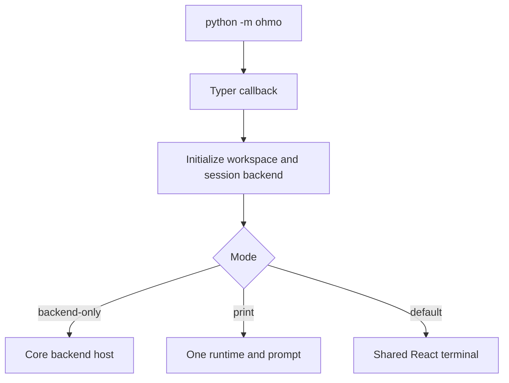

# Local CLI and runtime composition

## Entrypoint

The package entrypoint is `python -m ohmo`, which imports and calls the Typer app at
[`ohmo/__main__.py:14`](../../../ohmo/__main__.py#L14). The callback `main()` begins at
[`ohmo/cli.py:575`](../../../ohmo/cli.py#L575). When Typer selected a subcommand, the callback
returns; otherwise it initializes the workspace and selects backend-only, print, or React terminal
mode.



## Resume and continue

Before selecting a UI mode, `main()` creates `OhmoSessionBackend` and optionally restores state at
[`cli.py:599`](../../../ohmo/cli.py#L599):

- `--continue` loads the latest workspace snapshot through the backend's global latest pointer.
- `--resume ID` loads `session-ID.json` or the matching latest snapshot.
- only restored messages and tool metadata are passed to backend-only mode.

Print and React-launch calls do not receive the restored variables in this callback. Consequently,
the current `--resume`/`--continue` restoration path materially applies to `--backend-only`, which
is the child used by the React terminal, but the parent React launch does not add those flags to its
generated child command. This distinction should be preserved or changed with explicit tests.

## Backend-only composition

`run_ohmo_backend()` delegates to core `run_backend_host()` at
[`ohmo/runtime.py:50`](../../../ohmo/runtime.py#L50). It supplies:

- resolved project CWD;
- ohmo system prompt;
- active provider profile and optional injected API client;
- restore messages/tool metadata;
- `OhmoSessionBackend`;
- workspace skill and plugin roots;
- personal memory command backend;
- `include_project_memory=False`; and
- autodream paths rooted in ohmo memory/sessions.

The core backend host still owns line protocol, engine creation, commands, hooks, tools, providers,
and cleanup.

## React terminal parent/child model

`launch_ohmo_react_tui()` uses the same packaged React/Ink terminal as `oh` at
[`runtime.py:133`](../../../ohmo/runtime.py#L133). It:

1. locates the frontend and `package.json`;
2. runs `npm install --no-fund --no-audit` when `node_modules` is absent;
3. writes an `OPENHARNESS_FRONTEND_CONFIG` JSON object into the child environment;
4. sets `backend_command` to `python -m ohmo --backend-only ...`; and
5. starts `tsx src/index.tsx` with inherited stdio.

The backend argv builder is at [`runtime.py:101`](../../../ohmo/runtime.py#L101). It uses an argument
list and conditionally adds CWD, workspace, model, max turns, and provider profile.

The process topology is:

```text
ohmo parent Python process
  -> tsx frontend/terminal/src/index.tsx
       -> python -m ohmo --backend-only ...
            -> core backend host and RuntimeBundle
```

## Print mode

`run_ohmo_print_mode()` creates a runtime directly at
[`runtime.py:198`](../../../ohmo/runtime.py#L198). It temporarily changes process CWD, builds and
starts the bundle, routes the prompt through core `handle_line()`, streams text to stdout, sends
status/errors to stderr, closes the runtime, and restores the original CWD in `finally`.

An `ErrorEvent` makes the exit code 1; otherwise it returns 0. If `build_runtime()`,
`start_runtime()`, or `handle_line()` raises before the explicit `close_runtime()` call, the current
function restores CWD but does not close a partially created bundle in a surrounding `finally`.

## CLI subcommands

| Command area | Owner/reference |
| --- | --- |
| `init`, setup wizard | [`cli.py:661`](../../../ohmo/cli.py#L661) |
| `config`, optional gateway restart | [`cli.py:699`](../../../ohmo/cli.py#L699) |
| `doctor` workspace/profile status | [`cli.py:722`](../../../ohmo/cli.py#L722) |
| memory list/add/remove | [`cli.py:757`](../../../ohmo/cli.py#L757) |
| soul/user show/edit | [`cli.py:814`](../../../ohmo/cli.py#L814) |
| gateway run/start/stop/restart/status | [`cli.py:902`](../../../ohmo/cli.py#L902) |

The configuration wizard writes gateway/channel state, not provider secrets. Provider readiness is
queried through core `AuthManager` in doctor and selection flows.

## Tests and change checklist

- CLI initialization and secure defaults: [`test_cli.py:18`](../../../tests/test_ohmo/test_cli.py#L18).
- Interactive channel configuration/restart: [`test_cli.py:88`](../../../tests/test_ohmo/test_cli.py#L88).
- Extra skill/plugin roots: [`test_loading.py:130`](../../../tests/test_ohmo/test_loading.py#L130).

Launcher changes cross Python and TypeScript packaging boundaries and require frontend typechecking.
Pure documentation or workspace behavior does not.
