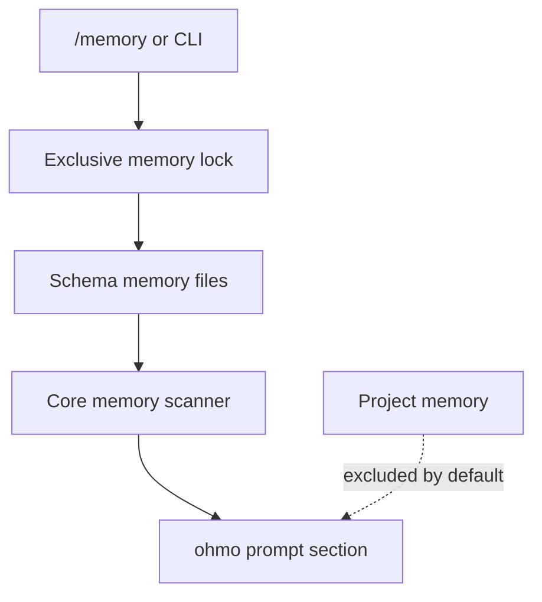

# Personal memory lifecycle

## Storage model

ohmo's normal personal-memory store lives under `<workspace>/memory`, separate from the normal
repository/project memory store.
`MEMORY.md` is the index/entrypoint; focused Markdown files carry schema front matter and content.
The path helpers are at [`workspace.py:253`](../../../ohmo/workspace.py#L253) and
[`workspace.py:312`](../../../ohmo/workspace.py#L312).

Memory reuses core scanning and schema utilities but binds them to ohmo paths. Imports are visible at
[`ohmo/memory.py:19`](../../../ohmo/memory.py#L19).

## Add workflow

`add_memory_entry()` begins at [`memory.py:61`](../../../ohmo/memory.py#L61):

1. slugify the title to a filename candidate;
2. acquire `memory/.memory.lock`;
3. fix default type/category to `personal`/`preference`;
4. compute a content/type/category signature;
5. scan enabled, disabled, and expired entries for a duplicate signature;
6. reuse the duplicate path or allocate `slug.md`, `slug_2.md`, and so on;
7. preserve ID/created timestamp when rewriting an existing entry;
8. render schema metadata and body atomically; and
9. append a link to `MEMORY.md` if the filename is not already present.

Duplicate detection is content-signature based, not title based. Re-adding identical content can
reactivate/update an existing disabled file because metadata is rewritten with `disabled=False`.

## Remove workflow

`remove_memory_entry()` performs a soft delete at
[`memory.py:140`](../../../ohmo/memory.py#L140). It matches the requested name against file stem,
filename, title, or memory ID; selects the first scan result; sets `disabled=true`; updates the
timestamp; and removes lines mentioning the filename from `MEMORY.md`.

The Markdown file remains on disk. A missing or already-disabled match returns `False`.

## Read and prompt injection

`list_memory_files()` delegates to the core scanner at
[`memory.py:39`](../../../ohmo/memory.py#L39), which naturally excludes disabled/expired entries in
the default scan.

`load_memory_prompt()` builds a prompt section at [`memory.py:196`](../../../ohmo/memory.py#L196):

- includes the first 200 lines of `MEMORY.md`;
- loads at most five active entries by lexicographically sorted path by default;
- truncates each rendered file to 4,000 characters; and
- includes paths/instructions that identify the store as personal memory.

It returns a non-empty header even when no entries exist. The result is appended by
`build_ohmo_system_prompt()` at [`prompts.py:98`](../../../ohmo/prompts.py#L98).

This recall path does not rank files against the latest prompt, add freshness labels, or update the
core usage index. The personal-memory section is read when an ohmo runtime is constructed and then
carried as the custom system-prompt base; ordinary per-turn dynamic prompt rebuilding does not
re-read the directory. Long-lived/cached bundles therefore need a refresh/rebuild to see later
personal-memory edits.

## Command and autodream integration

`create_memory_command_backend()` adapts the store to core `/memory` commands at
[`memory.py:228`](../../../ohmo/memory.py#L228). Local and gateway runtime composition pass this
backend explicitly. Status, list, show, add, remove, edit, migrate, stats, and dream directory
selection use personal state rather than the active repository.

Both runtime paths also pass `autodream_context` with ohmo memory/session directories; see
[`runtime.py:92`](../../../ohmo/runtime.py#L92) and
[`gateway/runtime.py:287`](../../../ohmo/gateway/runtime.py#L287). Core auto-dream uses that context
to select personal memory/workspace sessions and launch an ohmo runner.

The backend is not consumed by every core memory path. Manual `/memory extract` is rejected for a
custom backend, while optional engine auto-extraction still targets project memory for the effective
cwd. `/memory validate`, `session`, `team`, and `agent` also use core path helpers. Automatic
session-memory checkpoints are core cwd-hashed data rather than workspace files. See the
[shared-concepts comparison](../OH_AND_OHMO_SHARED_CONCEPTS.md#current-memory-boundary-exceptions)
before relying on personal/project isolation outside the normal prompt and common mutation paths.

## Isolation and concurrency

All mutation is synchronous and file-lock protected. Reads do not take the mutation lock. Atomic
writes prevent partial replacement, but the index and entry are two distinct writes; a process
failure between them can leave a valid entry absent from the index.

Auto-dream has its own consolidation lock and pre-change backup. The core runner uses broad
full-auto permissions with directory constraints expressed in its prompt; the ohmo runner does not
force full-auto, so personal-memory writes depend on effective permission settings and may be
blocked in default mode. Treat dream preview/diff as review aids, not a filesystem sandbox or proof
of semantic correctness.

## Tests and change checklist

Schema and soft-delete behavior is tested at
[`test_prompts.py:60`](../../../tests/test_ohmo/test_prompts.py#L60). Gateway binding to personal
memory is tested at [`test_gateway.py:1467`](../../../tests/test_ohmo/test_gateway.py#L1467), and
project-memory exclusion at [`test_gateway.py:1520`](../../../tests/test_ohmo/test_gateway.py#L1520).

Changes must preserve schema compatibility, duplicate signatures, soft deletion, index consistency,
lock/atomic-write behavior, prompt bounds, and project-memory isolation.
