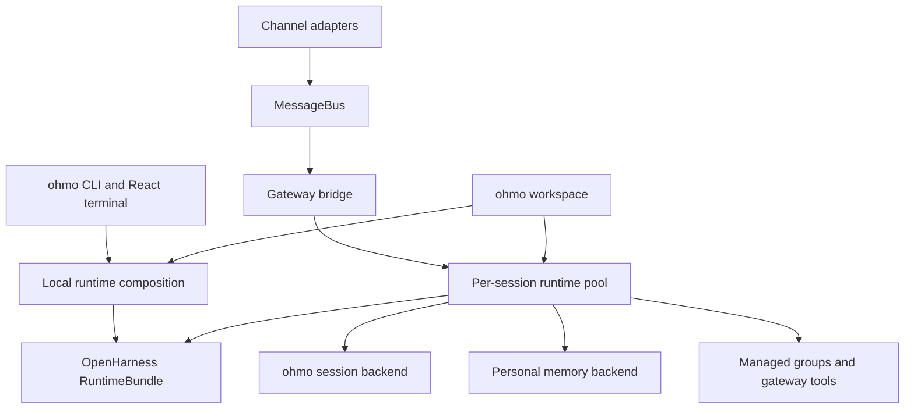

# ohmo developer reference

`ohmo` is the personal-agent application layered on the reusable OpenHarness runtime. This
directory is the source-oriented reference for its state ownership, local application modes,
gateway, conversation isolation, memory, persistence, media, and channel-specific workflows.

Every source link includes a current line number. Line numbers are navigation aids for this
revision; symbol names and tests remain authoritative after code moves.

## Reading paths

| Question | Dedicated document |
| --- | --- |
| What belongs in `ohmo` rather than core? | [Architecture and product boundary](ARCHITECTURE_AND_BOUNDARIES.md) |
| How is `~/.ohmo` created and turned into a persona prompt? | [Workspace, identity, and prompt assembly](WORKSPACE_IDENTITY_AND_PROMPTS.md) |
| How do `ohmo`, print mode, backend-only mode, and the React TUI launch? | [Local CLI and runtime composition](LOCAL_CLI_AND_RUNTIME.md) |
| How are durable personal memories created, indexed, disabled, and injected? | [Personal memory lifecycle](PERSONAL_MEMORY.md) |
| How are local and channel conversations persisted and restored? | [Session persistence and isolation](SESSION_PERSISTENCE.md) |
| How are gateway config, channels, process state, start/stop, and restart managed? | [Gateway configuration and service lifecycle](GATEWAY_CONFIG_AND_SERVICE.md) |
| How are inbound messages authorized, routed, interrupted, and published? | [Routing, bridge, and concurrency](ROUTING_BRIDGE_AND_CONCURRENCY.md) |
| How does each chat acquire and refresh an OpenHarness runtime? | [Per-conversation runtime pool](SESSION_RUNTIME_POOL.md) |
| How are inbound attachments, generated media, and image rejection handled? | [Attachments and media flow](ATTACHMENTS_AND_MEDIA.md) |
| How do remote commands, provider changes, managed groups, and notifications work? | [Commands, groups, and notifications](COMMANDS_GROUPS_AND_NOTIFICATIONS.md) |

For the shorter lifecycle overview, see the existing
[`ohmo` integration flow](../flows/OHMO_INTEGRATION.md).

## System map

## Non-negotiable invariants

- Dependency direction is `ohmo` to `openharness`; reusable behavior belongs in core. See
  [`ohmo/runtime.py:25`](../../../ohmo/runtime.py#L25) for the composition imports.
- Personal state defaults to `~/.ohmo`, not OpenHarness project memory. Workspace resolution is at
  [`ohmo/workspace.py:174`](../../../ohmo/workspace.py#L174).
- Gateway session keys isolate shared-chat senders. Routing is implemented at
  [`ohmo/gateway/router.py:19`](../../../ohmo/gateway/router.py#L19).
- Project memory is disabled in local and gateway runtime construction; personal memory is injected
  explicitly. See [`ohmo/runtime.py:77`](../../../ohmo/runtime.py#L77) and
  [`ohmo/gateway/runtime.py:273`](../../../ohmo/gateway/runtime.py#L273).
- Remote commands remain subject to `remote_invocable` and explicit administrator opt-in. See
  [`ohmo/gateway/runtime.py:179`](../../../ohmo/gateway/runtime.py#L179).
- A newer message for the same session cancels the older task before starting. See
  [`ohmo/gateway/bridge.py:181`](../../../ohmo/gateway/bridge.py#L181).
- Tool-call/message history is sanitized before persistence or runtime refresh. See
  [`ohmo/gateway/runtime.py:764`](../../../ohmo/gateway/runtime.py#L764).

## Source and test ownership

| Area | Primary source | Primary tests |
| --- | --- | --- |
| Workspace/prompt | [`workspace.py`](../../../ohmo/workspace.py#L174), [`prompts.py`](../../../ohmo/prompts.py#L48) | [`test_workspace.py`](../../../tests/test_ohmo/test_workspace.py#L15), [`test_prompts.py`](../../../tests/test_ohmo/test_prompts.py#L20) |
| Local app | [`cli.py`](../../../ohmo/cli.py#L575), [`runtime.py`](../../../ohmo/runtime.py#L50) | [`test_cli.py`](../../../tests/test_ohmo/test_cli.py#L10), [`test_loading.py`](../../../tests/test_ohmo/test_loading.py#L65) |
| Memory/session | [`memory.py`](../../../ohmo/memory.py#L39), [`session_storage.py`](../../../ohmo/session_storage.py#L81) | [`test_prompts.py`](../../../tests/test_ohmo/test_prompts.py#L60), [`test_ohmo_session_storage.py`](../../../tests/test_ohmo/test_ohmo_session_storage.py#L11) |
| Gateway | [`service.py`](../../../ohmo/gateway/service.py#L50), [`bridge.py`](../../../ohmo/gateway/bridge.py#L86), [`runtime.py`](../../../ohmo/gateway/runtime.py#L118) | [`test_gateway.py`](../../../tests/test_ohmo/test_gateway.py#L59) |

Run `uv run pytest -q tests/test_ohmo` for the focused offline suite.
