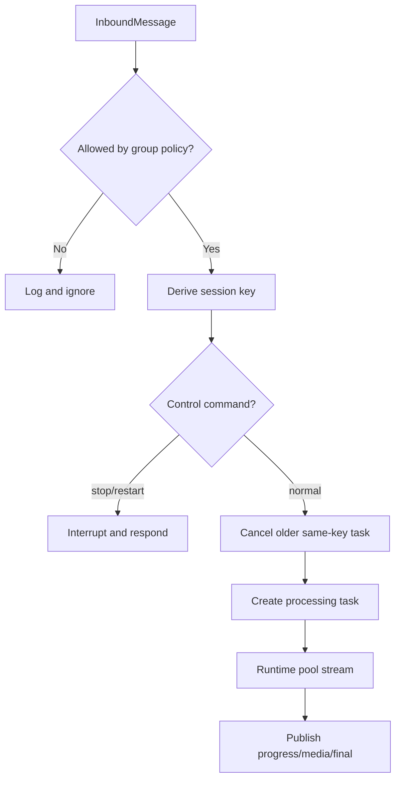

# Routing, bridge, and concurrency

## Session-key routing

`session_key_for_message()` is the isolation boundary at
[`ohmo/gateway/router.py:19`](../../../ohmo/gateway/router.py#L19).

| Message context | Key shape |
| --- | --- |
| explicit override | exact `session_key_override` |
| private with thread | `channel:chat_id:thread_id` |
| private without thread | `channel:chat_id` |
| shared with thread | `channel:chat_id:thread_id:sender_id` |
| shared without thread | `channel:chat_id:sender_id` |

Thread metadata is checked in order: `thread_id`, `thread_ts`, `message_thread_id`. Empty sender IDs
become `anonymous`. Private legacy keys are intentionally stable; shared keys add sender identity so
different people do not share model history.

## Bridge consume loop

`OhmoGatewayBridge.run()` begins at
[`gateway/bridge.py:128`](../../../ohmo/gateway/bridge.py#L128). It polls the inbound bus with a
one-second timeout so `stop()` can end the loop, then:

1. applies Feishu group policy;
2. derives the session key;
3. handles exact `/stop` and `/restart` control commands;
4. transforms `/group` when applicable;
5. cancels an older task for the same key;
6. starts one named task for the new message; and
7. removes task/cancellation metadata in a done callback.

## Feishu group admission

Non-Feishu and non-group messages always pass. Feishu group messages use the normalized policy at
[`bridge.py:483`](../../../ohmo/gateway/bridge.py#L483):

- `open`: all messages;
- `mention`: only bot mentions;
- `managed`: only groups with ohmo managed-group metadata;
- `managed_or_mention`: either condition.

Unknown policy values normalize to `managed_or_mention` at
[`bridge.py:580`](../../../ohmo/gateway/bridge.py#L580). Mention metadata accepts boolean or common
truthy strings at [`bridge.py:606`](../../../ohmo/gateway/bridge.py#L606). A managed-record load
failure is logged and treated as unmanaged.

## Cancellation semantics

There is at most one active processing task per session key. `_interrupt_session()` at
[`bridge.py:343`](../../../ohmo/gateway/bridge.py#L343) records a reason, calls `task.cancel()`,
optionally publishes a notice, and waits up to three seconds using `shield()`. Timeout does not
forcefully terminate nested provider/tool work beyond the task cancellation already issued.

A newer message publishes a replacement notice and starts immediately after the bounded wait.
`/stop` reports whether a task existed. `stop()` cancels all tracked tasks but is synchronous and
does not await them at [`bridge.py:198`](../../../ohmo/gateway/bridge.py#L198); service cleanup
cancels/awaits the bridge task itself.

## Message processing and outbound metadata

`_process_message()` starts at [`bridge.py:373`](../../../ohmo/gateway/bridge.py#L373). For group or
threaded messages it carries thread ID and optionally inbound message ID to progress/final outputs.
Feishu private replies deliberately omit message/thread metadata so they remain normal DMs.

Runtime updates behave as follows:

- `final` is held until streaming ends;
- progress/tool/media/error updates are published immediately;
- final media/metadata replace the last captured final values;
- cancellation is logged and re-raised;
- other exceptions become a sanitized user-facing auth/general gateway error; and
- an empty final reply produces no final outbound message.

The final outbound merges thread metadata, runtime metadata, and authoritative `_session_key` at
[`bridge.py:449`](../../../ohmo/gateway/bridge.py#L449).

## `/group` bridge transformation

The exact `/group` parser is at [`bridge.py:534`](../../../ohmo/gateway/bridge.py#L534). It is
accepted only for Feishu private chat. `_prepare_group_prompt_message()` marks internal metadata and
replaces user content with a constrained agent prompt at
[`bridge.py:270`](../../../ohmo/gateway/bridge.py#L270). The session key is recomputed after the
message replacement, though the override and primary addressing fields are preserved.

The generated prompt tells the model to call `ohmo_create_feishu_group` exactly once only when a
safe name/CWD can be inferred; otherwise it should clarify. See
[`bridge.py:555`](../../../ohmo/gateway/bridge.py#L555).

## Tests and invariants

- Routing isolation: [`test_gateway.py:59`](../../../tests/test_ohmo/test_gateway.py#L59).
- Feishu policy matrix: [`test_gateway.py:1951`](../../../tests/test_ohmo/test_gateway.py#L1951).
- Private/group reply threading: [`test_gateway.py:1883`](../../../tests/test_ohmo/test_gateway.py#L1883).
- Stop/restart/new-message cancellation: [`test_gateway.py:2142`](../../../tests/test_ohmo/test_gateway.py#L2142), [`test_gateway.py:2541`](../../../tests/test_ohmo/test_gateway.py#L2541).

Do not simplify keys, remove sender scoping, or change cancellation ordering without migration and
cross-sender/thread tests.
