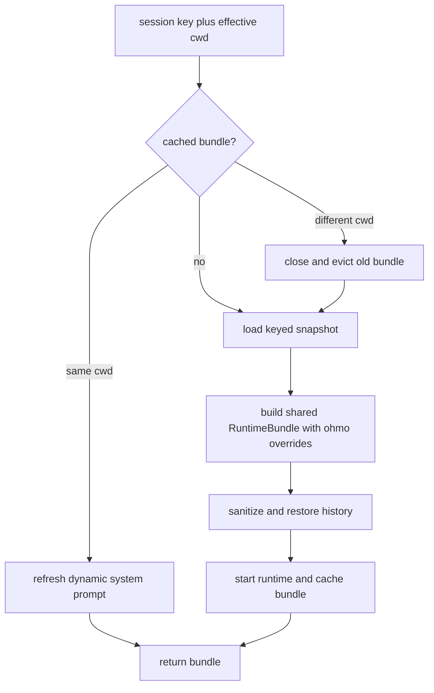

# Per-conversation runtime pool

The gateway does not share one agent engine across every chat. `OhmoSessionRuntimePool` owns a
`RuntimeBundle` per derived session key, restores that conversation's snapshot, and translates
OpenHarness engine events into channel-oriented updates. The bridge owns turn cancellation; the
pool owns runtime construction, refresh, persistence, and event conversion.

## Owned state

The pool is created with a default cwd, ohmo workspace, provider profile, optional model and turn
limit, and optional Feishu group callbacks. Its long-lived state is:

- a workspace-scoped `OhmoSessionBackend`;
- the current persisted gateway configuration;
- `_bundles: dict[str, RuntimeBundle]`, keyed by the router's session key.

See [`OhmoSessionRuntimePool.__init__`](../../../ohmo/gateway/runtime.py#L131). The public
`active_sessions` value is the number of in-memory bundles, not the number of persisted sessions or
currently executing turns ([`runtime.py:166`](../../../ohmo/gateway/runtime.py#L166)).

## Bundle acquisition and restoration

`get_bundle()` implements the cache boundary
([`runtime.py:226`](../../../ohmo/gateway/runtime.py#L226)):

1. Resolve the requested cwd. A managed group can override the service default through its stored
   group record ([`runtime.py:889`](../../../ohmo/gateway/runtime.py#L889)).
2. Reuse the cached bundle when its cwd still matches. Before returning it, rebuild the runtime
   system prompt using the latest user prompt.
3. If the cwd changed, close the old bundle and evict it. This prevents tools for the same session
   key from continuing in the wrong repository.
4. Load only the snapshot mapped to that exact session key. This is the isolation boundary between
   channel conversations.
5. Call the shared `build_runtime()` composition function with the ohmo prompt, provider profile,
   session backend, personal skills/plugins/memory roots, and `include_project_memory=False`.
6. Sanitize restored messages and tool metadata, restore the prior session ID, register gateway
   tools, start the runtime, update its dynamic prompt, and cache it.

The dynamic prompt path deliberately uses core `build_runtime_system_prompt()` after initial
composition so current settings, environment, skills, plugins, and project instruction files are
reflected without enabling project memory ([`runtime.py:861`](../../../ohmo/gateway/runtime.py#L861)).
The ohmo persona and personal-memory section remain inside the custom system-prompt base captured
when the bundle was constructed; this per-turn path does not re-read personal memory. Refresh or
rebuild a cached bundle to pick up later personal-memory changes.

## Message dispatch: command or agent turn

`stream_message()` first converts the inbound transport message into a core conversation message,
resolves the effective cwd, and obtains the bundle
([`runtime.py:308`](../../../ohmo/gateway/runtime.py#L308)). It then takes one of two paths:

- A built-in slash command is looked up first. A skill slash command is the fallback. Commands are
  considered only when the message has no media, so an attachment plus slash-like text is treated as
  an ordinary model turn.
- Otherwise the message is submitted to the agent engine.

The `CommandContext` is constructed lazily because ordinary model turns do not need it. It supplies
the bundle's engine, registries, session state, ohmo skill/plugin roots, and personal memory backend,
again with project memory disabled ([`runtime.py:336`](../../../ohmo/gateway/runtime.py#L336)).

Remote command authorization is applied before handler invocation. Gateway-owned `/provider` and
`/model` commands are then intercepted so they update gateway state rather than only the current
bundle ([`runtime.py:370`](../../../ohmo/gateway/runtime.py#L370)).

## Command result semantics

`_stream_command_result()` interprets the core `CommandResult`
([`runtime.py:432`](../../../ohmo/gateway/runtime.py#L432)):

- `refresh_runtime` closes and rebuilds the bundle while retaining sanitized conversation state.
- `message` becomes an immediate final channel update.
- `submit_prompt` starts a model turn; `submit_model` temporarily overrides the model and is restored
  in `finally`.
- `continue_pending` resumes the existing tool loop for the requested number of turns.
- A result with none of those actions still triggers a snapshot save.

Refresh preserves messages and metadata only after core conversation sanitation plus removal of
ephemeral `/group` prompt/context data. It rebuilds with the bundle's current settings, starts the
replacement, and overwrites the cache entry
([`runtime.py:805`](../../../ohmo/gateway/runtime.py#L805)).

## Engine streaming and channel updates

`_stream_engine_message()` emits a `thinking` progress update, installs any turn-scoped group-tool
context, and consumes `engine.submit_message()`
([`runtime.py:518`](../../../ohmo/gateway/runtime.py#L518)). Event conversion is centralized in
`_convert_stream_event()` ([`runtime.py:634`](../../../ohmo/gateway/runtime.py#L634)):

| Core event | Gateway behavior |
| --- | --- |
| text delta | append to the final reply accumulator; do not publish every token |
| status/compaction | emit localized progress when meaningful |
| tool execution started | emit a concise tool hint |
| successful tool completion with valid paths | emit a media update |
| error | emit an error update |
| assistant turn complete | provide fallback final text if no deltas accumulated |

The method catches `MaxTurnsExceeded`, always removes temporary group context, saves the snapshot,
and yields one final accumulated reply. If the provider explicitly rejects image input, it removes
image blocks from history and retries the pending turn once; that workflow is covered in
[Attachments and media flow](ATTACHMENTS_AND_MEDIA.md).

## Snapshot boundary

After a command or engine turn, `_save_snapshot()` records the session through
`OhmoSessionBackend` ([`runtime.py:764`](../../../ohmo/gateway/runtime.py#L764)). Before writing, it:

- removes the synthetic `/group` agent prompt from durable message history;
- removes transient group-request metadata;
- relies on core conversation sanitation to avoid dangling tool-call/tool-result sequences;
- includes the exact session key so later acquisition restores only that conversation.

This separation matters: the in-memory bundle is an execution object, while the JSON snapshot is a
sanitized resume artifact. See [Session persistence and isolation](SESSION_PERSISTENCE.md) for the
filesystem layout.

## Concurrency and lifecycle constraints

The pool does not lock a bundle internally. Instead, the bridge keeps at most one active task per
session key and cancels the older task before starting a replacement
([`bridge.py:343`](../../../ohmo/gateway/bridge.py#L343)). Different session keys may execute
concurrently and therefore use different bundles.

Closing is explicit on cwd changes and refreshes. Any new pool-level shutdown or eviction feature
must close every affected `RuntimeBundle`; merely deleting `_bundles` entries would leak runtime
resources. Keep synchronous filesystem work in the hot async path bounded.

## Tests to preserve

The focused gateway suite covers keyed restoration, runtime reuse and refresh, event/progress
translation, provider/model refresh, slash commands, group sanitation, and image fallback. Start at
[`tests/test_ohmo/test_gateway.py:481`](../../../tests/test_ohmo/test_gateway.py#L481),
[`test_gateway.py:710`](../../../tests/test_ohmo/test_gateway.py#L710),
[`test_gateway.py:2802`](../../../tests/test_ohmo/test_gateway.py#L2802), and
[`test_gateway.py:3108`](../../../tests/test_ohmo/test_gateway.py#L3108).
