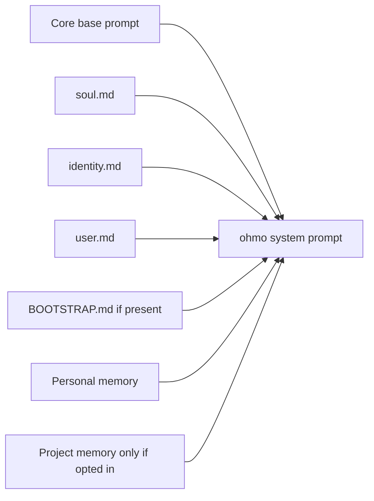

# Workspace, identity, and prompt assembly

## Workspace resolution

`get_workspace_root()` resolves state in this order:

1. explicit `workspace` argument;
2. `OHMO_WORKSPACE`;
3. `~/.ohmo`.

The path is expanded and resolved at [`ohmo/workspace.py:174`](../../../ohmo/workspace.py#L174).
An explicitly named directory does not need to be literally `.ohmo`; tests commonly use an
isolated `.ohmo-home` directory.

## Workspace layout

`ensure_workspace()` creates directories without seeding content at
[`workspace.py:413`](../../../ohmo/workspace.py#L413):

```text
<workspace>/
├── memory/
├── skills/
├── plugins/
├── groups/
├── sessions/
├── logs/
└── attachments/
```

`initialize_workspace()` then seeds missing files at
[`workspace.py:436`](../../../ohmo/workspace.py#L436):

```text
soul.md
user.md
identity.md
BOOTSTRAP.md
memory/MEMORY.md
state.json
gateway.json
```

Existing persona and profile files are never overwritten. `state.json` records the app/workspace
and a `bootstrap_seeded` marker. If state JSON is invalid, initialization reconstructs its base
shape. `BOOTSTRAP.md` is seeded once according to the marker; deleting it after first contact does
not cause it to reappear on every initialization. The relevant branch is
[`workspace.py:458`](../../../ohmo/workspace.py#L458).

Gateway config is created with `GatewayConfig` defaults when missing at
[`workspace.py:474`](../../../ohmo/workspace.py#L474). `workspace_health()` reports expected paths at
[`workspace.py:498`](../../../ohmo/workspace.py#L498); it checks presence, not semantic validity.

## Identity layers

The templates intentionally separate concerns:

| File | Meaning | Template source |
| --- | --- | --- |
| `soul.md` | behavioral values, privacy boundaries, tone, continuity | [`workspace.py:22`](../../../ohmo/workspace.py#L22) |
| `identity.md` | short name/kind/vibe/signature | [`workspace.py:118`](../../../ohmo/workspace.py#L118) |
| `user.md` | user facts, preferences, ongoing context, relationship notes | [`workspace.py:71`](../../../ohmo/workspace.py#L71) |
| `BOOTSTRAP.md` | first-contact task and setup guidance | [`workspace.py:129`](../../../ohmo/workspace.py#L129) |

The CLI exposes direct show/edit operations for soul and user files through `_show_or_edit()` at
[`ohmo/cli.py:814`](../../../ohmo/cli.py#L814). `--set` replaces the whole file with stripped text
plus a newline; there is no merge or schema validation.

## Prompt assembly order

`build_ohmo_system_prompt()` builds a deterministic sequence at
[`ohmo/prompts.py:48`](../../../ohmo/prompts.py#L48):

1. core OpenHarness base system prompt;
2. optional additional instructions;
3. soul;
4. identity;
5. user profile;
6. bootstrap instructions, if the file still exists;
7. workspace paths and session-compatibility note;
8. ohmo personal memory;
9. optional project memory.

Files are read with UTF-8 replacement and ignored when missing or whitespace-only at
[`prompts.py:31`](../../../ohmo/prompts.py#L31).



## Runtime prompt refresh

The initial gateway bundle receives `build_ohmo_system_prompt()` at
[`gateway/runtime.py:273`](../../../ohmo/gateway/runtime.py#L273). Before later turns,
`_runtime_system_prompt()` calls core `build_runtime_system_prompt()` with the latest user prompt,
ohmo skill/plugin roots, and `include_project_memory=False` at
[`gateway/runtime.py:861`](../../../ohmo/gateway/runtime.py#L861).

This means the base persona is not the only prompt content. Core runtime assembly can add current
skills/plugins and other runtime context around the ohmo base prompt. The base itself—including the
personal-memory bodies read during bundle construction—is retained rather than rebuilt from the
workspace on every turn; refresh/rebuild the bundle to observe later persona or memory edits.

## Private skills and plugins

The workspace `skills/` and `plugins/` directories are supplied as extra roots in local mode at
[`ohmo/runtime.py:34`](../../../ohmo/runtime.py#L34) and gateway mode at
[`gateway/runtime.py:283`](../../../ohmo/gateway/runtime.py#L283). They augment shared OpenHarness
roots rather than replacing them. Loading behavior is tested at
[`test_loading.py:65`](../../../tests/test_ohmo/test_loading.py#L65).

These plugins are workspace/user-level ohmo state. They should not be confused with untrusted
project plugins under a repository working directory.

## Tests and maintenance

- Workspace shape/template assertions: [`test_workspace.py:15`](../../../tests/test_ohmo/test_workspace.py#L15).
- Persona and memory prompt ordering: [`test_prompts.py:20`](../../../tests/test_ohmo/test_prompts.py#L20).
- Project-memory exclusion: [`test_prompts.py:40`](../../../tests/test_ohmo/test_prompts.py#L40).
- Private extension roots: [`test_loading.py:65`](../../../tests/test_ohmo/test_loading.py#L65).

When adding a workspace file, update its path helper, initialization, health output, prompt or
runtime consumer, CLI/doctor behavior if relevant, and isolated-workspace tests.
