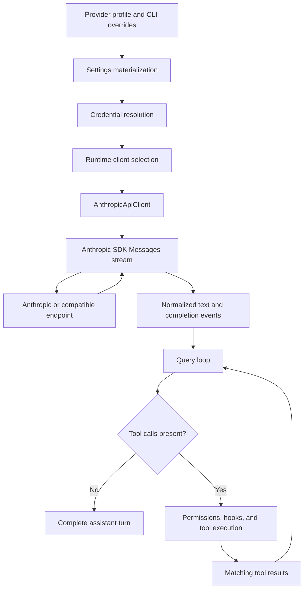

# Anthropic client integration

This document explains the complete Anthropic request path in OpenHarness, from provider profile
selection and credential resolution through streaming, tool execution, replay, and cleanup. It is
an implementation reference for contributors. For operator setup, see the
[LM Studio Anthropic-compatible guide](../../providers/LM_STUDIO_ANTHROPIC.md).

The source is authoritative. This guide describes the current implementation, including gaps that
are easy to miss when reading the broad provider protocol docstrings.

## What “Anthropic” means in this repository

Three related choices must not be conflated:

| Choice | Example | Effect |
| --- | --- | --- |
| Provider workflow | `anthropic`, `anthropic_claude`, or a custom profile | Selects authentication and profile behavior |
| API format | `anthropic` | Selects `AnthropicApiClient` instead of an OpenAI-compatible client |
| Model and endpoint | `claude-sonnet-4-6`, Kimi, LM Studio, or another compatible server | Determines actual model capabilities and wire compatibility |

An Anthropic-compatible endpoint is not necessarily Anthropic, and use of the Anthropic SDK does
not prove support for tools, images, thinking, parallel calls, or a particular context window.

## End-to-end ownership



The main owners are:

| Boundary | Source | Responsibility |
| --- | --- | --- |
| Profile and auth policy | [`config/settings.py`](../../../src/openharness/config/settings.py) | Materialize provider fields, normalize models, and resolve credentials |
| Credential persistence | [`auth/storage.py`](../../../src/openharness/auth/storage.py) | Store API keys or external-auth bindings |
| Claude subscription bridge | [`auth/external.py`](../../../src/openharness/auth/external.py) | Read and refresh Claude-managed credentials and construct identity headers |
| Runtime composition | [`ui/runtime.py`](../../../src/openharness/ui/runtime.py) | Select and construct the concrete API client |
| Anthropic transport adapter | [`api/client.py`](../../../src/openharness/api/client.py) | Build SDK requests, stream text, normalize final messages, usage, errors, and retries |
| Conversation wire conversion | [`engine/messages.py`](../../../src/openharness/engine/messages.py) | Serialize and parse text, image, tool-use, and tool-result blocks |
| Agent loop | [`engine/query.py`](../../../src/openharness/engine/query.py) | Consume normalized events, execute tools, and replay results |

## Configuration and client selection

`ProviderProfile` stores the workflow label, provider, API format, authentication source, default
and last-used model, optional base URL, and optional credential slot. The built-in profiles include:

```text
claude-api
  provider: anthropic
  api_format: anthropic
  auth_source: anthropic_api_key

claude-subscription
  provider: anthropic_claude
  api_format: anthropic
  auth_source: claude_subscription
```

Custom Anthropic-compatible profiles, such as the LM Studio profile, normally use
`provider=anthropic`, `api_format=anthropic`, and API-key authentication with a custom `base_url`.
The provider name alone does not select the client.

`_resolve_api_client_from_settings()` first materializes the active profile, then follows this
selection order:

1. `api_format == "copilot"` selects `CopilotClient`.
2. `provider == "openai_codex"` selects `CodexApiClient`.
3. `provider == "anthropic_claude"` selects `AnthropicApiClient` in Claude OAuth mode.
4. `api_format in ("openai", "openai_compat")` selects `OpenAICompatibleClient`.
5. Everything else selects `AnthropicApiClient` with an API key.

Consequently, a custom profile reaches the Anthropic client through its API format after the
higher-priority subscription and OpenAI branches are excluded.

### Model normalization

For Anthropic workflows, `normalize_anthropic_model_name()` removes an `anthropic/` prefix and
converts dots in `claude-*` names to hyphens. For example:

```text
anthropic/claude-sonnet-4-20250514 -> claude-sonnet-4-20250514
claude-opus-4.6                    -> claude-opus-4-6
```

This is name normalization only. It does not validate that the endpoint serves the model.

## Authentication modes

`AnthropicApiClient` can be constructed with an API key or an auth token. Runtime composition uses
two concrete modes:

| Mode | Constructor fields | SDK path | Intended endpoint |
| --- | --- | --- | --- |
| API key | `api_key`, optional `base_url` | `client.messages` | Anthropic API or a compatible server |
| Claude subscription | `auth_token`, optional direct Anthropic URL, `claude_oauth=True`, resolver | `client.beta.messages` | Direct Anthropic/Claude endpoint only |

API-key credentials are resolved in this order:

1. a profile-scoped credential when the profile has `credential_slot`;
2. a matching environment variable;
3. the explicit flat settings key when no credential slot is active; and
4. the normal stored credential for the resolved storage provider.

Profile-scoped keys are deliberately isolated so a local or third-party endpoint does not
overwrite the main Anthropic key.

Stored credentials use the system keyring when available. The default fallback is
`~/.openharness/credentials.json`, protected by file permissions but not encrypted. Settings and
profile metadata live separately in `~/.openharness/settings.json` by default. Tests and explicit
path configuration can relocate these roots.

Claude subscription authentication is rejected for third-party Anthropic-compatible base URLs.
It adds Claude-specific attribution, beta, metadata, session, and request headers. Before each
request, `_refresh_client_auth()` invokes the resolver and rebuilds the SDK client if the token has
changed.

The constructor also supports `auth_token` without `claude_oauth`; that adds the
`oauth-2025-04-20` beta header, but the current runtime selection path does not use that combination.

## The normalized client contract

The query loop does not depend directly on Anthropic SDK types. It supplies `ApiMessageRequest` and
consumes a small normalized event union.

### Request

```python
ApiMessageRequest(
    model="claude-sonnet-4-6",
    messages=[...],
    system_prompt="...",
    max_tokens=4096,
    tools=[...],
    effort=None,
)
```

### Events

| Event | Meaning |
| --- | --- |
| `ApiTextDeltaEvent` | A displayable fragment of assistant text |
| `ApiRetryEvent` | A recoverable attempt failed and another attempt is scheduled |
| `ApiMessageCompleteEvent` | The normalized final assistant message, token usage, and provider stop reason |

`stream_message()` is the public retrying async generator. `_stream_once()` performs exactly one
SDK streaming attempt.

## Outgoing message conversion

The engine stores provider-neutral `ConversationMessage` objects with `user` or `assistant` roles.
For the Anthropic client, `ConversationMessage.to_api_param()` serializes each content block:

| OpenHarness block | Anthropic Messages block |
| --- | --- |
| `TextBlock` | `{"type": "text", "text": ...}` |
| `ImageBlock` | A base64 `image` source with media type and data |
| `ToolUseBlock` | `tool_use` with stable ID, name, and parsed input object |
| `ToolResultBlock` | `tool_result` referencing `tool_use_id`, with content and error flag |

The system prompt is not inserted into the message list. `_stream_once()` sends it through the
Anthropic `system` parameter.

Tool schemas originate in `BaseTool.to_api_schema()` and use Anthropic's native shape:

```json
{
  "name": "read_file",
  "description": "Read a file",
  "input_schema": {
    "type": "object",
    "properties": {
      "path": {"type": "string"}
    },
    "required": ["path"]
  }
}
```

The client sends the complete registry schema whenever tools are present. The normalized request
has no tool-choice field, and this client does not add one.

## `_stream_once()` in detail

### 1. Build SDK parameters

Every request includes:

```python
params = {
    "model": request.model,
    "messages": [message.to_api_param() for message in request.messages],
    "max_tokens": request.max_tokens,
}
```

It conditionally adds `system` and `tools`. Claude subscription mode additionally:

- prepends a Claude attribution string to the system prompt;
- supplies Claude beta features;
- adds a JSON-encoded device/session identity under `metadata.user_id`; and
- adds a fresh `x-client-request-id` UUID.

The current Anthropic implementation does not read `request.effort`, so no effort or thinking
parameter is sent.

### 2. Open the SDK stream

API-key mode calls:

```python
async with self._client.messages.stream(**params) as stream:
```

Claude subscription mode calls the equivalent `self._client.beta.messages.stream(...)` path.
The Anthropic SDK owns HTTP construction, authentication headers, Server-Sent Events framing, JSON
decoding, typed event creation, and accumulation of the final message.

For a compatible base URL such as `http://localhost:1234`, the SDK resolves the Messages resource
under that base, normally `POST http://localhost:1234/v1/messages`. The compatible server must
accept Anthropic request fields and return an event stream the installed SDK can parse.

### 3. Emit incremental text

An Anthropic text stream conceptually contains:

```text
message_start
content_block_start
content_block_delta: text_delta "Hello"
content_block_delta: text_delta " world"
content_block_stop
message_delta
message_stop
```

OpenHarness examines every SDK event but emits only events matching both conditions:

```text
event.type == content_block_delta
event.delta.type == text_delta
```

Non-empty `delta.text` becomes `ApiTextDeltaEvent`. The query loop immediately translates it to
`AssistantTextDelta`, which lets the CLI or TUI render text before the response is complete.

All other incremental delta types are skipped. In particular, the client does not emit
incremental tool arguments or thinking/reasoning events.

### 4. Ask the SDK for the accumulated message

After iteration reaches the end of the SSE stream, `_stream_once()` calls:

```python
final_message = await stream.get_final_message()
```

This distinction is important: OpenHarness does not assemble tool JSON from raw SSE fragments.
The Anthropic SDK accumulates content blocks and partial JSON, and returns the completed typed
message.

### 5. Normalize the final response

`assistant_message_from_api()` walks `final_message.content`:

- `text` becomes `TextBlock`;
- `tool_use` becomes `ToolUseBlock`, retaining ID, name, and the SDK-parsed input dictionary;
- every other block type is ignored.

The role is normalized to `assistant`. Usage is reduced to integer `input_tokens` and
`output_tokens`, defaulting missing values to zero. The provider's `stop_reason` is copied onto the
completion event.

The query loop retains the final message and usage, but it does not currently use the provider
stop reason to control tool execution. Tool presence in the parsed message is the controlling
signal.

## Why streamed tool calls still work

A tool request is typically delivered as a `tool_use` block start followed by one or more
`input_json_delta` fragments:

```text
content_block_start:
  tool_use id=toolu_123 name=read_file input={}

content_block_delta:
  input_json_delta partial_json='{"path":"README.md"}'
```

Those fragments are not exposed as OpenHarness stream events. The SDK combines them, so
`get_final_message()` returns the equivalent completed block:

```python
ToolUseBlock(
    id="toolu_123",
    name="read_file",
    input={"path": "README.md"},
)
```

Tool execution therefore starts after the provider stream has completed, not while arguments are
still arriving.

## Multi-turn tool replay

When the final assistant message contains tool calls, `run_query()`:

1. appends the complete assistant message to conversation history;
2. emits an assistant-turn-complete event;
3. resolves each requested tool by name;
4. runs pre-tool hooks, input validation, permissions, and the tool itself;
5. normalizes success, rejection, or failure to a `ToolResultBlock` with the same tool-use ID;
6. runs post-tool hooks and emits execution events;
7. appends one user message containing all matching tool results; and
8. starts the next provider turn with the expanded history.

Multiple sibling calls execute concurrently. `asyncio.gather(..., return_exceptions=True)` ensures
one failure does not cancel siblings and leave an assistant `tool_use` without a matching
`tool_result`. Anthropic-compatible APIs commonly reject such incomplete replay.

The next request therefore contains a pair like:

```json
{
  "role": "assistant",
  "content": [
    {
      "type": "tool_use",
      "id": "toolu_123",
      "name": "read_file",
      "input": {"path": "README.md"}
    }
  ]
}
```

```json
{
  "role": "user",
  "content": [
    {
      "type": "tool_result",
      "tool_use_id": "toolu_123",
      "content": "...file contents...",
      "is_error": false
    }
  ]
}
```

Conversation sanitization removes dangling trailing tool calls when restoring interrupted or
malformed history. It also removes orphaned tool results, preserving the pairing invariant before
a resumed conversation reaches a provider.

## Image handling

`ImageBlock` serializes directly to Anthropic's base64 image source format, so the transport can
send image input. Whether the image arrives unchanged depends on engine preprocessing:

1. If the model-name heuristic says the active model is multimodal, the raw image remains.
2. If it is not recognized as multimodal and a vision-model configuration exists, the
   `image_to_text` tool replaces the image block with a text description before the request.
3. If no vision-model configuration exists, preprocessing returns without replacement, so the raw
   image block is still sent and the endpoint decides whether to accept it.

This is input support only. `assistant_message_from_api()` has no representation for image output.

## Retry and error behavior

`stream_message()` allows an initial attempt plus three retries. Backoff is exponential from one
second, adds up to 25 percent jitter, caps the base delay at 30 seconds, and honors a numeric
`retry-after` header up to 30 seconds.

The explicitly retryable HTTP statuses are:

```text
429, 500, 502, 503, 529
```

For one of those `APIStatusError` values, `_stream_once()` re-raises the SDK error so
`stream_message()` can emit `ApiRetryEvent`, sleep, and try again. Other SDK errors are translated
inside `_stream_once()`:

| SDK error class name | OpenHarness error |
| --- | --- |
| `AuthenticationError` or `PermissionDeniedError` | `AuthenticationFailure` |
| `RateLimitError` | `RateLimitFailure` |
| Other `APIError` | `RequestFailure` |

Because translated `OpenHarnessApiError` instances bypass the outer retry branch, generic SDK
network `APIError` failures are not retried by the current call path even though `_is_retryable()`
would classify a raw `APIError` as retryable. Plain `ConnectionError`, `TimeoutError`, or `OSError`
values that reach the outer loop are retryable. This is an implementation discrepancy to preserve
or fix deliberately, not a guarantee implied by the helper name.

Cancellation propagates through the async generator rather than being converted into a provider
error. Runtime teardown ultimately calls `AnthropicApiClient.close()`, which closes the current SDK
HTTP client.

Two lifecycle details deserve explicit attention:

- unlike the OpenAI-compatible branch, runtime construction does not pass `settings.timeout` into
  `AnthropicApiClient`, so the Anthropic SDK default governs request timeouts; and
- when Claude subscription refresh replaces the SDK client, the previous client is not explicitly
  closed by `_refresh_client_auth()`. Final teardown closes only the current client.

These are current implementation facts, not recommended contracts. A change should add focused
tests before altering either behavior.

## Compatibility requirements for third-party servers

An endpoint used by this client must provide enough of the Anthropic Messages contract for the SDK
and OpenHarness layers involved in the requested feature:

| Feature | Required server behavior |
| --- | --- |
| Basic text | Accept `model`, `messages`, `max_tokens`, optional `system`, and streaming; emit parseable text deltas and a final message |
| Tools | Accept Anthropic `tools`; return stable `tool_use` IDs, names, and valid JSON input; accept matching `tool_result` blocks on the next request |
| Parallel tools | Return multiple independently identified tool uses and accept all matching results |
| Images | Accept Anthropic base64 image source blocks and the supplied media type |
| Usage | Return Anthropic-compatible input/output token counters, or OpenHarness records zero |
| Stop reason | Return a parseable stop reason; OpenHarness reports it on the normalized completion event |

Compatibility has three independent layers:

1. the HTTP endpoint implements the Anthropic Messages shape;
2. the selected model and its prompt template produce the requested behavior; and
3. OpenHarness preserves that behavior in its normalized types.

A successful text response establishes only the first, simplest path. It does not establish tool
replay, vision, reasoning, parallel tool calls, or long-context support.

## Current capability boundary

| Capability | Current state | Important qualification |
| --- | --- | --- |
| Text input | Supported | Sent as Anthropic text blocks |
| Streamed text output | Supported | Only `text_delta` is emitted incrementally |
| System prompt | Supported | Sent as a separate string parameter |
| Custom tools | Supported | Native Anthropic schemas are sent |
| Tool-call output | Supported | Parsed from the SDK's accumulated final message |
| Tool-result replay | Supported | IDs and error flags are preserved across turns |
| Parallel tool execution | Supported | Execution is concurrent after response completion |
| Image input | Transport-supported | Model heuristic, preprocessing configuration, endpoint, and model all matter |
| Token usage | Partially supported | Only input and output totals are retained |
| Provider stop reason | Partially supported | Emitted but not used to drive the loop |
| Effort/reasoning request | Not implemented | `ApiMessageRequest.effort` is ignored by this client |
| Thinking/reasoning stream | Not implemented | Non-text deltas are skipped |
| Thinking-block replay | Not implemented | Final parser ignores thinking and redacted-thinking blocks |
| Incremental tool arguments | Not exposed | The SDK accumulates them before execution |
| Audio, citations, files, and server-tool blocks | Not implemented | Unknown final block types are ignored |
| Voice | Not supported | Provider diagnostics report voice unavailable |

The broad provider protocol docstrings describe the contract contributors should preserve across
clients. They are not proof that every listed feature is implemented by `AnthropicApiClient`; the
table above reflects the executable code.

## Failure localization

| Symptom | Likely boundary to inspect |
| --- | --- |
| Profile appears correct but wrong client is used | Materialized `provider` and `api_format` in `ui/runtime.py` |
| 401 or 403 | Credential source, endpoint auth mode, and SDK headers |
| 404 at a compatible endpoint | Base URL and availability of `/v1/messages` |
| Text works but tools do not appear | Endpoint tool schema support, model/template behavior, and final `tool_use` blocks |
| First tool request works but next turn fails | Tool-use IDs, matching tool results, or restored-history sanitization |
| Text appears twice | UI incorrectly rendering both deltas and the final accumulated text |
| Stream finishes with an empty-message error | Endpoint returned only block types that the final parser ignores, or malformed/empty content |
| Images fail | Model-name heuristic, vision fallback configuration, media type, endpoint, and model capability |
| `--effort` has no effect | Expected for the current Anthropic client implementation |
| No retry after a network SDK error | Inspect the `_stream_once()` translation boundary described above |

## Tests and evidence

Relevant offline coverage currently includes:

- [`tests/test_api/test_client.py`](../../../tests/test_api/test_client.py): API-key and token SDK
  construction, Claude headers and token refresh, subscription metadata, and image serialization;
- [`tests/test_engine/test_messages.py`](../../../tests/test_engine/test_messages.py): tool pairing and
  malformed-history sanitization;
- [`tests/test_engine/test_query_engine.py`](../../../tests/test_engine/test_query_engine.py):
  normalized stream consumption, tool execution, parallel failure handling, replay, and resume;
- [`tests/test_config/test_settings.py`](../../../tests/test_config/test_settings.py): profile
  materialization, environment precedence, profile-scoped credentials, and model normalization;
- [`tests/test_commands/test_cli.py`](../../../tests/test_commands/test_cli.py) and
  [`tests/test_ui/`](../../../tests/test_ui): configuration handoff, injected-client behavior, and
  user-interface integration. The concrete selection helper is commonly replaced with a fake in
  these tests rather than asserted branch by branch.

There are notable provider-specific test gaps:

- no unit test feeds Anthropic SDK text events through `_stream_once()`;
- no unit test feeds an accumulated Anthropic `tool_use` response through `_stream_once()`;
- no unit test covers Anthropic usage and stop-reason normalization;
- no unit test locks down retry behavior at the `_stream_once()` translation boundary;
- no Anthropic-client test documents ignored thinking blocks or the unused effort field; and
- no focused test covers timeout selection or cleanup of an SDK client replaced during token
  refresh; and
- the multi-turn tool-loop tests use normalized fake clients rather than the Anthropic adapter.

The manual [LM Studio local test flow](../../testing/LM_STUDIO_LOCAL_MANUAL_TEST.md) covers live text
and tool replay when an operator explicitly opts into a local model. Real model calls must remain
outside normal unit tests.

## Safe change checklist

When changing this integration, verify all of the following rather than stopping after a text
response succeeds:

1. profile materialization, model normalization, credential precedence, and secret redaction;
2. API-key and Claude-subscription client selection without allowing subscription auth on a
   third-party endpoint;
3. request conversion for system text, all message block types, tool schemas, and output limits;
4. streamed text ordering and cancellation;
5. final text, tool calls, usage, and stop reason;
6. one complete assistant tool request followed by the matching user tool result;
7. multiple tool calls with stable ordering and IDs, including one failing tool;
8. interrupted-session sanitization and resume;
9. retryable status, authentication, rate-limit, network, and malformed-stream failures;
10. image behavior for recognized, unrecognized, and fallback-configured models; and
11. explicit behavior for effort, thinking, and unknown content blocks if support is added.

Use the repository's `openharness-add-provider` skill and the test selection guidance in
[`docs/TESTING.md`](../../TESTING.md) for implementation work.
