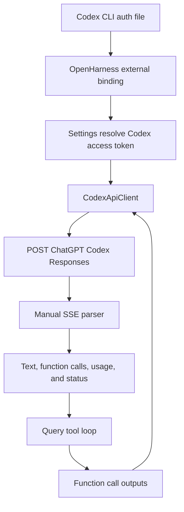

# Codex subscription integration

This document explains the OpenHarness integration with a local Codex CLI subscription session.
It covers external credential binding, the ChatGPT Codex Responses endpoint, request conversion,
manual SSE parsing, tools, reasoning effort, retries, and current limitations.

This is not the OpenAI-compatible API-key path. See the
[OpenAI-compatible client guide](OPENAI_COMPATIBLE_CLIENT_INTEGRATION.md) for `/chat/completions`.

## End-to-end path



| Boundary | Source | Responsibility |
| --- | --- | --- |
| Binding and credential loading | [`auth/external.py`](../../../src/openharness/auth/external.py) | Point at Codex CLI state and extract the access token |
| Profile/auth selection | [`config/settings.py`](../../../src/openharness/config/settings.py) | Select `openai_codex` and `codex_subscription` |
| Runtime construction | [`ui/runtime.py`](../../../src/openharness/ui/runtime.py) | Construct `CodexApiClient` before the generic OpenAI-format branch |
| Wire client | [`api/codex_client.py`](../../../src/openharness/api/codex_client.py) | Convert Responses input, build subscription headers, parse SSE, and normalize events |
| Agent loop | [`engine/query.py`](../../../src/openharness/engine/query.py) | Execute tools and append matching results |

## Profile and authentication

The built-in profile is:

```text
profile: codex
provider: openai_codex
api_format: openai
auth_source: codex_subscription
default_model: gpt-5.4
```

The explicit provider check is evaluated before the generic `api_format=openai` branch, which is
why this profile selects `CodexApiClient` instead of `OpenAICompatibleClient`.

### Binding to Codex CLI state

`oh auth codex-login` does not perform an OpenAI login. It creates an OpenHarness external binding
to the existing Codex CLI auth file:

```text
${CODEX_HOME:-~/.codex}/auth.json
```

OpenHarness stores binding metadata in its credential store. The access and refresh tokens remain
owned by the Codex CLI file.

The loader accepts an access token from either:

```text
payload.tokens.access_token
payload.OPENAI_API_KEY
```

It also reads the optional refresh token, account email claim, and JWT expiry for status metadata.
Unlike the Claude external-auth path, `Settings.resolve_auth()` asks for refresh only for Claude.
The Codex access token is therefore read but not refreshed by OpenHarness.

`CodexApiClient` keeps the resolved token for its lifetime. A changed Codex CLI auth file takes
effect when the OpenHarness client/runtime is rebuilt, not automatically before each request.

## Endpoint and URL restriction

The default endpoint is:

```text
https://chatgpt.com/backend-api/codex/responses
```

`_resolve_codex_url()` accepts a custom base only when it contains
`chatgpt.com/backend-api`. Unrelated URLs are discarded and replaced with the default. It then
normalizes bases ending in `/codex` or `/codex/responses`.

This restriction prevents an ordinary unrelated provider base URL from accidentally receiving a
ChatGPT subscription token. It is a substring check rather than parsed-host validation: a crafted
URL containing `chatgpt.com/backend-api` elsewhere could pass. It also means this client is not a
generic Responses API adapter.

## Subscription headers

Before each request, `_build_codex_headers()` decodes the token as a JWT and requires this nested
claim:

```text
payload["https://api.openai.com/auth"]["chatgpt_account_id"]
```

Missing, malformed, or undecodable account metadata produces `AuthenticationFailure` before the
network request. This local JWT operation only base64-decodes claims; it does not verify the JWT
signature. The backend still validates the Bearer token.

The request headers include:

```text
Authorization: Bearer <access token>
chatgpt-account-id: <decoded account ID>
originator: openharness
User-Agent: openharness (<platform> <machine>)
OpenAI-Beta: responses=experimental
accept: text/event-stream
content-type: application/json
```

The helper can include `session_id`, but `_stream_once()` does not pass one in the current path.

## Request conversion

Each request body starts with:

```json
{
  "model": "gpt-5.4",
  "store": false,
  "stream": true,
  "instructions": "system prompt",
  "input": [],
  "text": {"verbosity": "medium"},
  "include": ["reasoning.encrypted_content"],
  "tool_choice": "auto",
  "parallel_tool_calls": true
}
```

When no system prompt exists, `instructions` becomes `You are OpenHarness.`.

The current client does not send `request.max_tokens`, so the engine's requested output limit is
not represented in the Codex request body.

### User input

User text becomes `input_text`; images become base64 data URLs in `input_image` items:

```json
{
  "role": "user",
  "content": [
    {"type": "input_text", "text": "Describe this"},
    {"type": "input_image", "image_url": "data:image/png;base64,..."}
  ]
}
```

Tool results are emitted before new user text from the same internal message:

```json
{"type": "function_call_output", "call_id": "call_123", "output": "file contents"}
```

`ToolResultBlock.is_error` and result metadata are not represented in the Responses item.

### Assistant replay

Assistant text becomes a Responses `message` item. Each tool use becomes a separate
`function_call` item:

```json
{
  "type": "function_call",
  "id": "fc_call_123",
  "call_id": "call_123",
  "name": "read_file",
  "arguments": "{\"path\":\"README.md\"}"
}
```

The synthetic item ID uses `fc_` plus at most the first 58 characters of the stable call ID. The
full call ID is preserved separately for result matching.

Assistant text is combined and emitted before all replayed function calls, even if internal block
ordering differed.

### Tools and reasoning effort

Anthropic-shaped tool schemas become Responses function tools with top-level name, description,
and parameters. If no tools exist, the body still includes `tool_choice=auto` and
`parallel_tool_calls=true`, but omits the `tools` array.

Reasoning effort is normalized as follows:

| OpenHarness value | Sent value |
| --- | --- |
| `low`, `medium`, `high`, `xhigh` | unchanged |
| `max` | `xhigh` |
| anything else or empty | no `reasoning` field |

The body requests `reasoning.encrypted_content`, but the response parser does not retain or replay
reasoning output.

## HTTP and SSE lifecycle

Each `_stream_once()` creates a new `httpx.AsyncClient` with a 60-second timeout and redirect
following, opens a streaming POST, and closes both response and client context at the end. There is
no persistent HTTP client and no `close()` method on `CodexApiClient`.

`settings.timeout` is not passed into this client.

For an HTTP status of 400 or higher, the body is read and `_format_error_message()` prefers:

1. `error.message` from a JSON body;
2. a JSON `detail` string;
3. non-empty response text; or
4. a status-based fallback.

The method then raises `httpx.HTTPStatusError` so the retry and translation layers can classify it.

### Manual SSE parsing

Unlike the SDK-backed clients, Codex parses lines itself. `_iter_sse_events()`:

- collects only lines beginning with `data:`;
- joins multiple data lines until a blank line;
- ignores `[DONE]`;
- JSON-decodes the combined payload;
- yields dictionary values; and
- silently skips malformed JSON and non-dictionary payloads.

The `event:` field is ignored; dispatch uses the JSON payload's `type` member.

## Response event handling

### Text

`response.output_text.delta` immediately yields `ApiTextDeltaEvent` and is also retained as a
fallback. Completed `response.output_item.done` message items become final `TextBlock` values from
`output_text` or `refusal` blocks.

If text deltas arrived but no completed message item produced text, the concatenated deltas are
inserted into the final message. This avoids losing streamed text while preferring the provider's
completed item when present.

Output embedded only in the final `response.completed.response` object is not parsed as message
content. A compatible stream must send output-item events or text deltas for content to survive.

### Function calls

Only completed `response.output_item.done` items with `type=function_call` become tools. The parser
requires non-empty `call_id` and `name`. Arguments must decode to a JSON object; malformed JSON or a
non-object value becomes `{}`.

The client does not expose incremental function-call argument events.

### Completion, usage, and stop reason

`response.completed.response` supplies final status and usage. Usage is reduced to input and output
token totals. If no completed payload arrives, usage defaults to zero.

Stop reason is synthesized:

| Response status | Tool calls? | Stop reason |
| --- | --- | --- |
| `completed` | yes | `tool_use` |
| `completed` | no | `stop` |
| `incomplete` | either | `length` |
| `failed` or `cancelled` | either | `error` |
| other/missing | either | `None` |

The query engine still decides whether to continue from parsed tool presence, not this stop reason.

### Stream errors

`response.failed` and top-level `error` payloads raise `RequestFailure`. Formatting retains a
message or code and appends code/request ID when available. A failed response is not turned into a
normal completion event.

## Multi-turn tools

The engine executes parsed calls through the normal hooks, permissions, and tool registry. The
following request replays assistant `function_call` items and matching user
`function_call_output` items. Stable `call_id` values are the cross-turn invariant.

The client requests parallel tool calls, while concurrency and failure isolation are implemented by
the engine. A failed local tool still becomes a function-call output string; its structured error
flag is not transmitted.

## Retry and error translation

The client allows one initial attempt plus three retries with 1, 2, and 4 second delays. It retries:

- HTTP statuses 429, 500, 502, 503, and 504;
- `RateLimitFailure`;
- `RequestFailure` messages containing timeout, connect, network, rate, or overloaded; and
- `httpx.TimeoutException` or `httpx.NetworkError`.

Because stream `RequestFailure` retryability is based partly on message substrings, a provider error
whose wording includes one of those terms can be retried even without a retryable HTTP status.

Final HTTP error translation maps 401/403 to `AuthenticationFailure`, 429 to
`RateLimitFailure`, and everything else to `RequestFailure`. Cancellation propagates.

## Current capability boundary

| Capability | Current state | Qualification |
| --- | --- | --- |
| Text and system instructions | Supported | Default instruction is injected when absent |
| Streamed text | Supported | Completed message item is preferred for final content |
| Images | Transport-supported | Endpoint/model and engine preprocessing matter |
| Tools and result replay | Supported | Error flag and metadata are dropped |
| Parallel tools | Requested and engine-supported | Provider must honor Responses semantics |
| Reasoning effort | Supported | Limited normalization table above |
| Reasoning content | Requested but not normalized | Encrypted content is not parsed or replayed |
| Max output tokens | Not implemented | `request.max_tokens` is ignored |
| Usage | Partial | Requires `response.completed` usage |
| Refusals | Partially supported | Included in final text, not streamed separately |
| Incremental tool arguments | Not implemented | Only completed function-call items are parsed |
| Arbitrary Responses endpoints | Intentionally unsupported | URL is restricted to ChatGPT backend API |

## Tests and known gaps

[`tests/test_api/test_codex_client.py`](../../../tests/test_api/test_codex_client.py) covers message,
tool-result, image, and tool-schema conversion; unrelated base rejection; stream-error formatting;
streamed/final text; effort; usage; headers; and one tool call.

[`tests/test_auth/test_external.py`](../../../tests/test_auth/test_external.py) covers Codex auth-file
loading, binding, settings resolution, CLI binding, and profile activation.

Important gaps include:

- no focused tests for retry policy or final error-class translation;
- no test for malformed/multiline SSE data or missing `response.completed`;
- no test for refusals, failed responses, incomplete status, or cancelled status;
- no test for multiple/parallel Codex function calls and complete adapter-level replay;
- no test documenting ignored `max_tokens` or encrypted reasoning output; and
- no token refresh/reload behavior beyond rebuilding the runtime.

## Safe change checklist

Preserve the ChatGPT-only URL restriction, JWT account binding, token secrecy, Responses item
ordering, stable call IDs, effort normalization, SSE framing, failed-event diagnostics, retry
classification, and complete multi-turn replay. Explicitly test max-token or reasoning behavior if
adding either.

Use `openharness-add-provider` and [`docs/TESTING.md`](../../TESTING.md) for changes.
