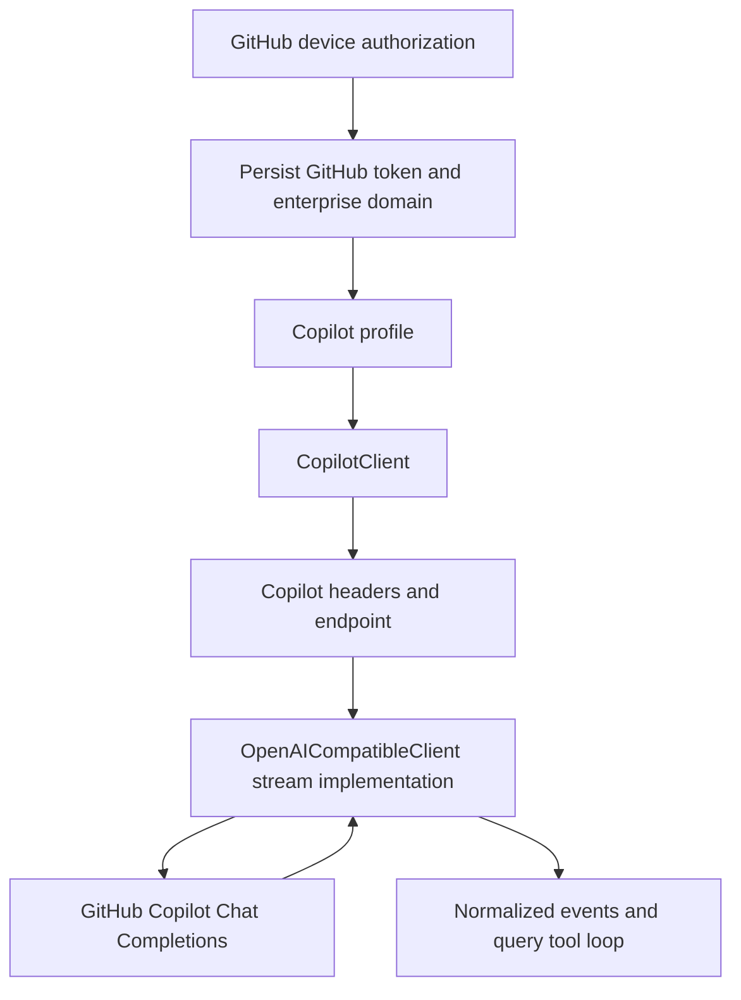

# GitHub Copilot integration

This document traces GitHub Copilot from OAuth device login and token persistence through endpoint
selection, Copilot-specific headers, the delegated OpenAI Chat Completions stream, tools, retries,
and cleanup.

Copilot has its own authentication/client wrapper, but its message and stream semantics are mostly
owned by [`OpenAICompatibleClient`](OPENAI_COMPATIBLE_CLIENT_INTEGRATION.md).

## End-to-end path



| Boundary | Source | Responsibility |
| --- | --- | --- |
| Device OAuth and persistence | [`api/copilot_auth.py`](../../../src/openharness/api/copilot_auth.py) | Request/poll device codes and save/load/clear the GitHub token |
| Login UX | [`auth/flows.py`](../../../src/openharness/auth/flows.py), [`cli.py`](../../../src/openharness/cli.py) | Select public or enterprise GitHub, open browser, show progress, and persist result |
| Runtime wrapper | [`api/copilot_client.py`](../../../src/openharness/api/copilot_client.py) | Select endpoint/model, add Copilot headers, and delegate streaming |
| Shared wire adapter | [`api/openai_client.py`](../../../src/openharness/api/openai_client.py) | Convert Chat Completions messages/tools and assemble streamed output |
| Client selection | [`ui/runtime.py`](../../../src/openharness/ui/runtime.py) | Prioritize `api_format=copilot` over every other provider branch |

## Profile and client selection

The built-in profile is:

```text
profile: copilot
provider: copilot
api_format: copilot
auth_source: copilot_oauth
default_model: gpt-5.4
```

Runtime selection checks `api_format == "copilot"` first, so this format always selects
`CopilotClient`. `Settings.resolve_auth()` returns a `copilot-managed` sentinel for status purposes,
but runtime construction does not use that value; `CopilotClient` loads its own persisted auth.

## OAuth device flow

`oh auth copilot-login` asks whether the deployment is public GitHub or GitHub Enterprise. It then
uses `DeviceCodeFlow`, which calls the synchronous helpers in `copilot_auth.py`.

### Device-code request

For public GitHub:

```text
POST https://github.com/login/device/code
```

For enterprise:

```text
POST https://<enterprise-domain>/login/device/code
```

The JSON body contains the configured OAuth client ID and scope `read:user`. The response supplies
the device code, user code, verification URL, polling interval, and expiry.

The CLI prints the URL/code and attempts to open only an HTTP(S) URL in the platform browser. It
uses argument-based process launching rather than shell interpolation.

### Token polling

The client polls `/login/oauth/access_token` until authorization succeeds or the timeout expires.
Each sleep is the server interval plus a three-second safety margin.

- `authorization_pending` continues polling.
- `slow_down` adopts a positive server interval or adds five seconds.
- any other OAuth error is terminal.
- the default overall timeout is 900 seconds.

The parsed device response's `expires_in` value is not passed to the polling helper; the helper's
900-second default governs the CLI flow.

The resulting GitHub access token is used directly against the Copilot API. There is no second
Copilot token exchange and no refresh flow in this implementation.

## Token persistence

The token and optional enterprise domain are stored by default in:

```text
~/.openharness/copilot_auth.json
```

The file is atomically written with mode `0600`, but its JSON token is not encrypted. An overridden
OpenHarness config root relocates it. This storage is separate from the generic credential/keyring
store.

Missing files, invalid JSON, and caught I/O errors return no auth rather than raising during load.
Structurally unexpected but valid JSON is not type-checked before `.get()` and can still raise an
attribute error. `oh auth copilot-logout` deletes the file.

Constructor precedence is:

```text
explicit github_token > persisted token
explicit enterprise_url > persisted enterprise URL > public GitHub
```

Without a token, construction raises `AuthenticationFailure` with login guidance.

## Endpoint resolution

Public GitHub uses:

```text
https://api.githubcopilot.com
```

Enterprise uses:

```text
https://copilot-api.<enterprise-domain>
```

The helper strips `http://` or `https://` and one trailing slash, then prefixes
`https://copilot-api.`. It does not validate or remove arbitrary paths, ports, query strings, or
already-prefixed `copilot-api` hostnames. The login UX expects a bare domain.

Unlike a normal `OpenAICompatibleClient` base URL, the final raw `AsyncOpenAI` client is constructed
directly with this base. The OpenAI SDK appends its Chat Completions path.

## Client construction and headers

`CopilotClient` creates a raw `AsyncOpenAI` client with:

```text
api_key: GitHub OAuth token
base_url: resolved Copilot base
User-Agent: openharness/0.1.0
Openai-Intent: conversation-edits
```

The SDK uses the token as Bearer authentication. The wrapper then creates an
`OpenAICompatibleClient` and replaces that inner wrapper's SDK client with the Copilot-configured
raw client. All request conversion, streaming, retry, error, and final-message behavior therefore
comes from the shared OpenAI-compatible implementation.

### Construction lifecycle caveat

Creating `OpenAICompatibleClient` allocates one AsyncOpenAI instance, then the wrapper overwrites it
with a second instance without explicitly closing the first. `CopilotClient.close()` closes the
replacement/current instance through the inner wrapper. The initially allocated instance has no
explicit cleanup path.

This is a current resource-ownership gap, not a pattern to copy.

## Model selection and request patching

Runtime composition always supplies a constructor-level model. Legacy Claude/default values:

```text
claude-sonnet-4-20250514
claude-sonnet-4-6
sonnet
default
```

are remapped to `gpt-4o`. Every other configured model, including the built-in profile's
`gpt-5.4`, is passed through unchanged.

Before delegation, `stream_message()` builds a new `ApiMessageRequest` containing:

- the constructor model, or the incoming request model when no constructor model exists;
- the same messages, system prompt, max tokens, and tools.

It does not copy `request.effort`. Reasoning effort is therefore dropped at the Copilot wrapper
even though it exists on the common request type.

Runtime construction also does not pass `settings.timeout`; the raw OpenAI SDK default applies.

## Message, image, tool, and stream behavior

After request patching, behavior is exactly the shared OpenAI-compatible path:

- the system prompt becomes a `role=system` message;
- text and images become Chat Completions user content;
- tool schemas become OpenAI function definitions;
- assistant tool calls and `role=tool` results are replayed by stable ID;
- visible text deltas are streamed;
- indexed tool-call fragments are assembled after the stream;
- non-standard `reasoning_content` can be retained for in-memory replay;
- `<think>...</think>` text is hidden;
- usage and finish reason are normalized when the endpoint supplies them; and
- retries/errors use `OpenAICompatibleClient` policy.

Copilot-specific code does not independently validate that a selected model supports images,
tools, reasoning conventions, or the requested token limit.

## Multi-turn tool replay

The query loop executes tool calls and appends results exactly as for other providers. The inner
client translates assistant tool calls to `tool_calls` and results to `role=tool`. Consequently,
the Copilot endpoint and selected model must support the same OpenAI function-calling contract.

The wrapper itself has no token refresh or model-catalog discovery during a turn. If the token is
revoked or the model is unavailable, the delegated client's normal error path handles the response.

## Retry, errors, cancellation, and cleanup

There is no Copilot-specific retry layer. The shared client allows one initial attempt and up to
three retries for its recognized status/network categories, then translates 401/403 to
`AuthenticationFailure`, 429 to `RateLimitFailure`, and other failures to `RequestFailure`.

Cancellation propagates through both async generators. Runtime teardown awaits
`CopilotClient.close()`, which delegates to the current inner SDK client.

Device-flow HTTP calls are synchronous and separate from the async inference client. Their 30-second
per-request timeout and 900-second polling deadline do not configure inference timeouts.

## Current capability boundary

| Capability | Current state | Qualification |
| --- | --- | --- |
| Public GitHub device login | Supported | Uses registered client ID and `read:user` scope |
| GitHub Enterprise login | Supported by domain construction | Domain input receives limited validation |
| Token persistence/logout | Supported | Plain JSON with filesystem permissions |
| Token exchange/refresh | Not implemented | Persisted GitHub token is used directly |
| Text and tools | Delegated support | Same behavior and gaps as OpenAI-compatible client |
| Images | Transport-supported through delegate | Model and Copilot endpoint must support them |
| Model selection | Configured override | No model-catalog negotiation or fallback after request |
| Reasoning effort | Not implemented | Wrapper drops `request.effort` |
| Usage and finish reason | Delegated/partial | Depends on Copilot stream shape |
| Configured timeout | Not applied | SDK default governs inference |
| Voice | Not supported | Provider diagnostics report voice unavailable |

## Tests and known gaps

[`tests/test_api/test_copilot_auth.py`](../../../tests/test_api/test_copilot_auth.py) covers public
and enterprise API bases, persistence, corrupt/missing files, logout, device-code endpoints,
pending/slow-down polling, timeout, and terminal OAuth errors.

[`tests/test_api/test_copilot_client.py`](../../../tests/test_api/test_copilot_client.py) covers auth
precedence, enterprise precedence/base selection, missing auth, and event delegation to a fake inner
client.

Important gaps remain:

- no adapter-level test sends a real fake Chat Completions stream through the Copilot headers;
- no test asserts the exact public endpoint path or complete required header set;
- no test documents dropped effort or unapplied settings timeout;
- no test covers the overwritten initial AsyncOpenAI client's cleanup;
- no test verifies a full Copilot tool request/result replay;
- no test covers token revocation, expiry, or reload without reconstructing the client; and
- no live model-catalog or capability validation exists in normal offline tests.

## Safe change checklist

Preserve token secrecy, config-root isolation, browser URL scheme checks, device polling semantics,
public/enterprise endpoint construction, Copilot intent headers, model override behavior, delegated
stream ordering, stable tool IDs, cancellation, and current-client cleanup. Add explicit ownership
tests before simplifying the double-client construction.

Use `openharness-add-provider` and [`docs/TESTING.md`](../../TESTING.md) for changes.
