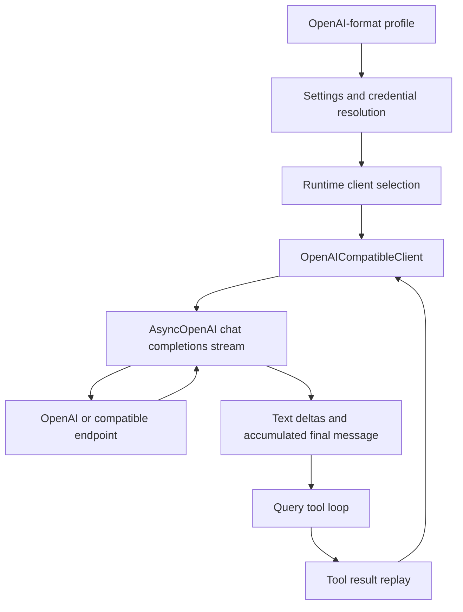

# OpenAI-compatible client integration

This document traces OpenHarness's shared OpenAI Chat Completions integration from profile and
credential selection through request conversion, streamed text/reasoning/tool assembly, retries,
and multi-turn replay. It describes `OpenAICompatibleClient` as implemented, not every feature that
an OpenAI-branded or OpenAI-compatible endpoint might offer.

See the [provider integration index](README.md) for the named providers routed through this client.

## Scope and ownership



| Boundary | Source | Responsibility |
| --- | --- | --- |
| Profiles and credentials | [`config/settings.py`](../../../src/openharness/config/settings.py) | Materialize provider, API format, model, base URL, timeout, and auth source |
| Registry metadata | [`api/registry.py`](../../../src/openharness/api/registry.py) | Detect and describe many providers that share this wire client |
| Client selection | [`ui/runtime.py`](../../../src/openharness/ui/runtime.py) | Construct this client when `api_format` is `openai` or `openai_compat` |
| Wire adapter | [`api/openai_client.py`](../../../src/openharness/api/openai_client.py) | Convert requests and assemble Chat Completions stream chunks |
| Neutral messages | [`engine/messages.py`](../../../src/openharness/engine/messages.py) | Define text, image, tool-use, and tool-result blocks |
| Agent loop | [`engine/query.py`](../../../src/openharness/engine/query.py) | Execute tools and send matching results on later turns |

## Which providers use it

The same client serves OpenAI itself, gateways such as OpenRouter, standard compatible APIs such
as DashScope and Groq, local servers such as Ollama and vLLM, built-in profiles such as NVIDIA NIM,
and arbitrary custom endpoints. A registry match can supply detection/default metadata, but the
runtime branch is controlled by the materialized API format.

This sharing has an important consequence: provider quirks must either fit the existing conversion
contract or be made explicit at a narrow compatibility boundary. A provider name alone does not
change the request.

## Configuration and authentication

The built-in generic workflow is:

```text
profile: openai-compatible
provider: openai
api_format: openai
auth_source: openai_api_key
default_model: gpt-5.4
```

Other built-in profiles select provider-specific auth sources and base URLs, but still reach the
same client. Custom profiles can bind a credential slot so their key remains isolated. Registry
`env_key` and `default_base_url` fields are not projected into settings by the current code.

API-key resolution follows the common settings order:

1. profile-scoped credential, when configured;
2. a matching `OPENHARNESS_*` or native provider environment variable, but only when
   `auth_source_env_var_candidates()` explicitly defines candidates for that auth source;
3. explicit flat settings key when no credential slot is active; and
4. stored key for the resolved provider namespace.

The current candidate table covers OpenAI, DashScope, Moonshot, Gemini, MiniMax, NVIDIA, and
ModelScope API-key sources. A registry declaration such as `DEEPSEEK_API_KEY`, `GROQ_API_KEY`, or
`OPENROUTER_API_KEY` is descriptive metadata and is not automatically probed by
`Settings.resolve_auth()`.

`OpenAICompatibleClient` passes the resolved key to `AsyncOpenAI` and explicitly supplies
`Authorization: Bearer <key>` as a default header. Runtime construction also passes
`settings.timeout`, unlike the Anthropic and Copilot branches.

## Base URL normalization

`_normalize_openai_base_url()` preserves existing path segments:

```text
https://example.com                 -> https://example.com/v1
https://example.com/v1/             -> https://example.com/v1
https://example.com/custom/openai/  -> https://example.com/custom/openai
```

The OpenAI SDK then appends the Chat Completions resource, normally producing
`.../chat/completions`. Query strings and fragments are preserved by the normalizer. A malformed
or relative base string is only stripped of a trailing slash; it is not validated here.

## Request conversion

The query engine supplies provider-neutral `ApiMessageRequest` values. `_stream_once()` converts
them into an OpenAI Chat Completions request.

### System and conversation messages

The system prompt becomes the first message:

```json
{"role": "system", "content": "You are a coding assistant."}
```

User text-only blocks are concatenated into one string. If any image is present, user content
becomes a list of `text` and data-URL `image_url` items. Empty text blocks are omitted in the
multimodal form.

Assistant messages become:

```json
{
  "role": "assistant",
  "content": "I will inspect it.",
  "tool_calls": [
    {
      "id": "call_123",
      "type": "function",
      "function": {
        "name": "read_file",
        "arguments": "{\"path\": \"README.md\"}"
      }
    }
  ]
}
```

Each `ToolResultBlock` becomes a separate `role=tool` message. When one internal user message
contains tool results and new user text, tool messages are emitted before the following user
message. The internal `is_error` flag is not represented on the OpenAI tool message.

### Tool schemas

OpenHarness's native Anthropic-shaped schema:

```json
{"name": "read_file", "description": "...", "input_schema": {}}
```

becomes OpenAI function format:

```json
{
  "type": "function",
  "function": {
    "name": "read_file",
    "description": "...",
    "parameters": {}
  }
}
```

No explicit `tool_choice` or parallel-tool flag is sent by this client.

### Output-token parameter

The model name controls which field is used:

- names whose final provider-qualified segment starts with `gpt-5`, `o1`, `o3`, or `o4` use
  `max_completion_tokens`;
- all other names use `max_tokens`.

This is a name heuristic, not endpoint capability negotiation.

### Stream options and tools

Without tools, the request includes:

```json
"stream": true,
"stream_options": {"include_usage": true}
```

When tools are present, the client removes `stream_options` entirely. This compatibility choice
avoids triggering thinking behavior on some Kimi-style endpoints, but it can also prevent a
provider from returning the final usage-only chunk. Usage then remains zero unless the provider
includes usage on another chunk.

`ApiMessageRequest.effort` is not used by this client.

## Streaming response assembly

Unlike the Anthropic client, OpenHarness itself incrementally assembles the OpenAI response.
`AsyncOpenAI` parses the HTTP/SSE framing into ChatCompletion chunks; `_stream_once()` owns the
cross-chunk state.

The module also contains `_parse_assistant_response()` for a non-streamed ChatCompletion object,
but no production caller uses it. It does not participate in the streaming path described here.

It tracks:

```text
collected_content
collected_reasoning
collected_tool_calls[index] = id + name + argument fragments
finish_reason
usage_data
think-tag buffer
```

### Visible text

Each `delta.content` fragment is added to a buffer. `_strip_think_blocks()` removes complete
`<think>...</think>` sections, including sections split across chunks, and holds partial opening or
unclosed tags for later input. Only visible text becomes `ApiTextDeltaEvent` and final `TextBlock`
content.

Any leftover think buffer at end of stream is not flushed. This hides an unclosed reasoning block,
but it can also drop a literal trailing string that looks like the start of `<think>`.

### Reasoning content

Non-standard `delta.reasoning_content` fragments are accumulated but not emitted to the UI. If any
were received, the final `ConversationMessage` gets a dynamic `_reasoning` attribute. On a later
tool turn, `_convert_assistant_message()` replays it as `reasoning_content`.

The `_reasoning` value is not part of the Pydantic `ConversationMessage` schema. It supports
in-memory replay during the active loop, but there is no explicit durable serialization contract
for session restore or compaction.

Some compatible endpoints require `reasoning_content: ""` on an assistant tool-call message even
when no reasoning was captured. That non-standard placeholder is opt-in:

```bash
export OPENHARNESS_REQUIRE_EMPTY_REASONING_CONTENT=1
```

The default omits it because strict providers can reject the extra field.

### Tool calls

The stream may split a function call across many chunks. Calls are keyed by the SDK-provided
integer index. For each index, OpenHarness updates the ID and name and appends argument fragments.
After the stream finishes it sorts indexes, skips entries with no name, parses the accumulated JSON,
and creates `ToolUseBlock` values.

Malformed or non-object argument JSON becomes `{}`. An empty tool-call ID is not repaired by this
client, so endpoint correctness matters for later result pairing.

### Finish reason and usage

The latest non-empty `choice.finish_reason` is copied directly to the normalized completion event.
Usage is read from ordinary or usage-only chunks and reduced to prompt/input and
completion/output token totals. Missing usage becomes zero.

After iteration completes, `_stream_once()` yields exactly one `ApiMessageCompleteEvent` containing
the accumulated visible text, sorted tool calls, usage, and raw finish reason.

## Multi-turn tool replay

The shared query loop appends the assistant message, executes requested tools through hooks and
permissions, and appends matching results. On the next call, this adapter translates:

```text
assistant ToolUseBlock -> assistant.tool_calls[]
user ToolResultBlock   -> role=tool with tool_call_id
```

Stable IDs are mandatory. Multiple tool calls are executed concurrently by the engine, not by this
client, and every result is emitted before any new user text stored in the same internal message.

## Images

Raw images are represented as `data:<media-type>;base64,<data>` URLs. Before client conversion, the
engine may replace images with text descriptions for models not recognized as multimodal when a
vision fallback is configured. Without such a fallback, the raw image still reaches the endpoint.

This client parses only text, reasoning metadata, and function calls from output. It does not
normalize image, audio, citation, or other output modalities.

## Retry, errors, cancellation, and cleanup

`stream_message()` allows one initial attempt plus three retries with deterministic exponential
delays of 1, 2, and 4 seconds. The configured 30-second cap is not reached with the current retry
count. There is no jitter and no `Retry-After` handling.

The code retries exceptions with status 429, 500, 502, or 503, plus Python
`ConnectionError`, `TimeoutError`, and `OSError`. Other SDK exception hierarchies are retryable only
if they satisfy one of those checks.

Final translation is status based:

| Status | Error |
| --- | --- |
| 401 or 403 | `AuthenticationFailure` |
| 429 | `RateLimitFailure` |
| Everything else | `RequestFailure` |

Cancellation propagates. Runtime teardown awaits `close()`, which closes the current AsyncOpenAI
client.

## Compatibility boundary

An endpoint needs only the portions of Chat Completions used by the selected scenario, but these
details frequently distinguish “text works” from a usable coding-agent integration:

| Feature | Required compatible behavior |
| --- | --- |
| Text | Stream chunks with `choices[0].delta.content` and a finish reason |
| Tools | Accept OpenAI function schemas and stream indexed IDs, names, and valid JSON arguments |
| Replay | Accept assistant `tool_calls` followed by matching `role=tool` messages |
| Images | Accept data-URL `image_url` content |
| Reasoning | Emit and accept the provider's `reasoning_content` convention, if required |
| Usage | Accept `stream_options`, or provide usage on another chunk when tools remove that option |

Native AWS Bedrock authentication, Google Vertex service-account exchange, and provider-specific
signing are not implemented by `OpenAICompatibleClient`. Registry labels for those platforms are
metadata, not proof that a raw API key plus Chat Completions transport is sufficient.

## Current capability boundary

| Capability | Current state | Qualification |
| --- | --- | --- |
| Text/system messages | Supported | System is a `role=system` message |
| Streamed text | Supported | Inline `<think>` sections are hidden |
| Custom tools and replay | Supported | Requires valid stable call IDs |
| Parallel tool calls | Supported by engine | Client assembles calls by stream index |
| Images | Transport-supported | Endpoint/model and preprocessing still matter |
| Usage | Partial | Tool requests omit `stream_options`; missing data becomes zero |
| Raw finish reason | Supported | Engine primarily reacts to parsed tool presence |
| `reasoning_content` replay | Partial/non-standard | Dynamic in-memory attribute; empty placeholder is opt-in |
| `effort` request | Not implemented | Field is ignored |
| Reasoning UI events | Not implemented | Reasoning is hidden and retained only for replay |
| Malformed tool arguments | Lossy fallback | Replaced with `{}` rather than failing the turn |
| Other output modalities | Not implemented | Not represented in the final message |

## Tests and known gaps

[`tests/test_api/test_openai_client.py`](../../../tests/test_api/test_openai_client.py) covers schema
conversion, conversation/tool-result conversion, multimodal input, base paths, timeout propagation,
Bearer auth, token-limit fields, think-tag buffering, and reasoning replay policy.

Important gaps remain:

- no focused test streams fragmented text and multiple tool calls through `_stream_once()`;
- no focused test asserts finish-reason and usage normalization for both tool and non-tool paths;
- no test locks down retry classification, delay sequence, or error translation;
- no test covers malformed tool argument JSON or missing tool-call IDs through the stream;
- no persistence test proves `_reasoning` survives save, compaction, or resume; and
- compatibility behavior is not proven uniformly across every registry-labelled provider.

## Safe change checklist

Before changing this adapter, verify base URL preservation, auth headers, system/user/image
conversion, both token-limit parameter families, tool schema conversion, fragmented tool arguments,
reasoning replay, usage with and without tools, retry/error paths, cancellation, cleanup, and at
least one full assistant-tool/result-assistant round trip.

Use the repository's `openharness-add-provider` skill and
[`docs/TESTING.md`](../../TESTING.md) to select validation.
