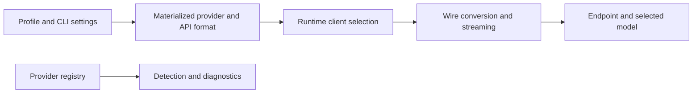

# Provider integration index

OpenHarness exposes many provider names, but they converge on four concrete runtime client
families. Start with the client family that owns the wire protocol, then inspect the active profile
for its endpoint, model, and credentials and the registry entry for detection/display metadata.

## Runtime client families

| Client family | Detailed reference | Selection rule |
| --- | --- | --- |
| Anthropic Messages | [Anthropic client integration](ANTHROPIC_CLIENT_INTEGRATION.md) | `provider == anthropic_claude`, or the fallback branch for Anthropic-format profiles |
| OpenAI Chat Completions | [OpenAI-compatible client integration](OPENAI_COMPATIBLE_CLIENT_INTEGRATION.md) | `api_format` is `openai` or `openai_compat`, except Codex subscription |
| ChatGPT Codex Responses | [Codex subscription integration](CODEX_SUBSCRIPTION_INTEGRATION.md) | `provider == openai_codex` |
| GitHub Copilot Chat Completions | [GitHub Copilot integration](GITHUB_COPILOT_INTEGRATION.md) | `api_format == copilot` |

`src/openharness/ui/runtime.py::_resolve_api_client_from_settings()` is the authoritative selection
boundary. Registry detection and display labels do not override its branch order.

## Named provider map

The provider registry currently maps these names to shared client behavior:

| Registry name | Classification | Runtime client |
| --- | --- | --- |
| `github_copilot` | OAuth workflow | `CopilotClient` |
| `anthropic` | Standard provider | `AnthropicApiClient` |
| `openrouter`, `aihubmix`, `siliconflow`, `volcengine` | Gateways | `OpenAICompatibleClient` |
| `modelscope`, `openai`, `deepseek`, `gemini`, `dashscope`, `moonshot`, `minimax`, `zhipu`, `groq`, `mistral`, `stepfun`, `baidu` | Standard providers | `OpenAICompatibleClient` |
| `bedrock`, `vertex` | Cloud-platform labels | `OpenAICompatibleClient` |
| `ollama`, `vllm` | Local deployments | `OpenAICompatibleClient` |

The built-in `nvidia` profile also uses `OpenAICompatibleClient`, although NVIDIA is not a
`ProviderSpec` in the current registry. GitHub Models and arbitrary custom `/chat/completions`
servers use the same client through custom OpenAI-format profiles without requiring registry
entries.

Two subscription workflows are selected outside the registry:

- `openai_codex` uses `CodexApiClient` and an external Codex CLI credential binding.
- `anthropic_claude` uses `AnthropicApiClient` in Claude subscription mode.

## Profiles, registry entries, and clients are different layers

- A profile is persisted user workflow state.
- A registry entry supplies detection and display metadata.
- A runtime client owns request conversion, streaming, replay, and error normalization.
- The endpoint and model determine which optional capabilities actually work.

Do not create provider-specific protocol claims from a registry label alone. For example, Bedrock
and Vertex registry entries are routed through the generic OpenAI-compatible client; the repository
does not implement native AWS SigV4 or Google service-account transports in that client.

The registry currently declares `env_key` and `default_base_url`, but no production code outside
`api/registry.py` reads those fields. They do not automatically configure settings, credentials, or
runtime endpoints. Built-in profiles and explicit custom profile fields provide the values that the
runtime actually materializes.

## Shared engine contract

All four client families accept `ApiMessageRequest` and yield the normalized event union defined in
`src/openharness/api/client.py`. The query engine then owns permissions, hooks, tool execution,
parallel results, continuation, persistence, and UI events.

Provider clients still differ materially in:

- authentication and endpoint restrictions;
- system/message/image/tool conversion;
- token-limit and reasoning parameters;
- who assembles streamed tool arguments;
- final usage and stop-reason extraction;
- retry and malformed-stream behavior; and
- what must be retained for a valid multi-turn replay.

Each detailed guide documents those differences and explicitly lists current implementation gaps.

## Source and test map

| Concern | Primary source | Representative tests |
| --- | --- | --- |
| Common request/events | [`api/client.py`](../../../src/openharness/api/client.py) | engine fake-client tests |
| Anthropic | [`api/client.py`](../../../src/openharness/api/client.py) | [`test_client.py`](../../../tests/test_api/test_client.py) |
| OpenAI-compatible | [`api/openai_client.py`](../../../src/openharness/api/openai_client.py) | [`test_openai_client.py`](../../../tests/test_api/test_openai_client.py) |
| Codex subscription | [`api/codex_client.py`](../../../src/openharness/api/codex_client.py), [`auth/external.py`](../../../src/openharness/auth/external.py) | [`test_codex_client.py`](../../../tests/test_api/test_codex_client.py), [`test_external.py`](../../../tests/test_auth/test_external.py) |
| Copilot | [`api/copilot_client.py`](../../../src/openharness/api/copilot_client.py), [`api/copilot_auth.py`](../../../src/openharness/api/copilot_auth.py) | [`test_copilot_client.py`](../../../tests/test_api/test_copilot_client.py), [`test_copilot_auth.py`](../../../tests/test_api/test_copilot_auth.py) |
| Profiles and auth precedence | [`config/settings.py`](../../../src/openharness/config/settings.py) | [`test_settings.py`](../../../tests/test_config/test_settings.py) |
| Client selection and lifecycle | [`ui/runtime.py`](../../../src/openharness/ui/runtime.py) | CLI and UI runtime tests |
| Tool replay | [`engine/query.py`](../../../src/openharness/engine/query.py), [`engine/messages.py`](../../../src/openharness/engine/messages.py) | engine query/message tests |

Use the repository's `openharness-add-provider` skill before changing any of these paths.
