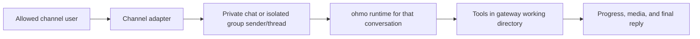

# ohmo user guide: common scenarios and workflows

ohmo is the personal-agent application included with OpenHarness. It can work interactively in a
terminal, run one prompt for a script, maintain personal context, and serve the same agent through
Telegram, Slack, Discord, or Feishu/Lark. It can also run recurring local jobs through the shared
OpenHarness cron scheduler.

This is a user guide. For implementation details, see the
[`ohmo` developer reference](../developer/ohmo/README.md).

## Command convention

Examples use installed commands:

```bash
ohmo --help
oh --help
```

When working from a source checkout, prefix them with `uv run`:

```bash
uv run ohmo --help
uv run oh --help
```

On Windows PowerShell, `oh` conflicts with the built-in `Out-Host` alias. Use `openh` for the core
OpenHarness command. The `ohmo` command is unchanged.

## Choose the workflow you need

| Scenario | Start here | Persistent state involved |
| --- | --- | --- |
| First-time setup | `oh setup`, then `ohmo init` | `~/.openharness`, `~/.ohmo` |
| Work interactively in one repository | `ohmo --cwd /path/to/repo` | ohmo session snapshots |
| Run one unattended prompt | `ohmo --cwd /path -p "..."` | a new snapshot and personal memory |
| Continue a saved local conversation | Start `ohmo`, then use `/resume` | `~/.ohmo/sessions` |
| Teach stable preferences | `/memory add ...` or `ohmo memory add ...` | `~/.ohmo/memory` |
| Change personality or user profile | `ohmo soul edit`, `ohmo user edit` | `soul.md`, `user.md` |
| Use ohmo from a chat application | `ohmo config`, then `ohmo gateway start` | `gateway.json`, channel sessions |
| Work in a Feishu managed group | Send `/group ...` in a private Feishu chat | `~/.ohmo/groups` |
| Send images or files | Attach them to a supported channel message | `~/.ohmo/attachments` and session history |
| Repeat work on a schedule | Ask local ohmo to create a cron job, then `oh cron start` | `~/.openharness/data/cron_jobs.json` |
| Diagnose a problem | `ohmo doctor`, gateway status/logs | workspace and operational state |
| Back up or migrate ohmo | Stop services and copy the workspace securely | personal data, channel secrets, sessions |

## 1. Install and prepare a provider

Install the packaged application:

```bash
pip install openharness-ai
```

Or use the installation command documented in the project [README](../../README.md#quick-start).

ohmo uses OpenHarness provider profiles. Configure and authenticate at least one profile first:

```bash
oh setup
```

This can configure a subscription-backed provider or an API-backed provider. Confirm that the
profile is reported as configured:

```bash
oh provider list
```

That status is not a live model check. After initializing ohmo, verify the selected profile with a
small one-shot request before configuring channels.

For a local LM Studio endpoint, follow the
[LM Studio Anthropic-compatible guide](../providers/LM_STUDIO_ANTHROPIC.md).

## 2. Initialize the personal workspace

Run:

```bash
ohmo init
```

The interactive flow creates the default workspace at `~/.ohmo`, asks which existing provider
profile the gateway should use, and offers channel setup. It is safe to initialize without enabling
a channel.

Use a separate workspace when you want an isolated persona or test environment:

```bash
ohmo init --workspace ~/workspaces/demo-ohmo
ohmo --workspace ~/workspaces/demo-ohmo
```

Alternatively, set `OHMO_WORKSPACE` for every command and daemon that should share that workspace:

```bash
export OHMO_WORKSPACE="$HOME/workspaces/demo-ohmo"
```

Do not mix workspace arguments casually. Identity, memory, sessions, gateway configuration, logs,
and attachments are all workspace-scoped.

Check the result:

```bash
ohmo doctor
```

`doctor` first initializes any missing standard workspace assets, then reports their presence and
which provider profiles are configured. It is therefore a small repair/bootstrap operation, not a
strictly read-only audit. It does not make a live model request or prove that channel credentials
and permissions work.

## 3. Complete first contact

Start ohmo in a directory where it is allowed to work:

```bash
cd /path/to/project
ohmo
```

On a new workspace, `BOOTSTRAP.md` asks ohmo to learn a small amount about you and its role. A useful
first message is:

> Call me Kevin. I am in America/Los_Angeles. Be concise by default, but explain risky technical
> decisions. I mainly want help maintaining this repository.

Review what was learned rather than assuming it was stored correctly:

```bash
ohmo user show
ohmo soul show
ohmo memory list
```

`BOOTSTRAP.md` remains part of the prompt until it is deleted. Remove it after first contact if the
assistant does not do so:

```bash
rm ~/.ohmo/BOOTSTRAP.md
```

In PowerShell, use `Remove-Item ~/.ohmo/BOOTSTRAP.md`.

## 4. Work interactively in a repository

The current working directory is the default tool boundary. Select it explicitly when starting from
somewhere else:

```bash
ohmo --cwd /path/to/project
```

Typical requests include:

- “Inspect this repository and explain its architecture before changing anything.”
- “Diagnose the failing test, but do not implement a fix yet.”
- “Implement this issue, run the focused tests, and show me the diff.”
- “Review the uncommitted changes for correctness and security.”
- “Summarize the latest logs and suggest the next diagnostic step.”

Be explicit about scope and authority. “Diagnose” requests inspection; “fix” authorizes changes;
“commit” and “push” should be requested separately when you want them.

Useful local slash commands include:

| Command | Purpose |
| --- | --- |
| `/help` | List commands known to the current runtime |
| `/status` | Show model, cwd, permissions, and session status |
| `/files` | Inspect files in the working directory |
| `/branch`, `/diff` | Inspect Git state |
| `/permissions` | Show or change the local permission mode |
| `/plan on`, `/plan off` | Enter or leave read-only planning mode |
| `/provider list` | List provider profiles |
| `/model show` | Show the current model and allowed model list |
| `/skills` | List available skills |
| `/memory` | Show the personal-memory command syntax |
| `/compact` | Compact an overly long conversation |
| `/session` | Show session information |
| `/resume` | List saved sessions |
| `/export` | Export the current text transcript |
| `/stop` | Interrupt an active turn |

### Permission modes

The default mode allows read-only operations and asks before mutating operations. Use plan mode when
you want analysis without changes:

```text
/permissions plan
```

Return to confirmation-based operation with:

```text
/permissions default
```

`full_auto` allows mutating tools without per-operation confirmation. Use it only in a controlled
working directory after reviewing the available tools and repository state:

```text
/permissions full_auto
```

Permission mode is shared OpenHarness configuration, not an ohmo-workspace-only preference.

## 5. Run one prompt and exit

Use print mode for scripts, shell pipelines, or a single answer:

```bash
ohmo --cwd /path/to/project -p "Summarize the current Git status and failing tests"
```

Select a profile, model, or turn limit for that invocation when needed:

```bash
ohmo \
  --cwd /path/to/project \
  --profile lmstudio-anthropic \
  --model YOUR_MODEL_ID \
  --max-turns 6 \
  -p "Review this repository without modifying files"
```

Print mode streams assistant text to standard output and diagnostics to standard error. It is not a
JSON-output interface. Each invocation constructs a fresh runtime; use durable personal memory for
stable context instead of expecting a prior terminal conversation to be loaded. Print mode also has
no interactive permission prompt, so a mutating tool that requires confirmation in default mode is
blocked. Use the local TUI when a task needs interactive approval.

## 6. Save, resume, and export conversations

ohmo saves a sanitized session snapshot after completed local and gateway turns. In the local TUI:

```text
/resume
/resume SESSION_ID
/session show
/session tag before-refactor
/export
```

`/resume` without an ID lists recent sessions; use the displayed ID to load one. `/export` writes a
Markdown transcript under the ohmo session directory. Exports contain text, not a complete rendering
of tool calls, tool results, or image blocks.

Current limitation: the top-level `ohmo --resume` and `ohmo --continue` options are exposed in CLI
help, but their restored state is not forwarded through the normal parent React-TUI launch path.
Use the in-session `/resume` command for local interactive restoration. Gateway conversations restore
automatically by their channel/chat/thread/sender routing key.

## 7. Personalize identity, behavior, and durable memory

The main files are:

| Path | Meaning |
| --- | --- |
| `~/.ohmo/soul.md` | Behavioral principles and personality |
| `~/.ohmo/identity.md` | Name and concise identity |
| `~/.ohmo/user.md` | Your profile and working preferences |
| `~/.ohmo/memory/MEMORY.md` | Index of durable personal memories |
| `~/.ohmo/memory/*.md` | Individual memory entries |

Inspect or replace the user and soul files:

```bash
ohmo user show
ohmo user edit --set "Preferred name: Kevin. Timezone: America/Los_Angeles. Prefer concise answers."

ohmo soul show
ohmo soul edit --set "Be calm, direct, evidence-driven, and careful with external actions."
```

`--set` replaces the entire file; it does not append. For structured multi-line edits, edit the file
with your normal editor instead.

Add focused memory from the shell:

```bash
ohmo memory add "Review preference" "Show correctness findings before style suggestions."
ohmo memory list
ohmo memory remove review_preference.md
```

Or from a local or channel conversation:

```text
/memory add Review preference :: Show correctness findings before style suggestions.
/memory list
/memory show review_preference.md
/memory remove review_preference.md
```

Removal disables the entry and removes it from the index; the file remains on disk. If data must be
erased, remove the source file and assess old session snapshots and backups that may still contain
it.

Keep memories concise and stable. Project-specific facts belong in project documentation; personal
preferences and recurring context belong in ohmo memory. ohmo intentionally does not load ordinary
project memory into its prompt by default. The prompt includes the memory index and bodies from at
most five active memory files, so consolidate overlapping entries instead of accumulating many tiny
files. Entries are selected by filename order rather than relevance, and a running/cached runtime
keeps the personal-memory snapshot captured when it was built. Restart or refresh long-lived
sessions after important edits.

The project-memory exclusion applies to normal prompt reads. Leave global automatic memory
extraction disabled when strict separation matters: the shared engine's optional auto-extraction
path currently writes project memory for the effective cwd. `/memory validate`, `session`, `team`,
and `agent` also use core paths rather than the personal backend.

### Personal skills and plugins

Workspace-specific extensions live under:

```text
~/.ohmo/skills/<skill-name>/SKILL.md
~/.ohmo/plugins/<plugin-name>/
```

Restart or refresh the runtime after changing extensions. Treat plugins as executable code and only
install ones you trust. See [Extending OpenHarness](../EXTENDING.md) for extension contracts.

## 8. Choose or change the provider and model

There are two related but distinct contexts:

- Local `ohmo` uses the active OpenHarness provider profile unless `--profile` overrides it.
- The gateway uses `provider_profile` stored in the selected ohmo workspace's `gateway.json`.

For local interactive use:

```text
/provider list
/provider PROFILE_NAME
/model show
/model MODEL_ID
/model default
```

`--profile` and `--model` are invocation overrides. In contrast, local `/provider` and `/model`
commands update shared OpenHarness profile state and can affect later `oh` or `ohmo` sessions.

To change the gateway reliably, run:

```bash
ohmo config
```

If the gateway is running, the wizard offers to restart it. A local `/provider` command does not
update the gateway's selected profile.

Remote `/provider` and `/model` commands are local-only by default. They work remotely only when all
of the following are true:

1. remote administrative commands are enabled in `ohmo config`;
2. `provider` and/or `model` is explicitly allowlisted; and
3. the sender passes the channel adapter's effective access policy.

Prefer local configuration for provider credentials and administrative changes.
When remotely enabled, `/provider` changes the workspace gateway selection, while `/model` updates
the selected shared OpenHarness profile's model state.

## 9. Connect a chat application

Run the configuration wizard:

```bash
ohmo config
```

The current wizard supports:

| Channel | Required setup |
| --- | --- |
| Telegram | Bot token and allowed sender IDs |
| Slack | Bot token, app-level token, Socket Mode, and Slack event scopes |
| Discord | Bot token, gateway intents, and allowed sender IDs |
| Feishu/Lark | App ID/secret, event configuration, permissions, domain, and allowed open IDs |

For every enabled channel, the wizard asks for `allow_from`:

- blank means deny every remote sender;
- specific IDs allow only those identities;
- `*` deliberately allows everyone who can reach the bot.

Start with specific IDs. The agent can read files and invoke tools in the gateway cwd, so an open bot
is not merely an open chat room. Telegram, Discord, and Feishu enforce this top-level list. Slack has
the separate limitation below and must not be assumed to enforce the wizard's top-level list.

The wizard uses ordinary text inputs and stores channel tokens/secrets as plaintext in
`gateway.json`. Run configuration in a private terminal, avoid screen sharing or shell capture, and
protect the workspace with restrictive filesystem permissions.

### Slack access-control limitation

The current ohmo wizard, compatibility schema, and Slack adapter do not agree on access-control
fields:

- the wizard writes top-level `allow_from`;
- the Slack DM path expects a nested object with attribute-style `dm.enabled`, `dm.policy`, and
  `dm.allow_from`; and
- the compatibility schema does not define that nested model, so a JSON object remains a plain
  dictionary and does not satisfy the adapter.

As a result, do not rely on Slack DMs in the current release, and do not treat the wizard's
top-level Slack `allow_from` as an effective group sender allowlist. For groups, `mention` can limit
responses to explicit bot mentions but does not restrict which channel member may mention the bot.
The `allowlist` group policy additionally needs a manually supplied `group_allow_from` list of Slack
channel IDs; the wizard does not currently ask for it. Use a private/test Slack workspace or channel
until these configuration boundaries are aligned.

### Start and operate the gateway

Start it in the background with an explicit work directory:

```bash
ohmo gateway start --cwd /path/to/default/project
```

Inspect and manage it:

```bash
ohmo gateway status --cwd /path/to/default/project
ohmo gateway restart --cwd /path/to/default/project
ohmo gateway stop --cwd /path/to/default/project
```

For live diagnostics, run it in the foreground instead:

```bash
ohmo gateway run --cwd /path/to/default/project
```

The background log is:

```text
~/.ohmo/logs/gateway.log
```

`gateway start` confirms that the detached process was spawned; it does not prove that every channel
authenticated or subscribed successfully. Check `gateway status`, send a test message from an
allowed identity, and inspect the log before relying on it.

The gateway process is not installed as an operating-system service. After a reboot, check status
and start it again.

### Typical remote conversation flow



Private conversations resume using their channel/chat key. Shared chats additionally isolate by
sender, and by thread when the adapter supplies one. Different people in one group therefore do not
share one conversation history.

A newer message in the same routed conversation cancels the older running turn. Wait for completion
when the new message is intended as supplementary context rather than a replacement.

Useful remote commands include:

```text
/help
/status
/usage
/compact
/memory list
/session show
/stop
/restart
```

`/restart` restarts the whole gateway, not just the current conversation. A sender must first pass
the channel adapter's effective access policy, but `/restart` itself is handled directly by the
bridge; protect that adapter policy accordingly. In particular, account for the Slack limitation
above.

Administrative commands such as `/permissions`, `/provider`, `/model`, `/commit`, and `/tasks` are
remote-disabled unless explicitly eligible and allowlisted through the remote-admin configuration.
Tool permission mode still comes from shared OpenHarness settings. A locally persisted `full_auto`
mode can therefore affect newly built gateway runtimes; return to `default` before exposing a channel
unless unattended mutation is intentional.

## 10. Use groups safely

Group behavior is channel-specific:

- Slack and Discord can require an explicit bot mention or respond openly, according to config.
- Feishu defaults to responding without a mention in ohmo-managed groups and requiring a mention in
  other groups.
- Each group sender receives an isolated agent session even when messages appear in the same room.

### Create a managed Feishu group

In a private Feishu conversation with ohmo, send:

```text
/group Create a group for HKUDS/OpenHarness and bind it to /path/to/OpenHarness
```

ohmo asks the model to choose the final name and optional repository/cwd, then exposes a
turn-scoped group-creation tool. If the request is ambiguous, it may ask for clarification.

Requirements:

- the request must originate in a Feishu private chat;
- the Feishu application must be allowed to create groups and invite the requester;
- the requested cwd must already exist;
- the app must receive group messages for mention-free managed-group behavior.

Managed-group metadata is stored under `~/.ohmo/groups/`. A valid stored cwd overrides the gateway's
default cwd for that group; if it later disappears, ohmo falls back to the gateway cwd.

## 11. Send attachments and receive generated files

Where the channel adapter supports attachment download, send text with images or files as a normal
message. ohmo supplies the model with:

- the message text;
- the local attachment filename and path;
- a bounded text preview or binary header for non-image files; and
- an image content block for recognized image files.

If the selected provider explicitly rejects image input, ohmo retries without image blocks while
retaining textual attachment notes. This lets a text-only model reason about filenames and previews,
but it does not give that model visual understanding.

Tools can return generated files or images to the channel. Existing absolute image paths mentioned
only in a final reply may also be attached as a fallback.

Attachments, previews, and paths can enter model prompts and session snapshots. Do not send secrets
or files you would not disclose to the configured provider.

## 12. Run a task repeatedly

Recurring work uses the OpenHarness cron registry and daemon. Create agent-turn jobs from a local
ohmo TUI so the mutating `cron_create` tool can receive an interactive approval.

For example, tell local ohmo:

> Create a cron job named `eight-hour-review`. Use schedule `0 */8 * * *` in timezone
> `America/Los_Angeles`. Run in `/path/to/project`. Inspect failing tests and unresolved TODOs, then
> summarize actionable findings. Do not modify files.

`0 */8 * * *` runs at 00:00, 08:00, and 16:00 in that timezone. It is not an interval measured from
the moment the job is created.

Start the separate scheduler daemon:

```bash
oh cron start
```

Inspect it:

```bash
oh cron status
oh cron list
oh cron history eight-hour-review
oh cron logs
```

Disable or re-enable a job:

```bash
oh cron toggle eight-hour-review false
oh cron toggle eight-hour-review true
```

Stop the daemon:

```bash
oh cron stop
```

For Feishu result delivery, include the destination in the creation request:

> Send each result as a Feishu DM to open ID `ou_REPLACE_ME` using notification type `feishu_dm`.

Current scheduling boundaries:

- `ohmo gateway` and `oh cron` are separate daemons; starting one does not start the other.
- The machine must be awake and the cron daemon must still be running.
- Neither daemon automatically starts after reboot.
- Each agent-turn job starts a fresh `ohmo --print` process with personal identity/memory, not the
  originating chat history.
- The fresh print process has no interactive approval callback. In default permission mode,
  confirmation-requiring mutations are blocked. Prefer read-only scheduled instructions or use
  narrowly reviewed OpenHarness tool policy; setting global `full_auto` also affects other local and
  gateway runtimes.
- Agent turns time out after five minutes.
- Without Feishu notification configuration, captured output remains in cron history; scheduler
  diagnostics remain in its log.
- Feishu is the only implemented proactive cron-notification target.
- Remote chat creation of a cron job is normally blocked in default permission mode because the
  gateway has no interactive tool-approval prompt. Create it locally.
- The `ohmo` executable must be available on the scheduler process's `PATH`.
- For a non-default ohmo workspace, export `OHMO_WORKSPACE` before starting the cron daemon so the
  generated agent turn and Feishu notification resolve the intended workspace.

A cron entry may instead contain a direct shell `command`. That bypasses an ohmo model turn and its
tool permission checks when the scheduler executes it, so review command jobs as unattended local
code.

Cron state belongs to OpenHarness rather than the ohmo workspace:

```text
~/.openharness/data/cron_jobs.json
~/.openharness/data/cron_history.jsonl
~/.openharness/logs/cron_scheduler.log
```

## 13. Back up, migrate, or reset

Before copying a live workspace, stop writers:

```bash
ohmo gateway stop
oh cron stop
```

The cron scheduler is shared OpenHarness infrastructure; stopping it pauses every registered cron
job, not only jobs created for ohmo.

Back up `~/.ohmo` when you need persona, memory, sessions, group bindings, gateway configuration,
logs, and attachments together. Also preserve the relevant OpenHarness provider configuration and
cron state if you need profiles or scheduled jobs. API credentials may instead come from environment
variables, an operating-system credential store, or subscription login state, so copying
`~/.openharness` alone is not a universal authentication backup.

Security notes:

- `gateway.json` contains channel credentials in plaintext.
- session files and logs may contain user messages, prompts, local paths, and tool output.
- attachments are copied into local workspace storage by supported adapters.
- provider authentication is owned by OpenHarness auth/configuration mechanisms, not by ohmo
  memory.
- never commit either personal-state directory to a repository.
- use an encrypted backup and restrictive filesystem permissions.

To start over without losing evidence accidentally, rename the workspace while services are stopped,
then initialize a new one:

```bash
mv ~/.ohmo ~/.ohmo.backup
ohmo init
```

In PowerShell, use `Move-Item ~/.ohmo ~/.ohmo.backup`.

Delete the backup only after checking whether it contains credentials or personal information you
still need.

## 14. Troubleshooting

### ohmo cannot call a model

```bash
oh provider list
ohmo doctor
ohmo --profile PROFILE_NAME -p "Reply with OK"
```

If the profile says `missing auth`, configure it through `oh setup`, `oh auth`, or the matching
provider guide. `ohmo config` selects a profile for the gateway but does not create missing provider
credentials.

### The bot does not answer

1. Run `ohmo gateway status`.
2. Inspect `~/.ohmo/logs/gateway.log` or run `ohmo gateway run` in the foreground.
3. Confirm the channel is enabled and its credentials are present.
4. For Telegram, Discord, or Feishu, confirm the sender ID is in `allow_from`; an empty list denies
   everyone.
5. In a group, mention the bot unless policy explicitly permits open replies.
6. For Slack, review the current access-control limitation above; DMs are not reliable in this
   release.
7. Check provider readiness with `ohmo doctor`.

### The bot stopped an earlier request

A newer message for the same conversation cancels its active task. Re-send the complete request or
wait for the current turn before adding context.

### A slash command says it is local-only

Run it in the local TUI. Only enable remote administration for specific commands after reviewing
the channel adapter's effective access policy and the command's side effects.

### An image was not understood

The provider may be text-only. ohmo can retry with attachment notes, but choose a vision-capable
model when image contents matter.

### A scheduled job did not run

```bash
oh cron status
oh cron list
oh cron logs
oh cron history JOB_NAME
```

Confirm the job is enabled, its next-run time and timezone are correct, its cwd exists, and the
`ohmo` executable and provider credentials are available to the detached scheduler process.

### Configuration changes have no effect

Restart the gateway:

```bash
ohmo gateway restart --cwd /path/to/default/project
```

Do not rely on manually setting `session_routing`, `permission_mode`, or `sandbox_enabled` in
`gateway.json`; those persisted fields currently have no effective gateway runtime consumer.

## Current behavior to keep in mind

- ohmo is a local process, not a hosted service.
- Local TUI sessions, one-shot runs, gateway sessions, and cron jobs share identity and personal
  memory but have different conversation lifecycles.
- The gateway cwd determines the default repository/tool scope for remote conversations.
- Shared-chat participants are intentionally isolated from one another's agent history.
- Channel access and model tool permissions are separate controls; passing `allow_from` does not
  automatically grant every mutating tool.
- Normal project-memory prompt recall is disabled in ohmo by default; use personal memory or
  explicit project files. Optional auto-extraction and several advanced `/memory` subcommands still
  use core paths as noted in the memory section above.
- Some CLI/config fields exist ahead of complete runtime wiring; this guide calls out the user-visible
  cases rather than treating schema presence as proof of support.
