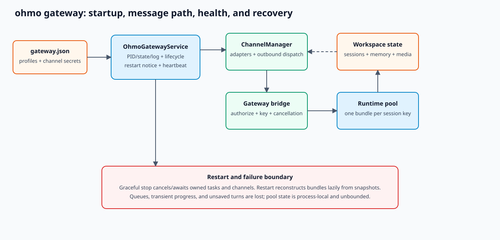

# ohmo gateway operations

## Process model

`ohmo/gateway/service.py::OhmoGatewayService.run_foreground()` constructs the message bus, channel
manager, gateway bridge, and per-session runtime pool. It writes PID/state, starts bridge and
channel tasks, publishes pending restart notices, maintains state heartbeat, and owns shutdown.



## Start and verify

```bash
ohmo gateway start
ohmo gateway status
```

`start` proves a detached process was launched, not that every SDK authenticated or every provider
works. Verify:

1. status reports the expected workspace/PID;
2. gateway log has no channel startup error;
3. enabled channel status is healthy;
4. an allowlisted test identity can send a message;
5. a non-allowlisted identity is ignored/denied;
6. one disposable model request completes and snapshots under the expected session key.

## Configuration changes

`ohmo config` writes `gateway.json` and can restart a running gateway. Provider profile/model
commands may rebuild per-conversation runtimes. A config file change is not guaranteed to hot-reload
every channel SDK; use the managed restart path.

Before widening access, verify adapter-specific `allow_from`, group/mention policy, remote command
flags, permission mode, and provider profile. Keep remote administrative commands disabled unless a
specific command is required.

## Health evidence

The service exposes PID/state/log files through `pid_file`, `state_file`, and `log_file` properties.
`write_state()` records running status and last error, including a channel manager error when
available. These files are local indicators, not a network health endpoint or durable event log.

Useful evidence:

- process exists and PID belongs to expected command/user;
- state heartbeat is recent;
- channel manager status lists enabled adapters;
- inbound/outbound queue sizes are not growing indefinitely;
- runtime active-session count is plausible;
- snapshot/log writes succeed and disk is available.

## Restart and shutdown

`request_restart()` writes a notice and triggers `_exec_restart()` so the new process can publish a
restart acknowledgement. A hard kill can lose that notice and in-flight progress. Graceful shutdown
should stop the bridge, cancel/await service tasks, stop all channels, close runtime bundles where
owned, and update state.

Use:

```bash
ohmo gateway restart
ohmo gateway stop
```

After restart, runtime bundles are reconstructed lazily from per-session-key snapshots. Unsaved
in-flight turns, queue entries, typing indicators, and transient progress are lost.

## Incident patterns

| Symptom | Evidence and action |
| --- | --- |
| PID exists but no replies | validate PID ownership, state heartbeat, channel connection, and bridge task |
| One channel fails | inspect adapter-specific last error/credentials; other adapters may continue |
| Same conversation loses context | inspect router metadata/session key and per-key latest snapshot |
| Replies go to wrong thread/user | stop exposure; capture synthetic metadata; audit adapter and router key before restart |
| Memory grows over time | inspect active session count; pool has no idle eviction today |
| Restart loops | stop service, preserve logs/state/config, validate config in foreground |

## Recovery limits

- Message bus queues and runtime pool are process-local.
- The runtime pool has no capacity/idle-eviction policy.
- Channel behavior and retries differ by SDK.
- Gateway config contains plaintext credentials.
- Multi-process active/active ownership is not defined.
