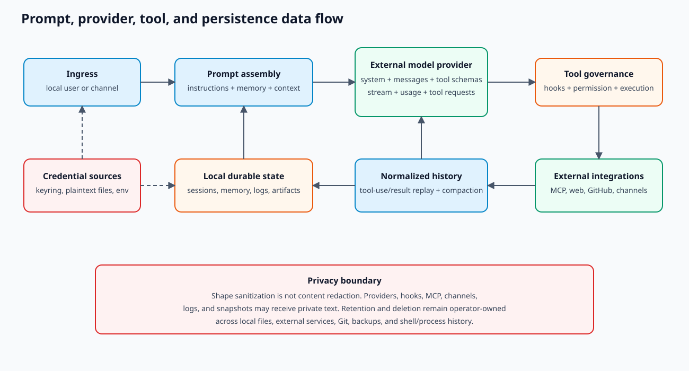

# Data handling, privacy, and retention

This guide describes where data goes in the current implementation. It is not a legal privacy
policy. Operators remain responsible for the policies of model providers, channel platforms, MCP
servers, Git hosts, proxies, and any plugin or hook endpoint they configure.

## Data-flow summary

## Data classes

| Data | May be sent externally? | May be persisted locally? | Primary implementation |
| --- | --- | --- | --- |
| User prompt | model provider; prompt/agent hooks | session snapshot, logs in some hosts | `QueryEngine.submit_message()`, provider clients |
| System prompt | model provider | session snapshot | `prompts/system_prompt.py`, session storage |
| Project memory/instructions | model provider when selected | project files | `memory/`, `prompts/claudemd.py` |
| Tool input/result | model provider on replay; hook endpoints | session, artifact, task or bridge logs | `engine/query.py`, `services/tool_outputs.py` |
| Images/attachments | vision/model provider; channel platform | session blocks and media directories | image blocks, channel adapters, ohmo workspace |
| Provider credential | provider authentication endpoint | keyring or credential file | `auth/storage.py`, `auth/external.py` |
| Channel credential | channel platform | ohmo `gateway.json` | `ohmo/gateway/config.py` |
| MCP request/result | configured MCP server and model on replay | session/tool result | `mcp/client.py`, MCP tool adapters |
| Autopilot issue/PR data | model provider, GitHub CLI/API | registry, journal, reports, dashboard | `autopilot/service.py` |

## Credential storage

`auth/storage.py` prefers a usable operating-system keyring. The fallback is
`~/.openharness/credentials.json`, plaintext JSON written with mode `0600` where the filesystem
supports POSIX modes. That mode restricts ordinary access but is not encryption.

External subscription bindings store source metadata in the OpenHarness credential store while the
external CLI continues to own its token file. Copying `~/.openharness` is therefore not a complete
credential backup or deletion operation.

The ohmo configuration wizard writes channel secrets into `gateway.json` as ordinary JSON. Protect
the workspace directory and backups as credential-bearing state.

Avoid command-line secrets. Root `--api-key` and frontend backend argv forwarding can expose values
through process inspection or shell history. Prefer interactive auth, environment variables, or the
credential store.

## Prompt assembly and external disclosure

`ui/runtime.py::build_runtime()` calls `build_runtime_system_prompt()` after resolving settings,
skills, plugins, memory, and current context. `engine/query.py::run_query()` sends the resulting
system prompt, conversation messages, and registered tool schemas to the selected provider.

Consequently, provider-visible data can include:

- project and user instructions;
- selected durable memory;
- environment/cwd context;
- previous tool results and compacted summaries;
- attachment descriptions or image data;
- tool schemas, including descriptions contributed by trusted extensions.

Compaction reduces context size; it is not a privacy boundary. A summarization call sends the
selected prior conversation to a model.

## Local persistence

Core session snapshots are written under the configured data root by
`services/session_storage.py::save_session_snapshot()`. ohmo writes workspace-global latest,
session-key latest, and named session files through `ohmo/session_storage.py::save_session_snapshot()`.
Messages are shape-sanitized and runtime objects are excluded, but textual content is not generally
redacted.

Other durable locations include:

- project and ohmo memory files;
- task and bridge output logs;
- cron registry and execution history;
- feedback logs;
- MCP/provider configuration;
- autopilot registry, JSONL journal, policies, run/verification reports, and dashboard snapshot;
- channel media and ohmo attachments;
- personalization rules/facts.

See [State and persisted formats](../reference/STATE_AND_PERSISTED_FORMATS.md) for owners and
atomicity.

## Hooks, plugins, and MCP

Command hooks receive JSON payload through environment variables. HTTP hooks send payload to the
configured URL. Prompt and agent hooks send derived context to a model client. `PRE_TOOL_USE` hooks
see raw tool input before validation and permission checks.

Python plugins execute in the host interpreter. MCP stdio servers execute locally; HTTP MCP servers
receive traffic over the configured transport. Enabling any of these mechanisms is a data-sharing
decision independent of model tool confirmation.

## Logs and generated artifacts

Configuration displays use redaction helpers, but not every log or artifact is a structured,
redacted audit record. Child process output and model/tool text may contain secrets supplied by the
user or emitted by another program. Treat these as sensitive:

- `OPENHARNESS_LOGS_DIR` / default OpenHarness logs;
- ohmo workspace logs and gateway state;
- task `<id>.log` files;
- bridge `<session-id>.log` files;
- `tool_artifacts` output;
- autopilot run and verification reports;
- exported transcripts and dashboard snapshots.

Do not publish `docs/autopilot/snapshot.json` without inspecting issue/PR bodies, source references,
labels, notes, and failure summaries.

## Retention and deletion

The current implementation does not enforce one global retention schedule. Many artifacts remain
until the operator deletes them. Deletion should account for:

1. active processes and gateways that may rewrite files;
2. core config, data, and log roots;
3. ohmo workspace, attachments, sessions, groups, and gateway config;
4. project `.openharness` state and worktrees;
5. system keyring entries and external CLI credentials;
6. provider/channel/MCP server-side retention;
7. Git history, PRs, CI logs, and published dashboards;
8. backups and shell history.

Stop services before taking a consistent backup or destructive cleanup. Verify a backup with
synthetic test state before relying on it for recovery.

## Safe operating checklist

- Use isolated configuration/data/log roots for tests.
- Keep secrets out of prompts, project memory, skills, issue bodies, and verification output.
- Review project skills and explicitly enabled plugins before opening an untrusted repository.
- Restrict channel `allow_from`; avoid `"*"` for privileged agents.
- Inspect provider, MCP, hook, and proxy data policies.
- Prefer default or plan permission modes outside a disposable sandbox.
- Review generated dashboard/transcript files before committing or sharing.
- Rotate any credential that appears in a session, log, argv, shell history, or Git commit.
