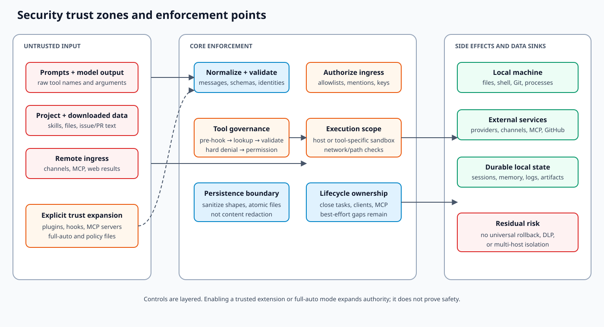

# Threat model

**Status:** current-state security architecture. This is not a certification or a claim that every
threat is completely mitigated.

## Scope and assets

This model covers the local runtime, terminal, `ohmo` gateway, channel adapters, extensions, MCP,
background work, cron, bridge sessions, and autopilot. Primary assets are:

| Asset | Typical owner and location | Why it matters |
| --- | --- | --- |
| Provider credentials | keyring or `~/.openharness/credentials.json` | Authorize paid or private model access |
| Subscription bindings | external CLI files referenced by `auth/external.py` | May include renewable access tokens |
| Channel credentials | ohmo `gateway.json` | Control bots and remote ingress |
| Source and worktrees | current project and autopilot/swarm worktrees | Model tools can read or mutate code |
| Conversations | core or ohmo session snapshots | May contain proprietary prompts and tool results |
| Memory and identity | project memory or ohmo workspace | Persisted text is injected into future prompts |
| Attachments and artifacts | data/workspace media and tool artifacts | Can contain source, screenshots, or private files |
| Execution authority | shell, filesystem, Git, network, channel, and PR credentials | Enables external side effects |

## Trust zones

### Untrusted inputs

- user and channel messages;
- model-generated tool names and arguments;
- repository files, instructions, skills, and downloaded content;
- MCP tool/resource output;
- plugin manifests before explicit trust;
- issue, PR, CI, and candidate text consumed by autopilot.

### Explicitly trusted code and configuration

- installed OpenHarness package and its dependencies;
- user-enabled plugins and configured hooks;
- configured MCP servers;
- channel SDK credentials and policies;
- permission rules, sandbox settings, and autopilot policies.

Trust is transitive: a command hook, Python plugin, stdio MCP server, or verification command can
execute code with the current process's authority. Permission checks around later model tool calls
do not contain import-time plugin behavior or hook/MCP startup behavior.

## Enforcement path for model tools

The implemented order in `src/openharness/engine/query.py::_execute_tool_call()` is:

1. `PRE_TOOL_USE` hooks receive the raw name and input and may block.
2. `ToolRegistry.get()` resolves an exact registered name.
3. The tool's Pydantic `input_model` validates arguments.
4. Permission metadata such as a path or command is normalized.
5. `PermissionChecker.evaluate()` applies hard sensitive paths, explicit rules, and mode defaults.
6. The host asks for confirmation when required.
7. `BaseTool.execute()` runs, possibly using a sandbox adapter inside the tool.
8. Results are normalized and `POST_TOOL_USE` hooks run for completed tool executions.

Pre-hooks are trusted policy code because they run before validation and permission denial.

## Threats and current controls

| Threat | Current controls | Residual risk / limitation |
| --- | --- | --- |
| Prompt injection requests credentials | sensitive-path patterns; permission metadata; confirmation | patterns are not a complete DLP system; a tool must expose accurate metadata |
| Hallucinated tool name | exact registry lookup returns an error result | pre-hooks still see the raw request |
| Destructive model action | default confirmation, plan mode, deny rules, optional Docker sandbox | full-auto and trusted extensions can still perform irreversible effects |
| Malicious project plugin | project plugins default off in `plugins/loader.py` | explicit opt-in grants Python import/execution authority |
| Malicious project skill | project skills can be disabled | enabled instructions can steer model behavior even without direct code execution |
| Hook command injection | argument substitution escapes shell values; hook timeout/failure policy | hook definitions themselves are trusted and can intentionally exfiltrate data |
| SSRF through web tools | `utils/network_guard.py` validates targets and proxy settings | external redirects, DNS behavior, and trusted proxies remain part of the boundary |
| MCP compromise | normal tool permission/hook pipeline after adaptation | server startup, resources, schemas, and returned content are external trust inputs |
| Remote-channel abuse | `allow_from`, group/mention policy, remote command flags | adapter behavior differs; misconfiguration or wildcard access can expose the agent |
| Session-key collision/leakage | router includes channel/chat/thread/sender dimensions | key-shape changes can merge or split histories without migration |
| Bridge secret disclosure | required fields/version validation | encoding is base64url, not encryption; disclosure exposes ingress token material |
| Autopilot unsafe mutation | worktree default, verification policy, draft/mode/label merge checks | full-auto execution remains powerful; declared release human-gate fields are not currently enforced |
| Automation prompt injection or overreach | deterministic admission/matching; exact action/tool/destination/namespace policy; structured agent output; sensitive-path rules | trusted definitions/plugins remain powerful; channel queue acceptance is not confirmed remote delivery and crash/platform failures can lose or duplicate messages |
| Sandbox confusion | explicit enablement, path/network validation, resource settings | one module-global Docker session slot; not every tool runs in the container |
| Sensitive logs/artifacts | bounded output and config redaction in selected paths | tool inputs, child output, sessions, and attachments may contain private data |

## Entry-point-specific risk

### Local interactive and print modes

The terminal can present confirmation. Print mode has no interactive approval callback, so its
permission behavior and flags must be reviewed before using it for mutation. `--api-key` and other
secrets passed through argv may be visible to shell history or process inspection.

### ohmo gateway

`ohmo/gateway/service.py::OhmoGatewayService.run_foreground()` starts the bridge and channel
manager. `ohmo/gateway/bridge.py` authorizes messages, derives session keys, and owns same-key
cancellation. The gateway is safe only to the extent that every enabled adapter enforces its
configured ingress policy. Administrative commands require separate opt-in in gateway config.

Admitted messages may also enter `ohmo.automation`. Event payloads are untrusted data; definitions
and enabled workspace plugins are trusted policy/code. Agent steps receive filtered tool registries,
while actions independently enforce channel destinations and knowledge namespaces. Approval actor
lists are checked against the admitted sender and are not bypassed by remote-admin settings.
Interrupted non-retry-safe effects fail with unknown outcome instead of automatic replay.

### Cron and remote triggers

`services/cron_scheduler.py` launches jobs from durable definitions. The scheduler runs with its
process environment and filesystem authority; machine wakefulness, PATH, credentials, and duplicate
execution around failures are operator responsibilities.

### Autopilot

`autopilot/service.py::RepoAutopilotStore.run_card()` combines issue/PR content, a model turn,
worktree mutation, verification commands, Git, and GitHub operations. Treat issue text as untrusted
prompt input and policy files as executable governance. Shell verification is rejected unless a
mapping explicitly opts into `shell: true`.

## Security invariants for changes

- Hard sensitive-path denial remains before configurable allow/mode defaults.
- Project plugin code remains opt-in.
- Channel access control and model tool permission remain separate layers.
- Secret displays remain redacted and tests use synthetic values.
- Every new executable extension or external transport documents startup and per-call authority.
- Every persisted artifact declares whether it can contain prompts, source, credentials, or paths.
- Sandbox documentation states coverage and non-coverage per tool.
- Remote administrative behavior requires explicit operator enablement.

## Verification map

| Boundary | Source | Tests |
| --- | --- | --- |
| Tool permission order | `engine/query.py`, `permissions/checker.py` | `tests/test_engine`, `tests/test_permissions` |
| Project plugin trust | `plugins/loader.py`, settings | `tests/test_plugins` |
| Network target checks | `utils/network_guard.py`, web tools | `tests/test_utils`, `tests/test_tools` |
| Sandbox routing | `sandbox/`, tool adapters | `tests/test_sandbox` |
| Channel authorization | `channels/impl/`, ohmo bridge | `tests/test_channels`, `tests/test_ohmo` |
| Credential storage | `auth/storage.py`, `auth/external.py` | `tests/test_auth` |
| Autopilot command policy | `autopilot/service.py` | `tests/test_autopilot` |

Live penetration, provider, channel, and Docker validation are not part of the default offline test
suite.
